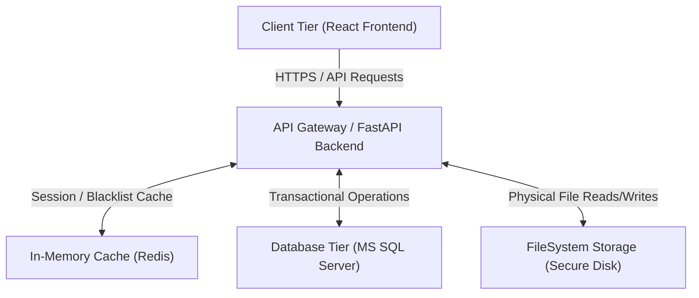

# TaskSync Enterprise V2
TaskSync Enterprise is an enterprise-grade web platform integrating Human Resource Management (HRM) and Project Management functionalities. Designed with strict security policies, real-time notification alerts, global audit logging, and modern React dashboard structures, it represents a state-of-the-art reference implementation for distributed full-stack applications.

---

## Project Overview
TaskSync Enterprise is designed to streamline corporate operations by combining employee directories, department hierarchy organization, role-based access control (RBAC), task planning, and resource tracking into a single unified workspace. The platform separates concerns logically and physically to enforce security boundaries, ACID transaction compliance, and high availability.

---

## Features
*   **Structured Employee Management:** Role tracking, department hierarchy, and manager assignment directories.
*   **Comprehensive Project & Task Workspaces:** Real-time assignment tracking, progress tracking, and file uploads.
*   **Security & Audit Logging:** Row-level IDOR validation, encrypted session storage, upload whitelists, and compliance logs.
*   **Eager Layout Performance:** Persistent layouts utilizing nested routing, minimizing redundant database query loops.

---

## Technology Stack

### Backend
*   **FastAPI:** Stateless, high-performance ASGI framework.
*   **Pydantic V2:** Structural input/output schemas and configuration management.
*   **Uvicorn:** Asynchronous HTTP server implementation.

### Frontend
*   **React 19:** Component declaration layer.
*   **Vite:** Core client bundler tool.
*   **TailwindCSS v4:** Utility-first styling engine.
*   **TanStack React Query:** Client-side caching and state synchronization.

### Database
*   **MS SQL Server:** Primary transactional database engine.
*   **SQLAlchemy 2.0:** Declarative ORM mapping with type annotated variables.
*   **Alembic:** Structural schema version control and migrations runner.

### Authentication
*   **JWT Bearer Tokens:** Encrypted access and refresh tokens.
*   **HTTP-Only Cookies:** Secure token caching preventing client XSS exploits.
*   **RBAC (Role-Based Access Control):** Admin, Manager, and Employee request authorization routing.

### Architecture
*   **Layered Architectural Design:** decoupling Routers ──► Dependencies ──► Services ──► CRUD ──► ORM Models.

---

## System Architecture Diagram



---

## Folder Structure

*   `backend/`: Source directories for the FastAPI application.
    *   `alembic/`: Schema migrations history and environments.
    *   `app/`: Core backend code modules.
        *   `core/`: Security setups, database config, and request middleware.
        *   `models/`: SQLAlchemy tables mapping entities.
        *   `schemas/`: Pydantic input/output validation models.
        *   `routers/`: HTTP request API endpoint routing.
        *   `services/`: Workflows and business validations.
        *   `repositories/`: Database CRUD abstractions.
*   `frontend/`: Source code for the client React SPA.
    *   `src/components/`: Reusable presentation widgets.
    *   `src/layouts/`: MainLayout persistent templates.
    *   `src/pages/`: Page containers (e.g., Dashboard, Employees, Tasks).
    *   `src/services/`: Token services and cookie managers.
    *   `src/router/`: AppRouter nested route declarations.
*   `docs/`: Discovery documents, roadmaps, and validation reports.
*   `.agents/`: Workspace-scoped agent customization guidelines.

---

## Phase 3.1: Hardened Infrastructure & Observability

During Phase 3.1, the TaskSyncEnterprise backend was upgraded to support production-grade operations:
- **Centralized Configuration**: Immutable frozen Settings class utilizing Pydantic Settings V2.
- **Observability Streams**: Separated logging files (`app.log`, `error.log`, `audit.log`) stamped with ContextVar-based request correlation IDs.
- **SRE Health Check Probes**: Independent liveness (`/health/live`) and readiness (`/health/ready`) checks with connection timeouts.
- **OWASP HTTP Hardening**: Injected custom security headers, disabled client caching on APIs, and restricted host spoofing.

For students and developers, see the comprehensive learning guides:
*   [Learning Guide 01: Backend Foundation](file:///e:/TaskSyncEnterprise/docs/learning/phase-3.1/01_Backend_Foundation.md)
*   [Learning Guide 02: Configuration Management](file:///e:/TaskSyncEnterprise/docs/learning/phase-3.1/02_Configuration_Management.md)
*   [Learning Guide 03: Enterprise Logging & Exception Handling](file:///e:/TaskSyncEnterprise/docs/learning/phase-3.1/03_Enterprise_Logging.md)
*   [Learning Guide 04: Health Checks & Diagnostics Probes](file:///e:/TaskSyncEnterprise/docs/learning/phase-3.1/04_Health_Checks.md)
*   [Learning Guide 05: Production Hardening & Audit](file:///e:/TaskSyncEnterprise/docs/learning/phase-3.1/05_Production_Hardening.md)
*   [Backend Architecture Blueprint Blueprint](file:///e:/TaskSyncEnterprise/docs/architecture/Backend_Architecture.md)
*   [Backend Architectural Glossary](file:///e:/TaskSyncEnterprise/docs/learning/Glossary.md)

---

## Getting Started

### Prerequisites
*   Python 3.11+
*   Node.js 18+
*   MS SQL Server Express / Developer Edition (configured on port 1433)

### Installation
Clone the repository and enter the workspace directory:
```bash
git clone https://github.com/huynhlethanhnhan/TaskSyncEnterprise.git
cd TaskSyncEnterprise
```

### Backend Setup
1.  Navigate to the backend folder:
    ```bash
    cd backend
    ```
2.  Create a virtual environment and activate it:
    ```bash
    python -m venv .venv
    # Windows:
    .venv\Scripts\activate
    # Unix:
    source .venv/bin/activate
    ```
3.  Install dependencies:
    ```bash
    pip install -r requirements.txt
    ```

### Frontend Setup
1.  Navigate to the frontend folder:
    ```bash
    cd ../frontend
    ```
2.  Install packages:
    ```bash
    npm install
    ```

### Database Setup
1.  Ensure SQL Server is running.
2.  Navigate to backend directory and run Alembic database schema migrations:
    ```bash
    alembic upgrade head
    ```
3.  Seed database with demo workspace accounts:
    ```bash
    python seed_v2.py
    ```

### Environment Configuration
1.  Configure database variables in a backend `.env` file:
    ```env
    MSSQL_USER=sa
    MSSQL_PASSWORD=YourPassword
    MSSQL_HOST=127.0.0.1
    MSSQL_PORT=1433
    SECRET_KEY=YourSecretKey
    ```
2.  Configure frontend variables in a frontend `.env.development` file:
    ```env
    VITE_API_URL=http://127.0.0.1:8000/api/v1
    ```

### Run Development Server
*   **Run Backend:**
    ```bash
    cd backend
    uvicorn app.main:app --reload --port 8000
    ```
*   **Run Frontend:**
    ```bash
    cd frontend
    npm run dev
    ```

### Run Tests
To run the automated backend test suite, run:
```bash
cd backend
python -m pytest
```

---

## API Documentation

### Swagger UI
FastAPI generates interactive documentation at runtime. Once the server is running, navigate to:
*   **Swagger:** `http://127.0.0.1:8000/docs`
*   **ReDoc:** `http://127.0.0.1:8000/redoc`

### Authentication
Security relies on Access and Refresh JWT tokens passed inside secure cookies. Protected routes require login and parse role permissions dynamically.

---

## Git Branch Strategy
To maintain production stability, we follow a strict branching model:
*   `master`: Mirror of stable production code. No direct commits allowed.
*   `develop`: The integration branch where feature branches merge.
*   `feature/*`: Feature-specific work branches (e.g. `feature/phase-3-backend-foundation`).

---

## Development Workflow
Our workflow ensures that no undocumented debt is introduced:
1.  **Architecture Review:** Verify impacts on database models and APIs before code changes.
2.  **Task Breakdown:** Split implementation roadmap phases into 30–60 minute tasks.
3.  **Implementation:** Develop changes inside designated feature branches.
4.  **Code Review:** Perform audits against security whitelists, SOLID principles, and regressions.
5.  **Release:** Fast-forward merge changes into integration and production tracks.

---

## AI Collaboration Workflow
The project leverages a collaborative group of specialized AI agents:
*   🏛️ **Enterprise Architect:** Models DB structures, validates roadmaps, and designs architectures.
*   📋 **Technical Lead:** Organizes plans into granular checklists and enforces branch naming rules.
*   💻 **Backend Developer:** Modifies code, writes models, and runs database migrations.
*   🔍 **Code Reviewer:** Reviews implementations against checklists to verify security and performance.
*   ✅ **Release Manager:** Handles branch configurations, git commits, staging, and pushes.

---

## Project Roadmap

We group the development roadmap into structural phases:
*   **Phase 1 — Setup & Discovery:** Workspace discovery, dependency mappings, and validation reviews.
*   **Phase 2 — Database Harmonization:** Migrating legacy models to SQLAlchemy 2.0 type annotated mapping style and timezone standardizations.
*   **Phase 3 — Backend Foundation:** Security updates, upload whitelists, pagination, and cookie authentication sessions.
*   **Phase 4 — Frontend Layout Refactoring:** Nested routing and TanStack React Query caching configurations.
*   **Phases 5 to 40 — Performance & Scaling:** Distributed caching, event brokers, database clustering, logging collectors, and deployment tracks.

---

## Documentation Index
*   [workspace_configuration.md](file:///e:/TaskSyncEnterprise/workspace_configuration.md): Workspace environments and IDE paths.
*   [enterprise_development_standards.md](file:///e:/TaskSyncEnterprise/enterprise_development_standards.md): Official coding and styling handbook.
*   [phase2_database_review.md](file:///e:/TaskSyncEnterprise/phase2_database_review.md): Database normalization audit report.
*   [docs/discovery_report.md](file:///e:/TaskSyncEnterprise/docs/discovery_report.md): Initial code discovery logs.
*   [docs/enterprise_roadmap.md](file:///e:/TaskSyncEnterprise/docs/enterprise_roadmap.md): Priority backlog tracker.

---

## Contributing
Please consult the [enterprise_development_standards.md](file:///e:/TaskSyncEnterprise/enterprise_development_standards.md) handbook before starting work. Open a pull request from a clean feature branch targeting the `develop` branch.

---

## License
Proprietary and Confidential. Registered to TaskSync Enterprise.
