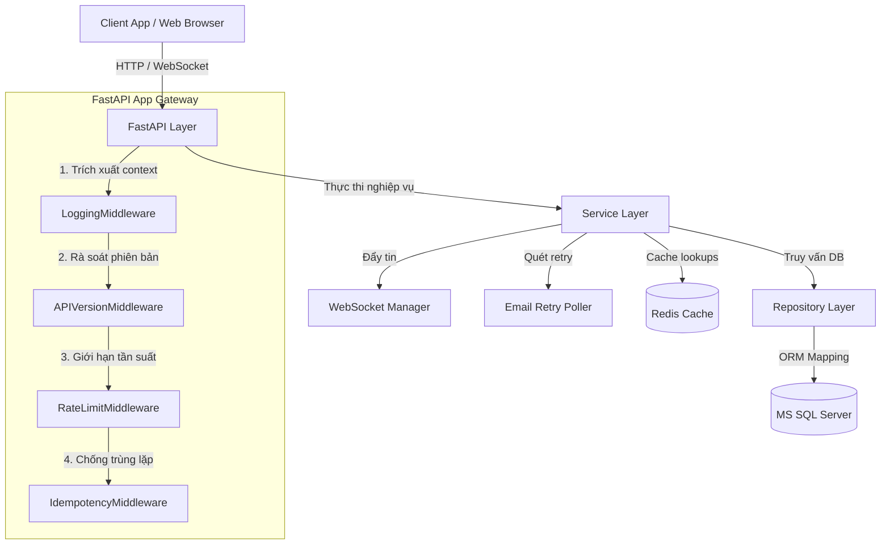

# Hướng Dẫn Vận Hành Hệ Thống TaskSyncEnterprise (Master README)

Hệ thống quản lý công việc và quy trình nghiệp vụ cấp doanh nghiệp (Enterprise Task & Process Management System).

---

## 🏛️ 1. Kiến Trúc Tổng Quan (System Architecture)

Dự án áp dụng mô hình phân rã dịch vụ sạch **Clean Architecture** tách biệt hoàn toàn giữa tầng giao tiếp client (HTTP/WS API), tầng logic nghiệp vụ chuyên biệt (Services) và tầng lưu trữ dữ liệu (Repositories/Database).



---

## 🛠️ 2. Công Nghệ Sử Dụng (Tech Stack)

* **Ngôn ngữ**: Python 3.12
* **Khung ứng dụng**: FastAPI (Tích hợp Asyncio & Pydantic V2)
* **Cơ sở dữ liệu**: MS SQL Server (ORM: SQLAlchemy 2.0 & Di trú: Alembic)
* **Bộ nhớ đệm & Khóa**: Redis (Sliding window rate limit, lock idempotency, caching)
* **Giao tiếp thời gian thực**: WebSockets (Private recipient channels, Heartbeats)
* **Bảo mật**: JWT (Access/Refresh Tokens), bcrypt password hashing, Token Blacklist
* **Đóng gói**: Docker (Multi-stage builds) & Docker Compose

---

## 📂 3. Cấu Trúc Thư Mục Ảo (Project Directory Tree)

```
TaskSyncEnterprise/
├── Dockerfile                      # Đóng gói Docker Backend đa tầng
├── docker-compose.yml              # Điều phối Backend, Redis, SQL Server
├── CHANGELOG.md                    # Nhật ký cập nhật phiên bản
├── README.md                       # Tài liệu Master
├── docs/                           # Tài liệu Hướng dẫn Vận hành
│   ├── INDEX.md                    # Mục lục tài liệu Master
│   ├── api/GUIDE.md                # Phiên bản, chống trùng lặp, khấu hao API
│   ├── architecture/GUIDE.md       # Cấu trúc Clean Architecture, Soft Delete, Logs
│   ├── deployment/GUIDE.md         # Hướng dẫn đóng gói, checklist sản xuất
│   └── notification/GUIDE.md       # WebSocket gateway, Strategy channels, Retry
├── reports/                        # Báo cáo kỹ thuật chi tiết
│   ├── README.md                   # Mục lục các báo cáo
│   ├── security/                   # An ninh bảo mật, audit IDOR
│   ├── performance/                # Tái sử dụng session, Redis caching
│   ├── audit/                      # Mức độ sẵn sàng sản xuất (Readiness score), Code Quality
│   └── testing/                    # Kết quả pytest tự động
├── roadmap/                        # Lộ trình phát triển sản phẩm
│   └── README.md                   # Gantt chart lộ trình và Milestone M3 progress
└── backend/                        # Thư mục chứa mã nguồn python
```

---

## 🚀 4. Khởi Động Nhanh Hệ Thống (Quick Start Guide)

### Khởi động bằng Docker Compose (Khuyên dùng cho DevOps/Production)
```bash
# 1. Build ảnh và khởi động hệ thống ngầm
docker-compose up -d --build

# 2. Đồng bộ các bảng di trú cơ sở dữ liệu
docker exec tasksync-backend alembic upgrade head

# 3. Tạo lập tài khoản dữ liệu mẫu
docker exec tasksync-backend python seed_v2.py
```

### Khởi động local (Dành cho Lập trình viên)
1. Cài đặt môi trường ảo Python 3.12:
   ```bash
   cd backend
   python -m venv .venv
   .venv\Scripts\activate
   pip install -r requirements.txt
   ```
2. Điền thông tin biến môi trường vào tệp `.env` (tham chiếu biến tại `app/config.py`).
3. Khởi chạy ứng dụng:
   ```bash
   uvicorn app.main:app --reload --port 8000
   ```
4. Truy cập giao diện tương tác Swagger UI tài liệu API tại: `http://localhost:8000/docs`.

---

## 📚 5. Mục Lục Tài Liệu (Documentation Links)
Để xem hướng dẫn chi tiết theo vai trò phát triển, vui lòng truy cập **[Master Documentation Index (docs/INDEX.md)](file:///e:/TaskSyncEnterprise/docs/INDEX.md)**.
