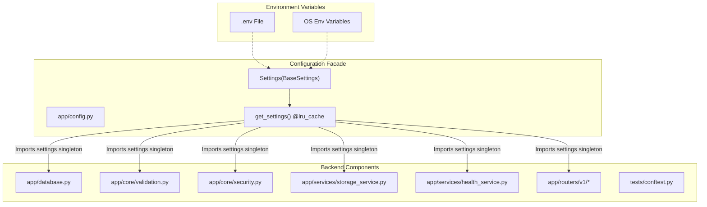
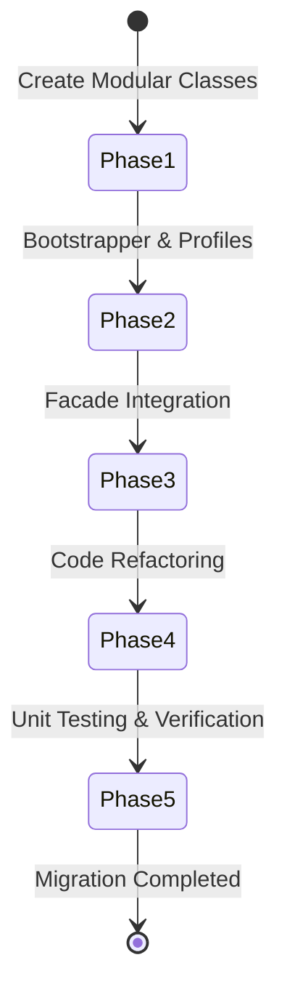
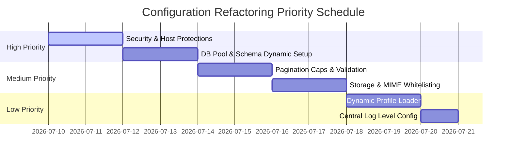

# Enterprise Configuration Architecture Audit

**Document Reference:** P3.2-001  
**Project:** TaskSyncEnterprise  
**Phase:** 3.2 (Infrastructure Configuration Layer Design)  
**Role:** Senior Software Architect, Principal Python Engineer, Enterprise Backend Reviewer  

---

## 1. Current Architecture

The current backend configuration management is structured as follows:



### Core Components of Current System:
1. **Pydantic Settings V2 Wrapper:** [config.py](file:///e:/TaskSyncEnterprise/backend/app/config.py#L9-L21) defines the `Settings` class inheriting from `pydantic_settings.BaseSettings`. It reads parameters from a `.env` file via `SettingsConfigDict` and exposes them as Python properties. The settings class is frozen (`frozen=True`) to guarantee runtime immutability.
2. **Settings Singleton & Caching:** The settings instance is loaded using the function `get_settings()` decorated with `@lru_cache`, which is instantiated as a module-level `settings` object at the bottom of [config.py](file:///e:/TaskSyncEnterprise/backend/app/config.py#L550-L557).
3. **Database Setup:** [database.py](file:///e:/TaskSyncEnterprise/backend/app/database.py) imports `settings.SQLALCHEMY_DATABASE_URI` (dynamically built from host, port, user, and password settings in [config.py](file:///e:/TaskSyncEnterprise/backend/app/config.py#L211-L232)) to instantiate the SQLAlchemy engine.
4. **Startup Validation:** [validation.py](file:///e:/TaskSyncEnterprise/backend/app/core/validation.py) uses the settings singleton to verify host configurations, evaluate database connectivity, check directory write permissions, and enforce secret key requirements before the FastAPI process accepts requests.
5. **Static Paths Resolution:** Absolute paths for static storage and log folders are dynamically calculated as properties in [config.py](file:///e:/TaskSyncEnterprise/backend/app/config.py#L520-L548) relative to the project root directory.

---

## 2. Problems Found

A comprehensive audit of the backend has identified multiple configuration concerns, hardcoded values, and architectural gaps that bypass the central configuration layer:

### 2.1 Hardcoded Constants
*   **Pagination Defaults & Limits:** 
    *   In the [paginate](file:///e:/TaskSyncEnterprise/backend/app/utils/pagination.py#L8) utility, the default parameter `page_size=20` is hardcoded.
    *   In [teams.py](file:///e:/TaskSyncEnterprise/backend/app/routers/v1/teams.py#L17) and [departments.py](file:///e:/TaskSyncEnterprise/backend/app/routers/v1/departments.py#L17), the routing parameter `limit: int = Query(20, ge=1, le=100)` is hardcoded. These values should reference `settings.DEFAULT_PAGE_SIZE` and `settings.MAX_PAGE_SIZE`.
    *   Routers like [projects.py](file:///e:/TaskSyncEnterprise/backend/app/routers/v1/projects.py#L29) and [employees.py](file:///e:/TaskSyncEnterprise/backend/app/routers/v1/employees.py#L36) use `settings.DEFAULT_PAGE_SIZE` but do not validate or enforce the upper limit (`settings.MAX_PAGE_SIZE`) on request parameters.
*   **Upload Size Limit Messages:** 
    *   In [storage_service.py](file:///e:/TaskSyncEnterprise/backend/app/services/storage_service.py#L51), the avatar size limit validation error message is hardcoded: `"Dung lượng ảnh đại diện không được vượt quá 5MB!"`.
    *   In [storage_service.py](file:///e:/TaskSyncEnterprise/backend/app/services/storage_service.py#L75), the attachment size validation error message is hardcoded: `"Dung lượng file đính kèm không được vượt quá 20MB!"`. If limits in `Settings` change, these error responses become out-of-sync and misleading.
*   **Database Timeouts:**
    *   In [validation.py](file:///e:/TaskSyncEnterprise/backend/app/core/validation.py#L104), database connectivity validation hardcodes a `3`-second timeout: `connect_args={"login_timeout": 3, "timeout": 3}`. This value bypasses `settings.HEALTH_TIMEOUT` used in health checks.
*   **Database Retry Policy:**
    *   No database connection retries or exponential backoff parameters are configured. Under transient network drops, the application startup validation throws a `RuntimeError` and terminates the ASGI process instantly.
*   **Statuses (Task & Project):**
    *   Task statuses (`"To Do"`, `"In Progress"`, `"Done"`) are hardcoded as raw string literals in [schemas/task.py](file:///e:/TaskSyncEnterprise/backend/app/schemas/task.py#L11), [routers/v1/tasks.py](file:///e:/TaskSyncEnterprise/backend/app/routers/v1/tasks.py#L35), [dashboard.py](file:///e:/TaskSyncEnterprise/backend/app/routers/v1/dashboard.py#L26-L28), and as SQL Server defaults in [models/task.py](file:///e:/TaskSyncEnterprise/backend/app/models/task.py#L47) (`server_default=text("N'To Do'")`). They bypass the `TaskStatus` Enum defined in [enums.py](file:///e:/TaskSyncEnterprise/backend/app/core/enums.py#L4-L10).
    *   Project statuses (`"Planning"`, `"Active"`, `"Completed"`) are hardcoded as raw string literals in [schemas/project.py](file:///e:/TaskSyncEnterprise/backend/app/schemas/project.py#L14) and [models/project.py](file:///e:/TaskSyncEnterprise/backend/app/models/project.py#L47) (`server_default=text("N'Planning'")`) instead of referencing the `ProjectStatus` Enum.
*   **RBAC Roles:**
    *   Role IDs (`1` = admin, `2` = manager, `3` = employee) and mapping labels are hardcoded in [constants.py](file:///e:/TaskSyncEnterprise/backend/app/core/constants.py#L3-L11) and [deps.py](file:///e:/TaskSyncEnterprise/backend/app/core/deps.py#L80-L82) (`RequireAdmin = require_roles([ROLE_ADMIN])`). In enterprise environments, role IDs should be retrieved dynamically from DB/cache or mapped via configuration.
*   **Allowed MIME Types:**
    *   The application has zero configuration settings or validation rules for allowed MIME types. Only extensions are validated, and the file's raw, unvalidated `content_type` is saved directly as `mime_type` in the database in [storage_service.py](file:///e:/TaskSyncEnterprise/backend/app/services/storage_service.py#L98).

### 2.2 Hardcoded Paths
*   **Static Uploads & Logs Base Directories:**
    *   `STORAGE_UPLOAD_DIR = "uploads"` and `LOG_DIRECTORY = "logs"` are defined in settings. However, directory resolution in [config.py](file:///e:/TaskSyncEnterprise/backend/app/config.py#L520-L548) utilizes hardcoded path logic: `Path(__file__).resolve().parent.parent / path`. If backend folder layouts change, these properties will fail.
*   **Temp Folder Locations:**
    *   No temporary folder path is configured. File write validations ([validation.py](file:///e:/TaskSyncEnterprise/backend/app/core/validation.py#L28)) and storage health checkers ([health_service.py](file:///e:/TaskSyncEnterprise/backend/app/services/health_service.py#L114)) perform file writes directly inside active uploads folders (`.write_test_...` and `.health_check_test_...`). 
*   **Static Assets & Reports Paths:**
    *   In [main.py](file:///e:/TaskSyncEnterprise/backend/app/main.py#L100), the static route path is hardcoded as `app.mount(f"/{settings.STORAGE_UPLOAD_DIR}", ...)` without centralized static assets parameters. Reports directories are not configured.

### 2.3 Security Settings
*   **JWT Fallback Credentials:**
    *   The default JWT signing key in [config.py](file:///e:/TaskSyncEnterprise/backend/app/config.py#L65) is hardcoded to a default string: `"task_sync_enterprise_secret_key_chuandry_2026"`. While [validation.py](file:///e:/TaskSyncEnterprise/backend/app/core/validation.py#L65-L75) checks this fallback on production startups, it should not be committed to the codebase.
*   **OAuth2 Login Endpoint Path:**
    *   In [deps.py](file:///e:/TaskSyncEnterprise/backend/app/core/deps.py#L14), the login token URL is hardcoded as `tokenUrl=f"{settings.API_V1_STR}/auth/login"`.
*   **Password Policy:**
    *   The backend has no configurations or validation filters for password complexity, min/max length, or character requirements. In [auth.py](file:///e:/TaskSyncEnterprise/backend/app/routers/v1/auth.py#L185-L200), user passwords are updated without security checks.
*   **Allowed Hosts:**
    *   `ALLOWED_HOSTS: list[str] = ["*"]` is hardcoded in settings. A wildcard allowed hosts setting in production exposes the server to Host Header Injection attacks.

### 2.4 Database Settings
*   **SQL Connection URL Loopback:**
    *   In [config.py](file:///e:/TaskSyncEnterprise/backend/app/config.py#L228), the loopback database check and dynamic URI building have hardcoded IP parameters: `if self.MSSQL_HOST == "JINDOU_ITSUKI" or self.MSSQL_HOST == "127.0.0.1"`.
*   **Pool Settings:**
    *   In [database.py](file:///e:/TaskSyncEnterprise/backend/app/database.py#L11-L12), pool recycling (`pool_recycle=1800`) and verification pre-pinging (`pool_pre_ping=True`) are hardcoded. Pool size limits and max overflow limits are not configured.
*   **Hardcoded Database Schema:**
    *   In [base.py](file:///e:/TaskSyncEnterprise/backend/app/models/base.py#L6), the schema name is hardcoded: `schema="dbo"`. This prevents changing the schema namespace dynamically between staging, testing, and production.
*   **Hardcoded DateTime Functions:**
    *   All models hardcode `server_default=text("SYSUTCDATETIME()")` (e.g. [employee.py](file:///e:/TaskSyncEnterprise/backend/app/models/employee.py#L93)). This creates severe unit testing friction with SQLite databases, requiring a runtime hack to intercept and rewrite table metadata on test setup in [conftest.py](file:///e:/TaskSyncEnterprise/backend/tests/conftest.py#L21-L31).

### 2.5 API Settings
*   **Application Release Version:**
    *   The health check report in [health_service.py](file:///e:/TaskSyncEnterprise/backend/app/services/health_service.py#L215) hardcodes `"version": "2.0.0"`. This version is disconnected from the central configuration.
*   **CORS Configuration:**
    *   In [main.py](file:///e:/TaskSyncEnterprise/backend/app/main.py#L93-L94), CORS allowed headers (`allow_headers=["*"]`) and methods (`allow_methods=["*"]`) are hardcoded, bypassing Pydantic settings controls.

### 2.6 Application & Environment-Specific Settings
*   **Dynamic Profile Selection:**
    *   The configuration layer is locked to reading from a single `.env` file in [config.py](file:///e:/TaskSyncEnterprise/backend/app/config.py#L16). There is no native support for dynamic profile-based configuration loading (e.g., loading `.env.development`, `.env.production`, or `.env.testing` based on an active environment profile).
*   **Hardcoded Test Database URL:**
    *   In [conftest.py](file:///e:/TaskSyncEnterprise/backend/tests/conftest.py#L10), the test suite database URL is hardcoded as `"sqlite:///./test.db"`, which should instead be managed by a test-specific environment profile.

### 2.7 Logging Configuration
*   **Library Log Levels:**
    *   The log level threshold for external libraries (e.g. Uvicorn, SQLAlchemy) is hardcoded. Changing the log level to `DEBUG` in settings does not affect all target loggers uniformly.

### 2.8 Duplicated Configuration Values
*   **Pagination Defaults:** Duplicated between `DEFAULT_PAGE_SIZE = 20` and `MAX_PAGE_SIZE = 100` in [config.py](file:///e:/TaskSyncEnterprise/backend/app/config.py#L237-L257) and hardcoded `20` / `100` values in router queries.
*   **Environment Verifications:** Standard validation of the development fallback key is written in both [validation.py](file:///e:/TaskSyncEnterprise/backend/app/core/validation.py#L65) and [health_service.py](file:///e:/TaskSyncEnterprise/backend/app/services/health_service.py#L137).

---

## 3. Risk Level

| Risk Area | Vulnerability | Severity | Justification |
|---|---|---|---|
| **Security** | Fallback `SECRET_KEY` committed to VCS & Wildcard `ALLOWED_HOSTS`. | **CRITICAL** | If deployed with default keys, attackers can forge admin JWTs. Host header injection is possible due to `ALLOWED_HOSTS=["*"]`. |
| **Availability / Denial of Service** | No maximum page size limit checked on employee/project queries. | **HIGH** | A single request with a high limit (e.g., `?limit=100000`) can exhaust database pools and trigger server Out-Of-Memory (OOM) failures. |
| **Maintainability** | Hardcoded statuses, roles, and schema configurations. | **MEDIUM** | Divergence between database models, API routing logic, and business enums. Modifying statuses requires code-wide changes. |
| **Testability** | Hardcoded SQLite overrides due to `SYSUTCDATETIME()` model defaults. | **MEDIUM** | Modifying DB schemas requires fragile runtime model reflection adjustments in `conftest.py`. |
| **Integrity / Data Upload** | No whitelist validation on uploaded files MIME types. | **MEDIUM** | Attackers can bypass basic extensions checks or upload dangerous content (e.g., executable files masquerading as images). |

---

## 4. Recommended Refactoring

To resolve the identified architecture problems, we propose centralizing all configuration settings into a modular **Infrastructure Configuration Layer** utilizing Pydantic Settings V2:

```
[Environment Environment/Profiles] 
        (e.g., ENVIRONMENT=production -> loads .env.production)
                 │
                 ▼
     [Modular Config Sub-Models]
  ┌──────────────────────────────────────────┐
  │ app/core/config/                         │
  │   ├── database.py   (Pools, Schema, UTC)  │
  │   ├── security.py   (JWT, Password, CORS) │
  │   ├── storage.py    (Size, MIME, Paths)   │
  │   ├── pagination.py (Page bounds, defaults)│
  │   └── logging.py    (Format, levels)      │
  └──────────────────────────────────────────┘
                 │
                 ▼
       [Unified Settings Facade]
          (app/config.py)
                 │
                 ▼
         [Config Consumers]
      (Routers, Models, Services)
```

### Key Refactoring Initiatives:
1. **Dynamic Environment Profile Loading:**
   *   Implement a profile-based config loader. Read the active profile using a bootstrap environment variable `ENVIRONMENT` (default: `"development"`).
   *   Instruct Pydantic to read settings from the matching profile file: `.env.development`, `.env.production`, or `.env.testing`.
2. **Modular Configurations Sub-Models:**
   *   Decompose the giant `Settings` class into logical, scoped sub-settings classes using Pydantic nested models:
       *   `DatabaseSettings`: MS SQL connection configurations, pool settings (`pool_size`, `max_overflow`, `pool_recycle`), database schema names, and UTC function queries.
       *   `SecuritySettings`: JWT secrets, algorithms, token lifetimes, allowed CORS methods, allowed CORS headers, trusted hosts, and password strength policies (length, regex patterns).
       *   `StorageSettings`: Upload directories, size limits, allowed extensions, allowed MIME types, and dedicated temp folders.
       *   `PaginationSettings`: Defaults and maximum bounds.
       *   `LoggingSettings`: Log paths, formats, rotation size, file/console logging flags, and external library log levels.
3. **Enum Integration for Statuses and Roles:**
   *   Enforce standard Enums (`TaskStatus`, `ProjectStatus`) in Pydantic schemas, database queries, and SQLAlchemy models. Eliminate hardcoded raw strings in models.
   *   Reference DB schema defaults using configuration values (e.g. `server_default=text(settings.database.current_timestamp_func)`).
4. **MIME Type Validation Integration:**
   *   Add `ALLOWED_AVATAR_MIME_TYPES` and `ALLOWED_ATTACHMENT_MIME_TYPES` in the storage configurations, and implement strict MIME type verification alongside file extensions checks.

---

## 5. New Folder Structure

```
backend/
├── app/
│   ├── main.py
│   ├── database.py
│   ├── config.py                     # Legacy unified import facade (backward compatible)
│   ├── core/
│   │   ├── config/                   # NEW: Infrastructure Configuration Layer
│   │   │   ├── __init__.py           # Config bootstrapper & profile resolver
│   │   │   ├── base.py               # Central Settings container class
│   │   │   ├── database.py           # DB connection, pool, and schema settings
│   │   │   ├── security.py           # JWT, CORS, hosts, and password policy settings
│   │   │   ├── storage.py            # Upload limits, paths, and MIME type settings
│   │   │   ├── logging.py            # Log directory, formats, and levels settings
│   │   │   └── pagination.py         # Pagination defaults and limits settings
│   │   ├── enums.py                  # Standard business enums (TaskStatus, ProjectStatus)
│   │   ├── constants.py              # Central application constants
│   │   ├── deps.py                   # Dependency injectors (uses new config layout)
│   │   └── validation.py             # Startup configuration validation routines
│   ├── models/                       # SQLAlchemy models
│   ├── routers/                      # API endpoint routers
│   └── services/                     # Core business services
├── tests/
│   └── conftest.py                   # Pytest fixtures (references .env.testing config)
├── .env.development                  # Environment profile: Local Development
├── .env.production                   # Environment profile: Production
├── .env.testing                      # Environment profile: Testing / CI
└── requirements.txt
```

---

## 6. Migration Strategy

To transition safely to the new Infrastructure Configuration Layer without interrupting development, follow this step-by-step migration sequence:



### Step 1: Create Modular Settings Classes
*   Build the modular settings sub-classes under `app/core/config/`. Define validation constraints on each field (e.g., `SecretStr`, `PositiveInt`).
*   Define standard default values suitable for local development environments in these schemas.

### Step 2: Implement Bootstrapper and Dynamic Profiles
*   Create `app/core/config/__init__.py`. Implement helper functions to resolve which `.env.{environment}` file to load based on `ENVIRONMENT` values.
*   Generate `.env.development`, `.env.production`, and `.env.testing` templates containing environment-specific settings.

### Step 3: Integrate the Unified Settings Facade
*   Rewrite the core [config.py](file:///e:/TaskSyncEnterprise/backend/app/config.py) to act as a unified facade. Maintain backward compatibility by exposing attributes from modular sub-models as properties or root attributes (e.g. `@property def SECRET_KEY(self): return self.security.secret_key`).
*   This ensures all existing imports (`from app.config import settings`) across routers, services, and models function perfectly without modification.

### Step 4: Refactor Codebase Dependencies
*   Update database connection engines in [database.py](file:///e:/TaskSyncEnterprise/backend/app/database.py) to read database pool parameters (`pool_size`, `max_overflow`, `pool_recycle`) from `settings.database`.
*   Replace hardcoded query limits in routers with `settings.pagination.DEFAULT_PAGE_SIZE` and clamp pagination limits using `settings.pagination.MAX_PAGE_SIZE`.
*   Replace hardcoded sizes and error messages in [storage_service.py](file:///e:/TaskSyncEnterprise/backend/app/services/storage_service.py) with dynamic calls referencing configured limit settings.
*   Update database models to read schema names (`settings.database.schema`) and timestamp functions (`settings.database.current_timestamp_func`) dynamically.

### Step 5: Test Verification
*   Execute unit test suites (`pytest tests/`) using the `.env.testing` environment profile. Ensure SQLite test configurations and tables are cleanly generated, verified, and torn down without hardcoded hacks.

---

## 7. Backward Compatibility

To maintain complete backward compatibility and prevent system disruptions during migration, the application must adhere to the following rules:

1. **V1 Settings Facade Preservation:**
   *   The central config instance `settings` must remain importable from `app.config`.
   *   All existing properties must be exposed at the root level of the settings object (either directly or via Python properties) to avoid breaking existing imports. For example:
       ```python
       class Settings(BaseSettings):
           database: DatabaseSettings
           security: SecuritySettings
           
           @property
           def SQLALCHEMY_DATABASE_URI(self) -> str:
               return self.database.build_uri()
               
           @property
           def SECRET_KEY(self) -> SecretStr:
               return self.security.secret_key
       ```
2. **Graceful Environment Fallbacks:**
   *   If profile-specific files (e.g. `.env.production`) are missing, the system must fallback to standard local environment variables or standard `.env` values rather than failing startup, unless running in production mode.
3. **Database Schema Fallbacks:**
   *   The default schema parameter in database configurations must default to `"dbo"` to preserve exact alignment with SQL Server schemas.

---

## 8. Estimated Impact

*   **Security (High Impact):** Eliminates hardcoded developer secrets, prevents Host Header injection vulnerabilities in production by configuring specific trusted domains, and blocks file upload exploits using strict MIME type white-lists.
*   **Reliability / Stability (High Impact):** Prevents potential memory overflow crashes on large queries by enforcing maximum pagination caps. Centralizing database pool configurations prevents pool exhaustion under heavy enterprise loads.
*   **Maintainability (High Impact):** Code duplication is resolved. Changing paths, page sizes, upload thresholds, database connections, or logging schemas is performed in a single location per environment profile.
*   **Testability (Medium Impact):** Dynamic configuration of database features allows testing frameworks (`conftest.py`) to run tests on SQLite without reflection hacks, while preserving MSSQL features in production.

---

## 9. Priority Order

To implement the refactoring plan systematically, tasks are categorized by priority:



1. **Priority 1: Security & Database Connections (High)**
   *   Isolate keys/secrets from source code.
   *   Configure specific `ALLOWED_HOSTS` per profile.
   *   Centralize database connection pooling (`pool_size`, `max_overflow`, `pool_recycle`).
2. **Priority 2: Dynamic Schema & SQLite Test Integration (High)**
   *   Centralize database schema names (`dbo` vs `none`).
   *   Support configuration of current UTC timestamp functions (`SYSUTCDATETIME()` vs `CURRENT_TIMESTAMP`).
   *   Refactor models and tests to eliminate the schema reflection hack in [conftest.py](file:///e:/TaskSyncEnterprise/backend/tests/conftest.py).
3. **Priority 3: Pagination and Query Limits Safeguards (Medium)**
   *   Refactor routers to use `settings` values in query validations.
   *   Enforce `MAX_PAGE_SIZE` parameter caps across all pagination routines.
4. **Priority 4: Storage Service Refactoring & MIME Types (Medium)**
   *   Define file upload size limits and allowed MIME type parameters in settings.
   *   Refactor [storage_service.py](file:///e:/TaskSyncEnterprise/backend/app/services/storage_service.py) to dynamically include allowed sizes in validation responses and verify MIME types.
5. **Priority 5: Modular Config Layout & Dynamic Environment Profiles (Low)**
   *   Decompose configs into `app/core/config/` structure.
   *   Integrate profile-based env loaders (`.env.production`, `.env.development`, `.env.testing`).

---

## 10. Definition of Done (DoD)

- [ ] **Modular Layout Setup:** All configuration settings are successfully split into modular sub-classes under `app/core/config/` with clear validation rules.
- [ ] **Unified Import Facade:** The unified config instance remains fully importable via `from app.config import settings` without changing existing references.
- [ ] **Vulnerability Mitigation:** Default development secrets are replaced in production, wildcard host headers are disabled, and password policies are enforced.
- [ ] **Query Limits Enforced:** Every paginated endpoint validates that request sizes do not exceed `MAX_PAGE_SIZE`.
- [ ] **MIME Verification Active:** Upload routers perform validation checks on file extensions and MIME types.
- [ ] **Alembic and Migration Integrity:** Running `alembic check` returns a clean status without model-migration drift.
- [ ] **SQLite Test Suite Verification:** All unit tests in `backend/tests/` execute successfully using SQLite without runtime reflection/metadata modification hooks.

---

## 11. Learning Objectives

*   **12-Factor App Configuration Principles:** Understand the separation of code and config, ensuring environment settings are entirely driven by configuration profiles.
*   **Advanced Pydantic Settings V2 Usage:** Learn how to build nested, type-safe settings classes, validate complex settings variables, and override them at runtime.
*   **Security Architecture Fundamentals:** Understand vulnerabilities related to wildcard CORS controls, host headers spoofing, default signing keys, and unvalidated file upload types.
*   **SQLAlchemy Performance Tuning:** Master SQL database connection parameters, pool sizes, connection timeouts, and dialect-agnostic database schemas.

---

## 12. Enterprise Architecture Notes

1. **Separation of Concerns:** Keep core application logic isolated from deployment infrastructure parameters. The codebase remains agnostic of whether it is running on a local desktop, a Docker cluster, or a cloud platform.
2. **Immutable Configurations:** The configuration layer is loaded once at system startup and frozen. This prevents state mutation side-effects and concurrency issues in high-throughput async threads.
3. **Type-Safe Validation:** Bypassing standard string parsing in favor of Pydantic type annotations (e.g. `SecretStr`, `PositiveInt`, `EmailStr`) guarantees that configuration errors are caught immediately during boot validation rather than causing failures under production loads.

---

## 13. Best Practices

- **Never Commit Secrets:** Cryptographic keys, DB passwords, and third-party API tokens must never reside in configuration code files. Enforce their configuration via external environment files or key vaults.
- **Fail Early:** Validate all configuration variables on startup. The application should refuse to start if paths are not writeable, database connections timeout, or critical keys are weak in production environments.
- **Log System Context Cleanly:** Log configuration metadata details (environment, API prefix, logging levels) clearly on startup while ensuring sensitive connection strings and passwords are obfuscated.
- **Dialect Agnosticism:** Maintain compatibility across multiple database engines (SQLite, MSSQL, PostgreSQL) by keeping database schemas and functions configurable at the settings level.
