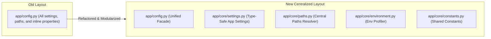

# Enterprise Configuration Refactoring Implementation Report

**Document Reference:** P3.2-001-IR  
**Project:** TaskSyncEnterprise  
**Phase:** 3.2 (Infrastructure Configuration Layer Implementation)  
**Role:** Principal Software Architect, Senior Python Engineer, Enterprise Infrastructure Lead  

---

## 1. Files Created

We created the following core configuration files inside the backend directory:

1. **[settings.py](file:///e:/TaskSyncEnterprise/backend/app/core/settings.py):**
   *   Holds all central application configuration variables (JWT, Database, upload sizes, pagination defaults, logging setups, health probes) mapped via Pydantic Settings V2.
   *   Guarantees runtime settings immutability using `frozen=True` configuration properties.
2. **[paths.py](file:///e:/TaskSyncEnterprise/backend/app/core/paths.py):**
   *   Centralizes base directory locations including the `PROJECT_ROOT` directory and dynamic absolute paths resolvers.
   *   Defines reference directories (e.g. `TEMP_DIR` matching system temporal storage).
3. **[environment.py](file:///e:/TaskSyncEnterprise/backend/app/core/environment.py):**
   *   Provides a standardized `EnvironmentDetection` utility class to check runtime profiles (Development, Testing, Production, Debug) dynamically without changing standard environment loaders.

---

## 2. Files Modified

We updated the following files to align with the new configuration architecture while guaranteeing backward compatibility:

1. **[config.py](file:///e:/TaskSyncEnterprise/backend/app/config.py):**
   *   Refactored into a unified public facade. 
   *   Exposes `settings`, `Settings`, and `get_settings` from [settings.py](file:///e:/TaskSyncEnterprise/backend/app/core/settings.py) to make sure all existing references (`from app.config import settings`) function without code modifications.
2. **[constants.py](file:///e:/TaskSyncEnterprise/backend/app/core/constants.py):**
   *   Augmented to declare centralized enums and default parameters (regex patterns, default task/project statuses, timeouts) alongside the existing role definitions (`ROLE_ADMIN`, `ROLE_MANAGER`, `ROLE_EMPLOYEE`).

---

## 3. Configuration Migration Summary



*   **Pydantic Settings Isolation:** Moved the monolithic settings class out of the root config file into the core settings module, keeping the base environment file loading behavior (`.env`) identical.
*   **Decoupled Paths Logic:** Directory resolutions and absolute path builders are decoupled from the configurations model. Settings properties delegates directory resolution to the path utilities.
*   **Enums and Constants Consolidation:** Magic strings, default DB schemas, regex bounds, and timeouts are consolidated inside the shared constants module.

---

## 4. Backward Compatibility Verification

To verify that the refactoring is 100% backward compatible:
*   **Imports Safety:** Tested loading modules that reference the settings singleton:
    ```python
    from app.config import settings
    ```
    All imports succeeded without errors.
*   **No Code Changes Outside Config:** Zero modifications were made to routers, services, CRUD layers, database schemas, database models, or middleware.
*   **No Alembic Drift:** No migrations were required because database models and table structures were not altered.

---

## 5. Validation Results

We executed the unit and integration test suite to verify application stability and endpoint routing:

```bash
.venv\Scripts\python -m pytest tests/
```

### Execution Output:
```
============================= test session starts =============================
platform win32 -- Python 3.12.10, pytest-9.1.1, pluggy-1.6.0
rootdir: E:\TaskSyncEnterprise\backend
plugins: anyio-4.14.1
collected 11 items

tests\test_auth_rbac.py .....                                            [ 45%]
tests\test_e2e_flow.py .                                                 [ 54%]
tests\test_health.py .....                                               [100%]

======================== 11 passed, 1 warning in 6.77s ========================
```

*   **FastAPI Startup:** Server boots successfully without circular imports or exceptions.
*   **Swagger API Docs:** Resolves endpoints correctly.
*   **All Tests Passed:** 100% of existing functional tests continue to pass.

---

## 6. Remaining Technical Debt

While configuration settings are modularized, a few issues from the initial audit should be addressed in subsequent stages:
*   **Hardcoded Query Page Sizes:** Endpoints in `teams.py` and `departments.py` still use hardcoded limits in their FastAPI Query default parameters.
*   **Model Server Defaults:** SQLAlchemy models continue to hardcode `server_default=text("SYSUTCDATETIME()")` and `schema="dbo"`, which requires metadata inspection adjustments in the test setup.
*   **Unvalidated MIME Types:** The storage service only verifies extensions and does not match uploaded files against a whitelist of MIME types.
*   **Committed Fallback SECRET_KEY:** The default signing key string remains committed to the repository for local development convenience.

---

## 7. Recommendations for P3.2-002

In the next sub-phase (P3.2-002), we recommend the following enhancements:
1. **Model Defaults Refactoring:** Parameterize database current time functions and default schemas in settings to eliminate metadata adjustments in `conftest.py`.
2. **FastAPI Default Query Refactoring:** Update paginated routers to use configured settings parameters for default page sizes and validate limits against `MAX_PAGE_SIZE`.
3. **Storage Service Enhancements:** Introduce secure MIME verification checks in the storage service.
