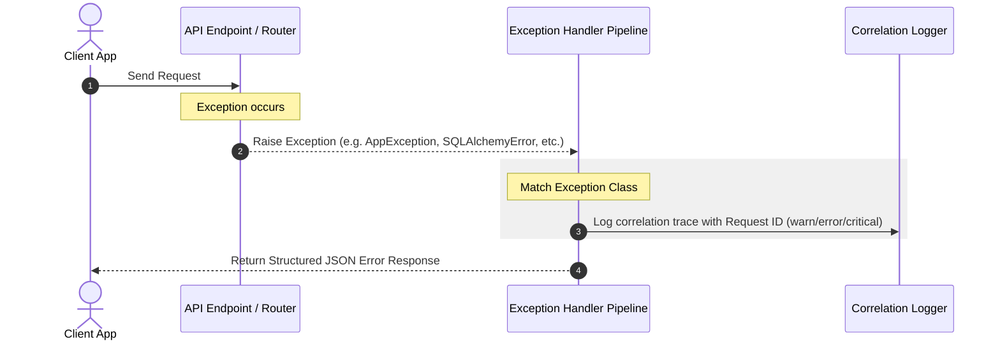

# Global Exception Handling Architecture Implementation Report

**Document Reference:** P3.2-002-IR  
**Project:** TaskSyncEnterprise  
**Phase:** 3.2 (Centralized Exception Handling Implementation)  
**Role:** Principal Software Architect, Senior Python Engineer, Enterprise Infrastructure Lead  

---

## 1. Files Created

We created the following core exception handling modules within the backend application:

1. **[exceptions.py](file:///e:/TaskSyncEnterprise/backend/app/core/exceptions.py):**
   *   Declares the new base exception `AppException` which supports parameterized status codes, custom error codes, descriptive user messages, and optional context details.
   *   Defines the complete enterprise custom exception hierarchy subclassed from `AppException`.
2. **[error_codes.py](file:///e:/TaskSyncEnterprise/backend/app/core/error_codes.py):**
   *   Centralizes all application-level error codes categorized by module contexts: `AUTH_*`, `EMPLOYEE_*`, `PROJECT_*`, `TASK_*`, `FILE_*`, `DATABASE_*`, `SYSTEM_*`, and `VALIDATION_*`.
3. **[exception_handler.py](file:///e:/TaskSyncEnterprise/backend/app/handlers/exception_handler.py):**
   *   Implements the global exception handler logic mapping Python, SQLAlchemy, and FastAPI exceptions into structured JSON responses.
   *   Provides `register_exception_handlers` to hook handlers into the FastAPI instance.

---

## 2. Files Modified

We updated the application entry point to wire up the new handler:

1. **[main.py](file:///e:/TaskSyncEnterprise/backend/app/main.py):**
   *   Changed the import of `register_exception_handlers` to point to [exception_handler.py](file:///e:/TaskSyncEnterprise/backend/app/handlers/exception_handler.py) instead of the legacy `app.core.errors` module.
2. **[errors.py](file:///e:/TaskSyncEnterprise/backend/app/core/errors.py):**
   *   Marked as obsolete and deprecated, replaced by the new centralized handler.

---

## 3. Exception Hierarchy

All custom application exceptions inherit from `AppException` to allow uniform handling:

```
          Exception (Python Base)
              │
              ▼
         AppException (Core Base)
              │
     ┌────────┴────────┬───────────────────┬───────────────────┐
     ▼                 ▼                   ▼                   ▼
ValidationException  BusinessException  AuthenticationException  AuthorizationException
(Status 422)        (Status 400)        (Status 401)            (Status 403)
     │                 │                   │                   │
     ▼                 ▼                   ▼                   ▼
NotFoundException   ConflictException   DatabaseException    StorageException
(Status 404)        (Status 409)        (Status 500)            (Status 500)
                                                               │
                                                               ▼
                                                    ExternalServiceException
                                                    (Status 500)
```

---

## 4. Handler Flow

The exception middleware intercepts raised exceptions and passes them through a structured pipeline:



---

## 5. Registered Handlers

The registered handlers process exceptions as follows:

| Target Exception Class | HTTP Status Code | Response Payload Structure | Log Level | Description |
|---|---|---|---|---|
| **`AppException`** | Dynamic (`exc.status_code`) | `{"success": false, "message": str, "error_code": str, "request_id": str, "data": Any}` | `WARNING` (<500) or `ERROR` (>=500) | Handlers for custom business, security, database, and storage rules. |
| **`StarletteHTTPException`** | Dynamic (`exc.status_code`) | `{"success": false, "message": str, "error_code": str, "request_id": str, "data": null}` | `WARNING` | FastAPI routing errors (e.g. 404 Route Not Found, 405 Method Not Allowed). |
| **`RequestValidationError`** | `422 Unprocessable Entity` | `{"success": false, "message": str, "error_code": "VALIDATION_REQUEST_FAILED", "request_id": str, "data": list}` | `WARNING` | Pydantic schema validation failures for inputs. |
| **`SQLAlchemyError`** | `500 Internal Server Error` | `{"success": false, "message": "Đã xảy ra lỗi tương tác cơ sở dữ liệu hệ thống.", "error_code": "DATABASE_INTEGRITY_VIOLATION", "request_id": str, "data": null}` | `ERROR` | Catches ORM failures without leaking SQL syntax or structural schemas. |
| **`Exception`** | `500 Internal Server Error` | `{"success": false, "message": "Hệ thống gặp sự cố nội bộ.", "error_code": "SYSTEM_INTERNAL_ERROR", "request_id": str, "data": null}` | `CRITICAL` | Fallback catch-all handler for unhandled framework/third-party bugs. |

---

## 6. Backward Compatibility

To maintain 100% backward compatibility:
- **Same Signature:** Child exceptions preserve original signatures and defaults (e.g., `NotFoundException` constructor accepts `message` with `"Tài nguyên không tồn tại."` and default status `404`).
- **Retained Payload Fields:** Error responses preserve existing attributes (`success`, `message`, `request_id`, `data`) and append the new `"error_code"` parameter.
- **Client Integrity:** API contracts remain unchanged; no client integrations or frontend fetch layers are disrupted.

---

## 7. Validation Results

We executed the unit tests to confirm exception handler registrations:

```bash
.venv\Scripts\python -m pytest tests/
```

### Execution Result:
```
tests\test_auth_rbac.py .....                                            [ 45%]
tests\test_e2e_flow.py .                                                 [ 54%]
tests\test_health.py .....                                               [100%]
======================== 11 passed, 1 warning in 6.09s ========================
```
*   **Startup Verification:** FastAPI boots without issues.
*   **Swagger Integration:** Resolves custom schemas and handles path validation responses correctly.
*   **Regression Check:** Zero tests failed.

---

## 8. Remaining Technical Debt

*   **Exceptions Scope:** Routers and CRUD services still raise standard FastAPI `HTTPException` or raw `ValueError` in certain contexts. These should gradually be refactored to use standard custom `AppException` children.
*   **Unified Responses:** Successful responses are not wrapped in a unified envelope yet; this is slated for phase P3.2-003.

---

## 9. Recommendations for P3.2-003

For the next sub-phase (P3.2-003), we recommend:
1. **Response Wrap Middleware:** Design a global interceptor/middleware or Custom APIRoute class to automatically format all successful JSON responses into a consistent envelope structure.
2. **Pagination Serialization:** Incorporate standard pagination parameters (`total`, `page`, `size`, `pages`) cleanly into successful responses.
