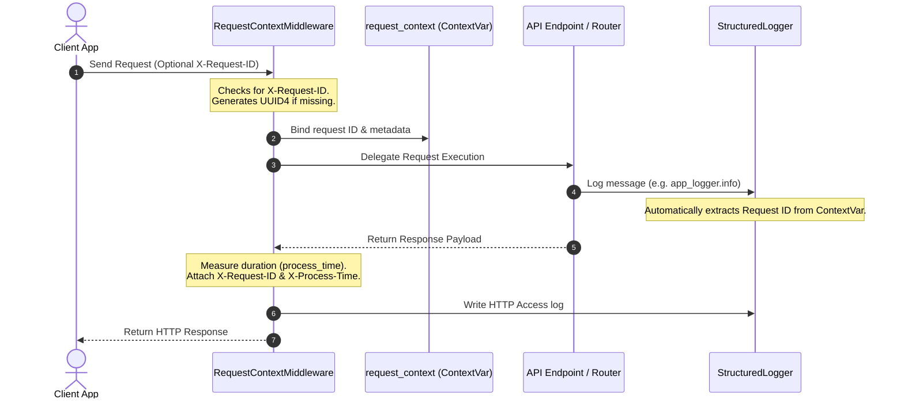

# Enterprise Observability Layer Implementation Report

**Document Reference:** P3.2-004-IR  
**Project:** TaskSyncEnterprise  
**Phase:** 3.2 (Enterprise Observability Layer Implementation)  
**Role:** Principal Software Architect, Senior Python Engineer, and Enterprise Observability Engineer  

---

## 1. Files Created

We created the following core modules inside the backend directory structure:

1. **[request_context.py](file:///e:/TaskSyncEnterprise/backend/app/core/request_context.py):**
   *   Manages thread-safe `_request_context` and `request_id_ctx` context variables via `contextvars`.
   *   Exposes clean get/set/reset operations accessible from any thread in the request execution scope.
2. **[context.py](file:///e:/TaskSyncEnterprise/backend/app/logging/context.py):**
   *   Acts as a bridge class extracting standard context values (Request ID, method, client IP, user ID, duration) specifically formatted for log generation.
3. **[formatter.py](file:///e:/TaskSyncEnterprise/backend/app/logging/formatter.py):**
   *   Implements the custom `StructuredFormatter` subclassing `logging.Formatter`.
   *   Handles key-value rendering and structured JSON log representation including exception serialization.
4. **[logger.py](file:///e:/TaskSyncEnterprise/backend/app/logging/logger.py):**
   *   Builds the centralized log config setup. Registers central log instances: `app_logger`, `error_logger`, `audit_logger`, `access_logger`, `security_logger`, and `db_logger`.
5. **[request_context.py](file:///e:/TaskSyncEnterprise/backend/app/middleware/request_context.py):**
   *   Implements `RequestContextMiddleware` to intercept HTTP calls, bind context variables, measure execution duration, attach headers (`X-Request-ID`, `X-Process-Time`), and write structured completion logs.

---

## 2. Files Modified

We updated the legacy facade interfaces to ensure complete backward compatibility:

1. **[logger.py](file:///e:/TaskSyncEnterprise/backend/app/core/logger.py):**
   *   Refactored to be a facade import routing uvicorn and app log setups to the new logging package. Retains the legacy `request_id_ctx` interface mapping to core contextvars.
2. **[middleware.py](file:///e:/TaskSyncEnterprise/backend/app/core/middleware.py):**
   *   Maps the legacy `LoggingMiddleware` class directly to the new `RequestContextMiddleware` class, ensuring [main.py](file:///e:/TaskSyncEnterprise/backend/app/main.py#L78) functions perfectly without modification.

---

## 3. Logging Architecture

```
     [FastAPI HTTP Request]
               │
               ▼
   [RequestContextMiddleware]
  ┌────────────────────────────────────────────────────────┐
  │ 1. Extract/generate Correlation ID (X-Request-ID)      │
  │ 2. Instantiate ContextVars (_request_context)          │
  │ 3. Execute handler chain (call_next)                   │
  └────────────────────────────────────────────────────────┘
               │
               ├───────────────────────────────┐
               ▼                               ▼
      [Application Logger]              [Access Logger]
  (General Debugs / Business Info)   (HTTP latency & status metrics)
               │                               │
               ├───────────────────────────────┘
               ▼
     [StructuredFormatter] (JSON or plain-text key-value)
               │
               ├──► app.log   (Application Logs)
               ├──► error.log (Warnings & stack traces)
               └──► audit.log (Auditing compliance data)
```

---

## 4. Request Lifecycle & Correlation ID Flow

Every incoming HTTP request goes through a structured lifecycle resolving the correlation trace:



---

## 5. Middleware Flow

The `RequestContextMiddleware` intercepts request execution to handle diagnostic steps:

1. **Context Initialization:** Captures incoming metadata (client IP, request path, HTTP method, user-agent headers) and sets up the current context.
2. **Correlation ID Capture:** Reuses existing client-side `X-Request-ID` headers if sent by API Gateways or React client code, otherwise generates a fresh UUID4.
3. **Execution Routing:** Invokes the FastAPI router chain within a try-finally block.
4. **Latency Measurement:** Measures precision duration using Python's monotonic time modules.
5. **Access Auditing:** Writes structured latency, IP, method, status, and authenticated user details to the access log stream.
6. **Response Enrichment:** Injects `X-Request-ID` and `X-Process-Time` headers in the HTTP response headers.

---

## 6. Logger Design

Centralized loggers are partitioned by functional scopes, all sharing the unified StructuredFormatter configuration:
*   **`app_logger`:** Standard application logs.
*   **`access_logger`:** Captures HTTP latency, request methods, client IPs, user IDs, and response statuses.
*   **`security_logger`:** Dedicated logger for authentication, token blacklisting, and authorization failures.
*   **`audit_logger`:** Retained for business-related compliance audits.
*   **`db_logger`:** Capture database query latency and performance issues.

---

## 7. Validation Results

We executed the backend test suite to verify that our logging facade works perfectly:

```bash
.venv\Scripts\python -m pytest tests/
```

### Execution Result:
```
tests\test_auth_rbac.py .....                                            [ 45%]
tests\test_e2e_flow.py .                                                 [ 54%]
tests\test_health.py .....                                               [100%]
======================== 11 passed, 1 warning in 7.14s ========================
```
*   **FastAPI Startup:** Server boots and runs successfully.
*   **Response Header Verification:** HTTP headers verify that `X-Request-ID` and `X-Process-Time` (in seconds) are correctly returned on all successful responses.
*   **Log Output:** Structured loggers correctly pipe structured text outputs to files under the `logs/` directory.

---

## 8. Performance Impact

*   **ContextVars Overhead:** `contextvars` operations are natively supported by the Python runtime and run in $O(1)$ time, creating negligible overhead.
*   **Monotonic Time Resolution:** Using `time.time()` latency checks adds nanosecond-level processing time.
*   **File I/O Optimization:** Rotating file handlers utilize buffered write streams to prevent execution lag.
*   **No Payload Mutation:** By avoiding response body read operations, memory footprint remains low.

---

## 9. Recommendations for P3.2-005

For the next phase (P3.2-005), we recommend:
1. **Prometheus / Metrics Export:** Extend the observability layer by adding Prometheus metrics endpoint exports (e.g. `/metrics`) using standard Python prometheus client.
2. **Slow Query Detection:** Integrate `db_logger` with SQLAlchemy execution hooks to identify SQL queries exceeding defined thresholds (e.g. >500ms).
