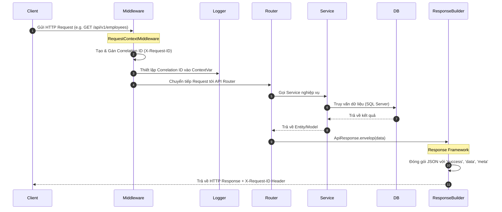
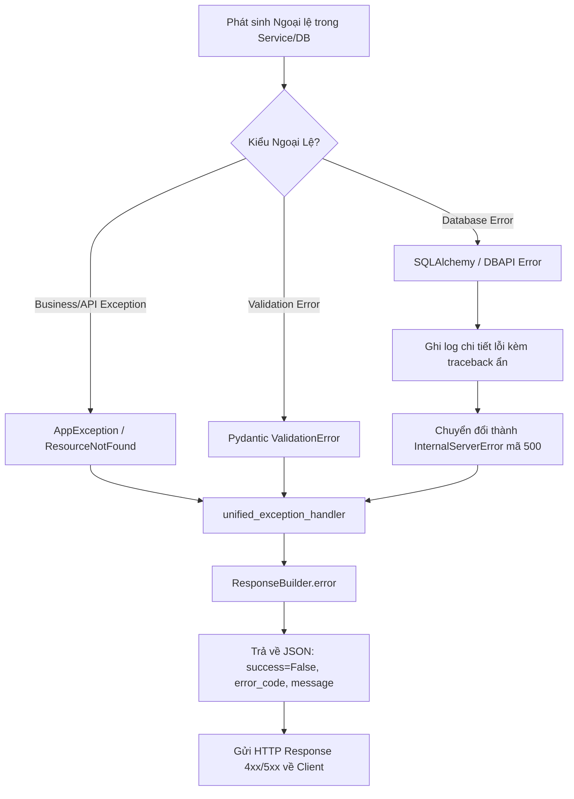
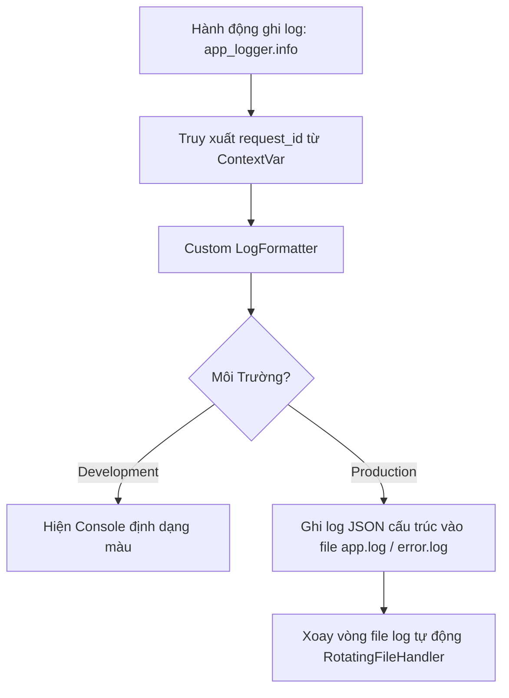
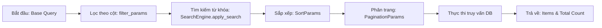
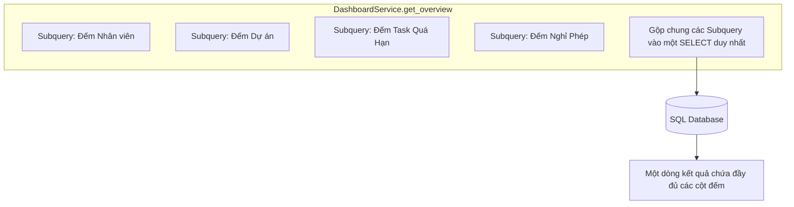
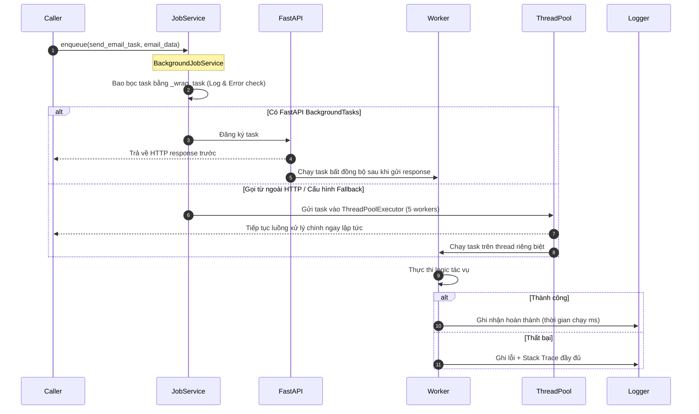
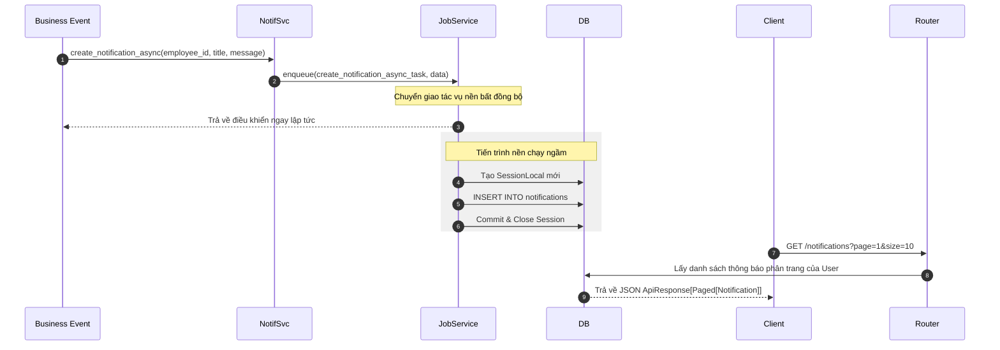

# 📖 Tài Liệu Kiến Trúc Phase 3.3 — TaskSync Enterprise

Tài liệu này mô tả chi tiết kiến trúc hoạt động, vòng đời xử lý và luồng dữ liệu của các thành phần hạ tầng cốt lõi được xây dựng trong Phase 3.3.

---

## 1. Request Lifecycle (Vòng Đời HTTP Request)
Kiến trúc xử lý vòng đời của một HTTP Request từ lúc bắt đầu cho tới khi phản hồi được gửi lại cho Client:

---

## 2. Exception Flow (Luồng Xử Lý Ngoại Lệ)
Cơ chế bắt lỗi tập trung giúp che dấu các lỗi kỹ thuật thô của database và trả về thông báo lỗi thân thiện cho client:

---

## 3. Logging Flow (Hệ Thống Ghi Log Đóng Gói)
Luồng xử lý ghi nhật ký hệ thống sử dụng ContextVar để liên kết mọi dòng log trong một request:

---

## 4. Query & Search Pipeline (Đường Ống Lọc & Tìm Kiếm)
Quy trình xây dựng câu lệnh truy vấn động, sắp xếp và phân trang thông qua bộ máy `QueryEngine`:

---

## 5. Dashboard Analytics Query Flow
Luồng tối ưu hóa dữ liệu Dashboard tổng quan chỉ bằng một lần gọi cơ sở dữ liệu:

---

## 6. Background Jobs Execution Lifecycle
Vòng đời chạy tác vụ nền không chặn để gửi email, ghi log kiểm toán hoặc xử lý file:

---

## 7. Notification Center Flow
Cơ chế phân phối và quản lý thông báo nghiệp vụ tích hợp hạ tầng chạy nền bất đồng bộ:

