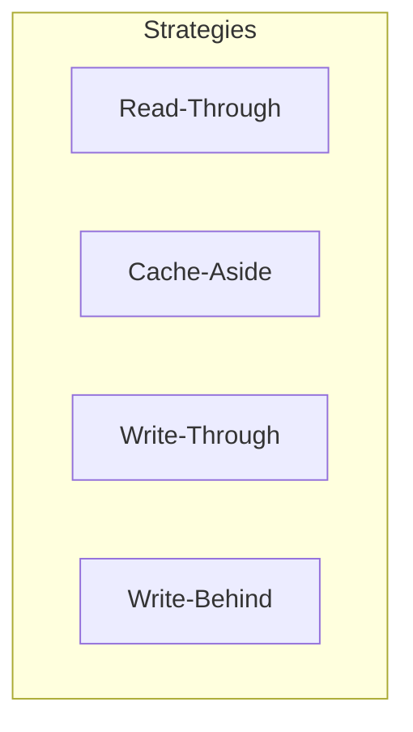
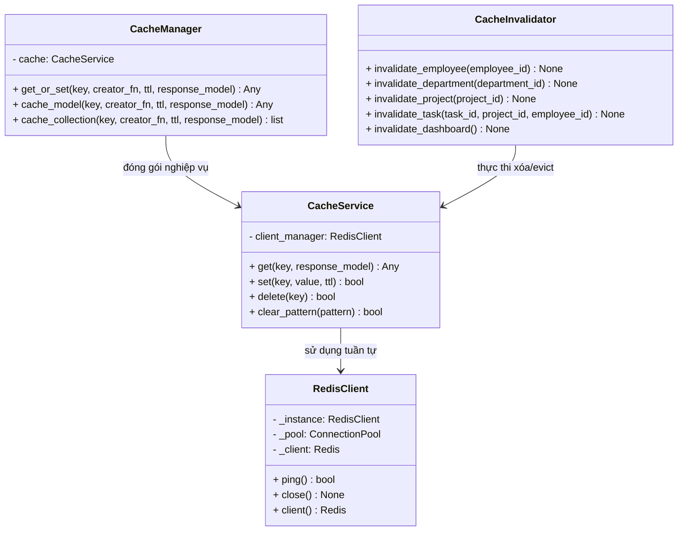
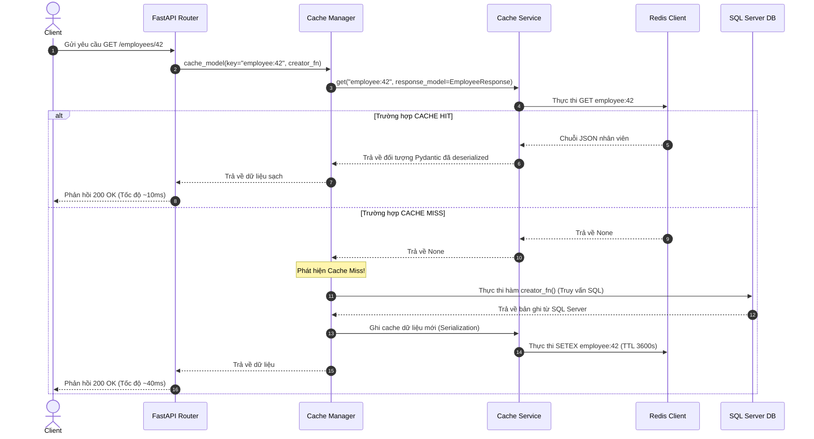
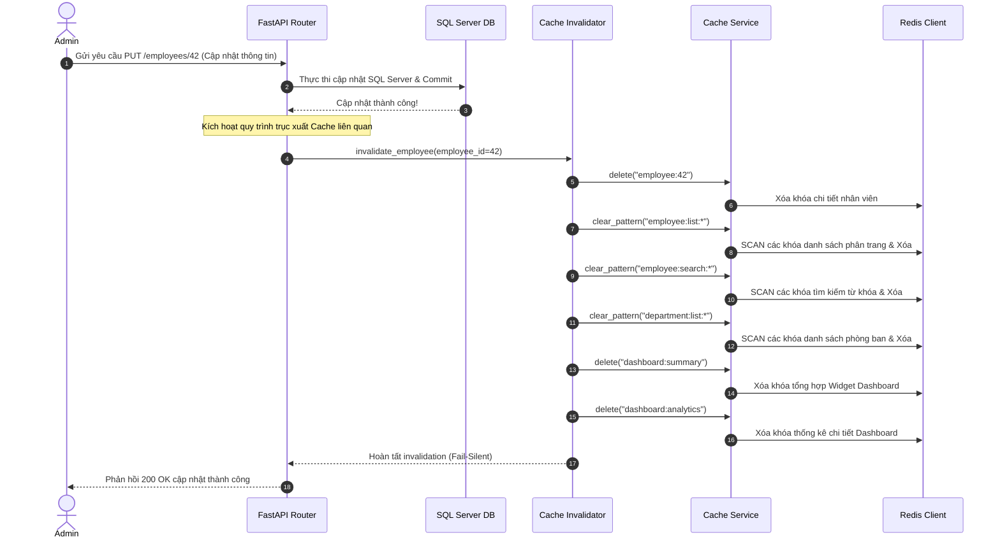

# Hướng Dẫn Kiến Trúc & Học Tập Redis Caching (TaskSyncEnterprise)

Tài liệu này cung cấp cái nhìn toàn diện về hệ thống bộ đệm dữ liệu (Caching) sử dụng Redis trong dự án TaskSyncEnterprise. Tài liệu được thiết kế dành cho các kỹ sư mới onboard, sinh viên nghiên cứu, và các nhà duy trì hệ thống trong tương lai.

---

## 1. Các Khái Niệm Cơ Bản Về Caching & Redis

### 1.1. Redis Là Gì?
**Redis (Remote Dictionary Server)** là một hệ thống lưu trữ cấu trúc dữ liệu mã nguồn mở, hoạt động hoàn toàn trên bộ nhớ RAM (In-Memory Data Structure Store). Khác với các hệ quản trị cơ sở dữ liệu quan hệ truyền thống (như SQL Server) lưu trữ dữ liệu trên đĩa cứng (Disk), Redis lưu toàn bộ dữ liệu trên RAM, giúp đạt tốc độ truy xuất cực nhanh (thời gian phản hồi dưới 1 mili-giây - sub-millisecond).
Redis hỗ trợ nhiều cấu trúc dữ liệu đa dạng như: Strings, Hashes, Lists, Sets, Sorted Sets, Bitmaps, v.v. Trong dự án TaskSyncEnterprise, chúng ta sử dụng kiểu **Strings** kết hợp với định dạng JSON để lưu trữ dữ liệu cached của các mô hình thực thể.

### 1.2. Redis Hoạt Động Như Thế Nào?
Redis hoạt động theo mô hình **Single-threaded Event Loop** sử dụng kỹ thuật I/O Multiplexing. Mặc dù chỉ chạy trên một luồng đơn để xử lý các lệnh tuần tự, Redis vẫn đạt hiệu năng cực cao (hàng trăm ngàn request/giây) nhờ tránh được chi phí chuyển đổi ngữ cảnh (Context Switching) giữa các luồng và cơ chế khóa (Locking) phức tạp.
Để tránh mất dữ liệu khi mất điện hoặc crash hệ thống, Redis cung cấp hai cơ chế ghi đĩa (Persistence):
*   **RDB (Redis Database Backup):** Ghi lại ảnh chụp nhanh (Snapshot) toàn bộ dữ liệu tại một thời điểm nhất định vào đĩa.
*   **AOF (Append Only File):** Ghi lại mọi thao tác ghi (Write commands) dưới dạng nhật ký tuần tự vào cuối file. Khi khởi động lại, Redis sẽ chạy lại các lệnh này để khôi phục trạng thái dữ liệu.

### 1.3. Cache Là Gì?
**Cache (Bộ nhớ đệm)** là một tầng lưu trữ dữ liệu tốc độ cao, tạm thời chứa một phần dữ liệu thường xuyên được truy xuất từ nguồn dữ liệu chính (Database). 
Caching hoạt động dựa trên nguyên lý **Locality of Reference (Tính cục bộ của tham chiếu)**:
*   **Temporal Locality (Cục bộ thời gian):** Một dữ liệu vừa được truy xuất có khả năng cao sẽ được truy xuất lại trong tương lai gần.
*   **Spatial Locality (Cục bộ không gian):** Các dữ liệu nằm gần dữ liệu vừa truy xuất cũng có khả năng cao sẽ được truy xuất (ví dụ: các dòng tiếp theo trong trang phân trang).

---

## 2. Các Chiến Lược Caching Phổ Biến

Trong thiết kế hệ thống phần mềm, có 4 chiến lược đọc/ghi cache kinh đoán:

### 2.1. Read-Through Cache
Ứng dụng tương tác với tầng bộ đệm thông qua một **Cache Manager** duy nhất. Tầng ứng dụng coi Cache Manager là nguồn dữ liệu chính.
*   **Luồng hoạt động:** Ứng dụng yêu cầu dữ liệu từ Cache Manager. Nếu dữ liệu có trong cache (Cache Hit), trả về ngay. Nếu không có (Cache Miss), Cache Manager tự động truy vấn database, nạp dữ liệu vào cache, rồi trả về cho ứng dụng.
*   **Ưu điểm:** Tách biệt hoàn toàn logic cache ra khỏi code nghiệp vụ API; code gọn gàng, dễ bảo trì.
*   **Ứng dụng:** Đây là chiến lược được áp dụng chính trong **TaskSyncEnterprise**.

### 2.2. Cache-Aside (Lazy Loading)
Tầng ứng dụng tự chịu trách nhiệm tương tác trực tiếp với cả cache và database.
*   **Luồng hoạt động:** Ứng dụng tự kiểm tra dữ liệu trong cache. Nếu có, trả về. Nếu không, ứng dụng tự query database, tự ghi dữ liệu đó vào cache rồi mới trả về.
*   **Khác biệt với Read-Through:** Ở Cache-Aside, logic xử lý cache miss nằm trực tiếp ở code nghiệp vụ của ứng dụng thay vì được đóng gói bên trong lớp Cache Manager độc lập.

### 2.3. Write-Through
Dữ liệu được ghi đồng thời vào cả cache và database trước khi hệ thống trả về kết quả thành công cho client.
*   **Ưu điểm:** Đảm bảo dữ liệu trong cache luôn cập nhật nhất và đồng nhất với database.
*   **Nhược điểm:** Tốc độ ghi chậm hơn vì phải thực thi hai thao tác I/O đồng bộ.

### 2.4. Write-Behind (Write-Back)
Ứng dụng chỉ ghi dữ liệu vào cache và lập tức phản hồi thành công cho client. Sau đó, một tiến trình chạy nền (Background Worker) sẽ gom dữ liệu từ cache và đồng bộ bất đồng bộ (Asynchronously) xuống database sau.
*   **Ưu điểm:** Tốc độ ghi cực kỳ nhanh, giảm tải áp lực tức thời cho database.
*   **Nhược điểm:** Nguy cơ mất dữ liệu cao nếu cache crash trước khi tiến trình đồng bộ kịp chạy.

---

## 3. Các Cơ Chế & Thuật Ngữ Nâng Cao Trong Enterprise Cache

### 3.1. Cache Invalidation (Trục xuất Cache)
Là hành động xóa bỏ dữ liệu cũ khỏi cache khi dữ liệu tương ứng trong database bị thay đổi (bởi các lệnh ghi POST, PUT, PATCH, DELETE). Mục đích là ngăn chặn tình trạng trả về dữ liệu cũ (Stale Data) cho client.

### 3.2. TTL (Time-To-Live - Thời gian sống)
Mỗi key lưu trong Redis đều được thiết lập một khoảng thời gian sống cụ thể (ví dụ: 1800 giây). Sau khi hết khoảng thời gian này, Redis sẽ tự động giải phóng key đó khỏi bộ nhớ. Đây là chốt chặn bảo mật giúp dữ liệu tự động làm mới nếu logic invalidation gặp sự cố.

### 3.3. Cache Key Design (Thiết kế khóa)
Trong môi trường Enterprise, khóa phải được thiết kế phân cấp, rõ ràng để tránh xung đột key (Key Collision). Định dạng tiêu chuẩn sử dụng dấu hai chấm (`:`) làm dấu phân tách:
`[tên_thực_thể]:[phân_loại]:[tham_số_1]:[tham_số_2]`
*   *Ví dụ detail:* `employee:42` (thông tin nhân viên ID 42).
*   *Ví dụ list:* `employee:list:0:20` (trang danh sách nhân viên offset 0, limit 20).

### 3.4. Serialization & Deserialization
Vì Redis chỉ lưu chuỗi ký tự thô (thông qua kiểu String), tầng ứng dụng phải chuyển đổi đối tượng Python (SQLAlchemy model, Pydantic schema) thành chuỗi JSON trước khi ghi vào Redis (Serialization) và chuyển ngược lại từ JSON thành đối tượng Python khi đọc ra (Deserialization).

### 3.5. Cache Stampede & Thundering Herd (Quá tải dồn dập)
Xảy ra khi một key rất hot (nhiều lượng truy cập cùng lúc) bị hết hạn hoặc bị xóa. Tại thời điểm đó, hàng trăm request đồng thời gặp Cache Miss, tất cả cùng lúc gửi truy vấn xuống Database để lấy dữ liệu mới và cùng ghi vào cache. Điều này có thể làm treo database Server hoặc đẩy CPU lên 100%.

### 3.6. Fail-Silent Policy (Chính sách lỗi im lặng)
Nguyên tắc thiết kế hệ thống quy định rằng: **Sự cố của tầng Caching không bao giờ được phép làm sập ứng dụng chính.** Nếu kết nối tới Redis bị ngắt hoặc Redis bị sập, hệ thống sẽ tự động bắt ngoại lệ, ghi log cảnh báo (Warning), bỏ qua cache (Bypass) và truy cập thẳng xuống Database để phục vụ người dùng. Giao dịch mua bán/CRUD nghiệp vụ không được phép rollback chỉ vì không ghi được cache.

### 3.7. Connection Pool (Hồ kết nối)
Quá trình thiết lập kết nối TCP tới Redis (bao gồm bắt tay 3 bước và xác thực mật khẩu) rất tốn kém thời gian. Connection Pool duy trì sẵn một danh sách các kết nối mở tới Redis. Khi ứng dụng cần thực thi lệnh, nó sẽ "mượn" một kết nối từ pool và "trả" lại ngay sau khi hoàn thành thao tác, tối ưu hóa tối đa hiệu năng mạng.

---

## 4. Kiến Trúc Caching Trong TaskSyncEnterprise

### 4.1. Vì Sao TaskSyncEnterprise Chọn Read-Through Caching?
Chúng tôi chọn chiến lược Read-Through vì nó giúp **đóng gói hoàn toàn logic quản lý cache** trong lớp `CacheManager`. API routers không cần biết dữ liệu được lấy từ Redis hay SQL Server, chúng chỉ cần gọi `cache_manager.cache_collection` hoặc `cache_manager.cache_model` và truyền vào một hàm nạp cơ sở dữ liệu (`creator_fn`). Code của API hoàn toàn sạch bóng các khối lệnh `try-except` hay kiểm tra Redis thủ công.

### 4.2. Vì Sao Không Sử Dụng Các Thư Viện FastAPI Cache Có Sẵn?
Các thư viện có sẵn (như `fastapi-cache2`) thường sử dụng decorators bao quanh router. Tuy nhiên, chúng gặp các hạn chế lớn trong môi trường Enterprise:
1.  **Khó khăn trong Invalidation có điều kiện:** Trục xuất cache phức tạp (ví dụ: khi cập nhật nhân viên, ta cần xóa cả danh sách phòng ban, dự án và dashboard) rất khó cấu hình bằng decorator đơn giản.
2.  **Xử lý kiểu dữ liệu đặc thù:** SQLAlchemy models chứa các quan hệ nạp lười (Lazy loading relationships), kiểu dữ liệu `datetime` múi giờ UTC, hoặc khóa ngoại dạng `UUID` thường gây lỗi crash khi thư viện ngoài tự động serialization.
3.  **Khóa đồng bộ (Synchronous Blocking):** Hầu hết thư viện ngoài ép buộc dùng async hoàn toàn, trong khi hệ thống TaskSyncEnterprise sử dụng kiến trúc SQLAlchemy ORM đồng bộ trên các luồng luân phiên.

### 4.3. Sơ Đồ Kiến Trúc Lớp Caching

---

## 5. Luồng Hoạt Động Chi Tiết (Sequence Diagrams)

### 5.1. Luồng Truy Vấn Dữ Liệu (Read-Through Caching)

---

### 5.2. Luồng Trục Xuất Bộ Đệm (Cache Invalidation)

Khi có một thao tác ghi, luồng trục xuất cascading diễn ra để đảm bảo tính nhất quán dữ liệu tức thì:

