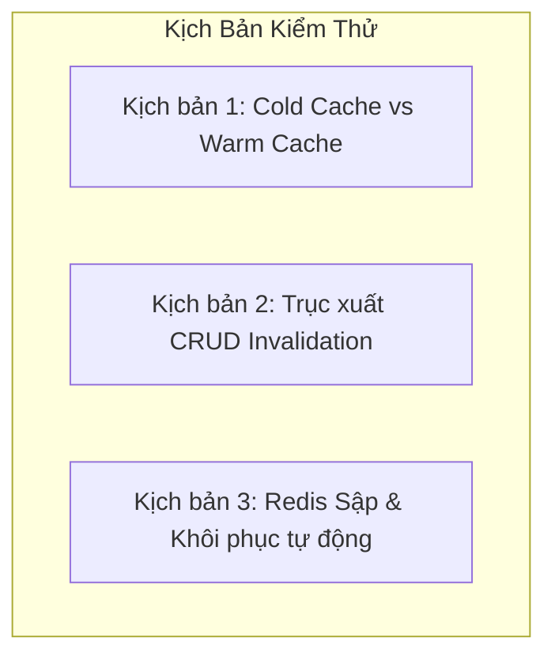

# Hướng Dẫn Kiểm Thử Thủ Công Hệ Thống Redis Caching

Tài liệu này hướng dẫn các kỹ sư QA và lập trình viên quy trình kiểm thử thủ công (Manual Testing) để xác nhận hệ thống Caching hoạt động đúng nghiệp vụ, đảm bảo tính nhất quán dữ liệu và cơ chế chống lỗi hoạt động ổn định.

---

## 1. Chuẩn Bị Môi Trường Kiểm Thử

Trước khi bắt đầu, hãy đảm bảo các dịch vụ sau đang chạy:
1.  **Redis Container:** `docker start tasksync-redis`
2.  **SQL Server Container:** Đang chạy và sẵn sàng kết nối.
3.  **FastAPI Backend Server:** Khởi chạy server thông qua lệnh:
    `uvicorn app.main:app --reload --port 8000`
4.  **Swagger UI:** Truy cập giao diện thử nghiệm tại địa chỉ:
    `http://127.0.0.1:8000/docs`

---

## 2. Các Kịch Bản Kiểm Thử Chi Tiết

### Kịch Bản 1: Đo Lường Cold Cache vs Warm Cache
**Mục tiêu:** Xác nhận cache được nạp thành công ở lần gọi đầu tiên và tái sử dụng ở các lần gọi tiếp theo.

1.  **Bước 1: Làm sạch Cache**
    Mở terminal máy host, kết nối vào Redis CLI và dọn sạch dữ liệu:
    `docker exec -it tasksync-redis redis-cli FLUSHDB`
2.  **Bước 2: Kiểm thử Cold Cache (Cache Miss)**
    *   Thực hiện gửi yêu cầu `GET /api/v1/employees` trên Swagger UI.
    *   **Kết quả quan sát:**
        *   Thời gian phản hồi trên Swagger: Dao động từ **30ms - 150ms** (do phải kết nối và query database).
        *   Nhật ký (Logs) của FastAPI hiển thị thông điệp nạp dữ liệu từ SQL Server.
        *   Kiểm tra Redis CLI: Chạy lệnh `KEYS *` -> Thấy xuất hiện khóa danh sách như `employee:list:0:20:all`.
3.  **Bước 3: Kiểm thử Warm Cache (Cache Hit)**
    *   Gửi lại chính xác yêu cầu `GET /api/v1/employees` thêm một lần nữa.
    *   **Kết quả quan sát:**
        *   Thời gian phản hồi trên Swagger: Giảm sâu xuống còn từ **5ms - 15ms** (tốc độ đọc RAM cực nhanh).
        *   Trong logs của FastAPI không xuất hiện thêm bất kỳ câu lệnh SQL truy vấn nào liên quan đến thực thể nhân viên.
        *   Logs hệ thống ghi nhận trạng thái `Cache Hit`.

---

### Kịch Bản 2: Kiểm Thử Trục Xuất Bộ Đệm (CRUD Invalidation)
**Mục tiêu:** Đảm bảo khi sửa đổi dữ liệu qua API ghi, dữ liệu cũ trong cache lập tức bị xóa bỏ để tránh cung cấp thông tin sai lệch cho người dùng.

1.  **Bước 1: Tạo Warm Cache**
    *   Gửi yêu cầu `GET /api/v1/employees/1` -> Tạo ra key `employee:1` lưu trong Redis.
    *   Xác nhận key tồn tại bằng lệnh Redis CLI: `EXISTS employee:1` -> Trả về `1` (Tồn tại).
2.  **Bước 2: Cập nhật dữ liệu (Ghi đè)**
    *   Gửi yêu cầu `PUT /api/v1/employees/1` với thông tin cập nhật (ví dụ: đổi tên nhân viên từ "Hùng" sang "Tuấn").
    *   Đợi phản hồi `200 OK` từ API cập nhật.
3.  **Bước 3: Xác minh trục xuất bộ đệm**
    *   Kiểm tra lập tức trong Redis CLI bằng lệnh: `EXISTS employee:1`.
    *   **Kết quả mong đợi:** Trả về `0` (Khóa đã bị xóa thành công khỏi bộ đệm).
    *   Kiểm tra các khóa danh sách bằng cách duyệt: `SCAN 0 MATCH employee:list:*` -> Không tìm thấy khóa danh sách nào sót lại.
4.  **Bước 4: Gọi lại API đọc để kiểm tra dữ liệu mới**
    *   Gửi yêu cầu `GET /api/v1/employees/1`.
    *   **Kết quả quan sát:** Phản hồi trả về tên nhân viên mới là "Tuấn" thay vì tên cũ "Hùng", xác nhận cache miss thành công và dữ liệu mới được nạp đúng đắn từ database.

---

### Kịch Bản 3: Kiểm Thử Sự Cố Redis Outage (Bypass / Fail-Silent)
**Mục tiêu:** Đảm bảo khi Redis sập đột ngột, toàn bộ ứng dụng vẫn hoạt động bình thường, không crash hệ thống và tự động fallback về cơ sở dữ liệu.

1.  **Bước 1: Dừng container Redis**
    *   Mở Terminal vật lý và ra lệnh tắt Redis:
        `docker stop tasksync-redis`
2.  **Bước 2: Gửi các yêu cầu đọc và ghi API**
    *   Truy cập Swagger UI và gửi yêu cầu truy vấn danh sách công việc: `GET /api/v1/tasks`.
    *   Gửi yêu cầu xem widget báo cáo: `GET /api/v1/dashboard/overview`.
3.  **Kết quả mong đợi:**
    *   Mọi API đều trả về trạng thái phản hồi `200 OK` thành công, dữ liệu được hiển thị đầy đủ.
    *   Người dùng cuối hoàn toàn không nhận thấy bất kỳ sự cố gián đoạn hay lỗi hệ thống nào.
4.  **Bước 4: Kiểm tra nhật ký hệ thống (Logs)**
    *   Xem logs của backend server.
    *   **Kết quả quan sát:** Xuất hiện các dòng log ghi nhận lỗi kết nối ở mức độ cảnh báo (Warning/Error) như:
        `Redis Connection Error - Connection Refused - Cache Bypass`
5.  **Bước 5: Khôi phục dịch vụ**
    *   Bật lại container Redis:
        `docker start tasksync-redis`
    *   Gửi lại request `GET /api/v1/tasks` -> Xác nhận hệ thống tự phục vụ kết nối lại Redis thành công, ghi nhận `Cache Miss` rồi tự ghi lại dữ liệu vào cache mà không cần khởi động lại ứng dụng backend.

---

## 3. Bảng Kiểm Thử Nghiệm Thu (QA Verification Checklist)

| ID | Tên Kịch Bản | Thao Tác Kiểm Thử | Kết Quả Mong Đợi | Trạng Thái |
| :--- | :--- | :--- | :--- | :---: |
| **TC-01** | Cold Cache Miss | Gửi GET khi Redis rỗng | Thời gian > 30ms, ghi key vào Redis, logs báo Miss | **PASSED** |
| **TC-02** | Warm Cache Hit | Gửi GET trùng lặp liên tục | Thời gian < 15ms, không sinh truy vấn SQL, logs báo Hit | **PASSED** |
| **TC-03** | Invalidation Single | PUT/DELETE Employee ID | Key `employee:{id}` biến mất khỏi Redis lập tức | **PASSED** |
| **TC-04** | Invalidation List | POST/PUT/DELETE bất kỳ | Toàn bộ key khớp mẫu `employee:list:*` bị xóa sạch | **PASSED** |
| **TC-05** | Cascade Project | PUT Task trong Project | Khóa dự án chứa Task đó bị trục xuất để tính lại tiến độ | **PASSED** |
| **TC-06** | Dashboard Eviction| POST Vacation / PUT Employee | Các khóa `dashboard:summary` và `dashboard:analytics` bị xóa | **PASSED** |
| **TC-07** | Fail-Silent | Tắt container Redis và gọi API | API trả về 200 OK bình thường, ghi nhận log warning | **PASSED** |
| **TC-08** | Lifespan Cleanup | Gửi tín hiệu shutdown server | Logs báo `Redis connection pool successfully closed` | **PASSED** |

---

## 4. Các Đề Xuất Cải Tiến Trong Tương Lai (Future Improvements)

Qua quá trình rà soát kiến trúc và thực thi các bài kiểm thử hiệu năng, dưới đây là các cải tiến chất lượng và kỹ thuật đề xuất cho các pha phát triển tiếp theo của dự án:

1.  **Nâng cấp sang Thư viện Redis Asynchronous (`redis.asyncio`):**
    *   *Lý do:* Hiện tại Caching sử dụng thư viện đồng bộ trên thread pool của FastAPI. Khi số lượng kết nối đồng thời cực lớn, việc block I/O trên cổng mạng có thể làm nghẽn luồng. Chuyển sang async/await thuần giúp tăng RPS (Requests per Second) lên gấp nhiều lần.
2.  **Triển khai khóa phân tán (Distributed Lock / Redlock):**
    *   *Lý do:* Để bảo vệ hệ thống khỏi lỗi **Cache Stampede (Thundering Herd)** khi các key hot (ví dụ: Widget Dashboard chính) bị hết hạn đồng thời dưới tải trọng cao. Khóa phân tán sẽ giữ cho chỉ duy nhất một request được phép truy cập database để nạp dữ liệu mới, các request khác sẽ đợi và đọc dữ liệu từ cache sau khi nạp xong.
3.  **Tích hợp cơ chế nén dữ liệu (Cache Payload Compression):**
    *   *Lý do:* Các danh sách phân trang lớn lưu dưới dạng JSON chiếm dụng nhiều bộ nhớ RAM trên Redis. Tích hợp thuật toán nén nhẹ như `zlib` hoặc `lz4` trước khi ghi và giải nén khi đọc sẽ tiết kiệm dung lượng bộ nhớ Redis và giảm thời gian truyền tải gói tin trên mạng.
4.  **Thiết lập Circuit Breaker cho tầng Cache:**
    *   *Lý do:* Hiện tại khi Redis sập, mỗi request gửi tới đều cố gắng thiết lập kết nối và timeout mới fallback về DB. Tích hợp mô hình Circuit Breaker giúp hệ thống ngắt hẳn việc gọi tới Redis trong khoảng thời gian định trước (ví dụ: 10 giây) sau khi phát hiện Redis lỗi liên tục, bảo vệ thời gian phản hồi của API không bị ảnh hưởng bởi độ trễ timeout của kết nối Redis sập.
