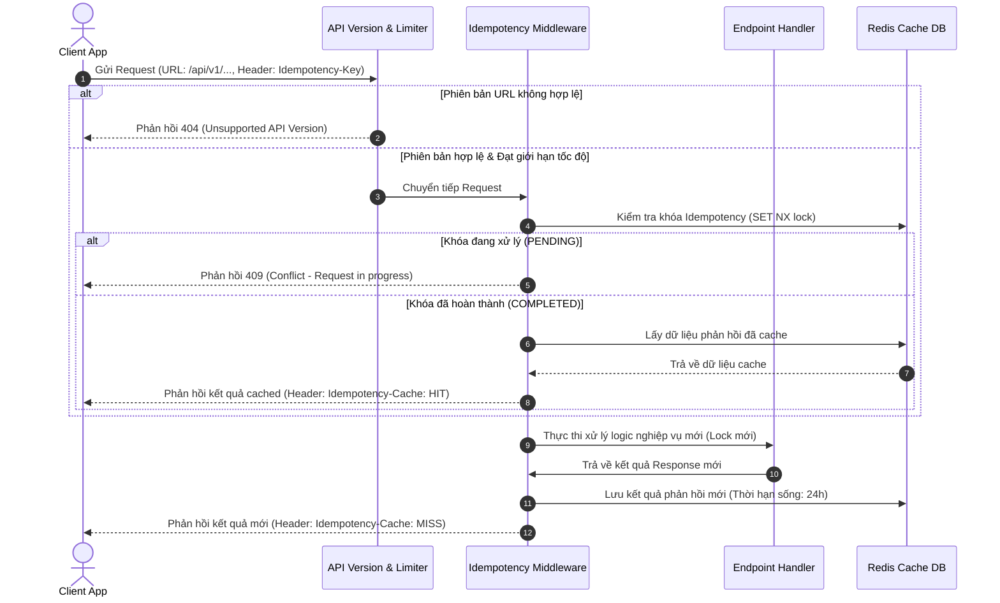

# Hướng Dẫn Quản Trị API (API Governance Guide)

Tài liệu này cung cấp các tiêu chuẩn thiết kế, hướng dẫn vận hành và cấu trúc hoạt động của lớp Quản trị API (API Governance) trong hệ thống `TaskSyncEnterprise`.

---

## 🔍 1. Tổng Quan (Overview) & Mục Đích (Purpose)
Để đảm bảo hệ thống API hoạt động ổn định, bảo mật cao và tương thích ngược (backward compatibility) lâu dài cho các đối tác doanh nghiệp, lớp Quản trị API thực thi 3 chính sách cốt lõi:
1. **Phân Phiên Bản API (API Versioning)**: Cách ly các phiên bản phát hành qua các tiền tố URL `/api/vX/`.
2. **Đảm Bảo Tính Nhất Quán (Idempotency)**: Ngăn ngừa việc thực thi lặp lại các yêu cầu thay đổi trạng thái lặp dữ liệu (`POST`, `PUT`, `PATCH`) dưới điều kiện mạng chập chờn hoặc người dùng click đúp.
3. **Quản Lý Vòng Đời Sunset/Khấu Hao (API Deprecation)**: Tự động thông báo ngày hết hạn và URL thay thế cho các ứng dụng khách thông qua các HTTP Response Header tiêu chuẩn.

---

## 📐 2. Kiến Trúc (Architecture) & Quy Trình (Workflow)



---

## ⚙️ 3. Các Class Quan Trọng (Important Classes) & Cấu Hình (Configuration)

### Các Class Cốt Lõi
* **`APIVersionMiddleware`** ([api_version.py](file:///e:/TaskSyncEnterprise/backend/app/middleware/api_version.py)): Chốt chặn kiểm tra tiền tố phiên bản URL.
* **`IdempotencyMiddleware`** ([idempotency.py](file:///e:/TaskSyncEnterprise/backend/app/middleware/idempotency.py)): Quản lý trạng thái khóa trùng lắp nghiệp vụ thông qua cơ chế Redis.
* **`APIDeprecationMiddleware`** ([deprecation.py](file:///e:/TaskSyncEnterprise/backend/app/middleware/deprecation.py)): Tiêm (inject) các header hết hạn và chuyển đổi URL successor vào HTTP response.
* **`@deprecate_endpoint`**: Decorator đánh dấu Metadata khấu hao trực tiếp trên API router.

### Tham Số Cấu Hình (`settings.py`)
```python
SUPPORTED_API_VERSIONS = ["v1"]             # Danh sách phiên bản API được hỗ trợ
IDEMPOTENCY_TTL_SECONDS = 86400             # Thời hạn lưu cache phản hồi (24 giờ)
```

---

## 🧪 4. Kiểm Thử (Testing) & Khắc Phục Sự Cố (Troubleshooting)

### Lệnh Chạy Kiểm Thử Tự Động
```bash
.venv\Scripts\python -m pytest tests/test_api_versioning.py tests/test_idempotency.py
```

### Khắc Phục Sự Cố (Troubleshooting)
> [!WARNING]
> **Lỗi 409 Conflict liên tục trên API**:
> * *Nguyên nhân*: Client gửi các request đồng thời rất nhanh mang cùng một khóa `Idempotency-Key` khi request trước chưa xử lý xong (lock PENDING đang giữ).
> * *Khắc phục*: Tích hợp cơ chế chờ / retry phía Client hoặc đảm bảo sinh UUID ngẫu nhiên cho mỗi giao dịch nghiệp vụ khác nhau.

---

## 💡 5. Hạn Chế Đã Biết (Known Limitations) & Thực Hành Tốt Nhất (Best Practices)

* **Hạn chế**: Bộ nhớ cache Idempotency lưu trữ toàn bộ nội dung body phản hồi (kể cả nhị phân/hình ảnh) vào Redis. Mặc dù đã nén mã hóa Base64, việc lạm dụng trên các API tải file lớn có thể gây phình dung lượng RAM của Redis.
* **Thực hành tốt nhất**: Chỉ sử dụng header `Idempotency-Key` trên các yêu cầu thay đổi tài sản dữ liệu nghiệp vụ quan trọng (`POST`, `PUT`, `PATCH`). Bỏ qua trên các API truy vấn tĩnh (`GET`).
