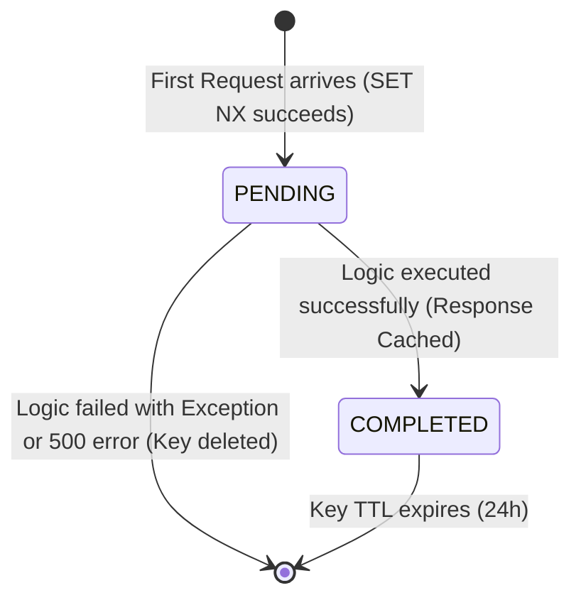

# Enterprise Request Idempotency Governance

To prevent double-execution of mutation logic (such as creating double payments, duplicate tasks, or overlapping logs), TaskSyncEnterprise enforces request idempotency based on unique client keys.

---

## ⚙️ How it works
1. **Methods**: Enforced only for mutation operations (`POST`, `PUT`, `PATCH`). Requests using `GET` and `DELETE` bypass this check.
2. **Header**: Clients must pass a unique string key in the `Idempotency-Key` header (e.g. a UUIDv4).
3. **Storage**: Redis holds the lock status and completed responses.
4. **TTL**: The keys expire automatically after **24 hours** (`86400` seconds), configurable via `IDEMPOTENCY_TTL_SECONDS` setting.

---

## 🔄 Lifecycle States in Redis



1. **PENDING Lock**:
   * When a request starts, Redis sets `idempotency:{user}:{key}` to `{"status": "PENDING"}` atomically using `SET NX`.
   * If a concurrent request with the same key arrives, it sees the `PENDING` state and **polls** Redis (up to 5 seconds) waiting for completion.
2. **COMPLETED Cache**:
   * After successful execution, the middleware serializes the status code, response headers, and base64-encoded body into Redis, transitioning the key state to `COMPLETED`.
   * When a subsequent or polling request reads the `COMPLETED` cache, it reconstructs the response, injects `Idempotency-Cache: HIT` header, and returns it immediately.
3. **Fail-Safe Cleanup**:
   * If the execution crashes or returns a `5xx` error, the Redis key is deleted immediately, enabling clients to retry the request.

---

## 📡 Example Response Header

When a request is fulfilled from the idempotency cache, the client receives:

```http
Idempotency-Cache: HIT
X-Idempotency-Cache: HIT
```
If a second request arrives concurrently before the first one completes, and times out after 5 seconds, it receives:
* **Status**: `409 Conflict`
* **Body**:
```json
{
    "success": false,
    "message": "A concurrent request is already processing this idempotency key.",
    "error_code": "CONCURRENT_REQUEST"
}
```
