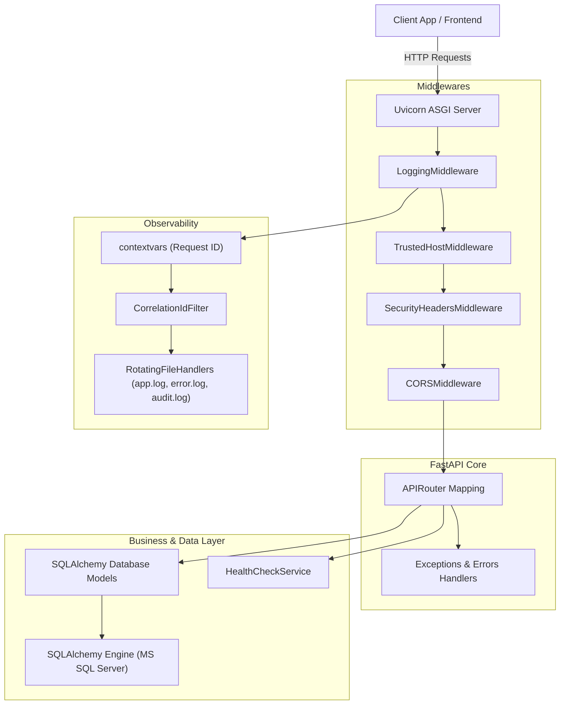
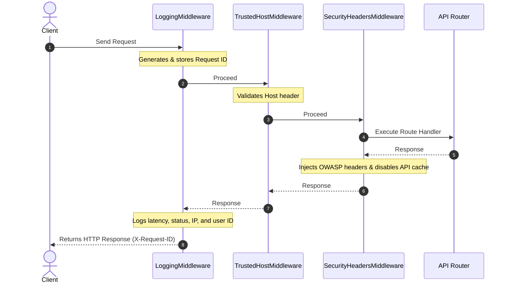
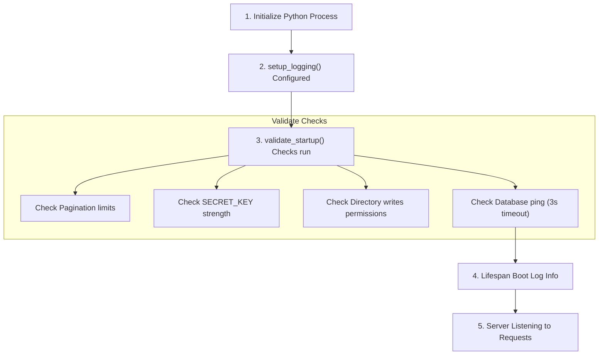
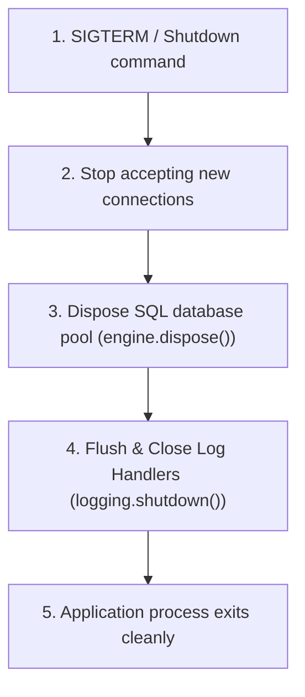

# TaskSyncEnterprise V2 Backend Architecture Blueprint

This document details the overall architecture, folder layouts, and system lifecycles of the TaskSyncEnterprise backend.

---

## 1. Overall System Architecture
The backend is structured around a decoupled layers model. Requests enter via the ASGI web server, process through multiple middleware layers, and hit the API routers. The router calls specific database queries or business operations before returning the response.



---

## 2. Directory Layout & Folder Structure

```
backend/
├── app/
│   ├── config.py              # Central Settings (Pydantic Settings V2)
│   ├── main.py                # App entrypoint & Lifespan configurations
│   ├── database.py            # Session mapping & SQLAlchemy connection setup
│   ├── models/                # SQLAlchemy database models
│   ├── routers/               # APIRouters
│   │   └── v1/
│   │       ├── health.py      # Health checkpoints (Probes)
│   │       └── auth.py        # Authentication
│   ├── core/
│   │   ├── logger.py          # Central logging config & filters
│   │   ├── middleware.py      # HTTP Logging, Security, and Cache Middlewares
│   │   ├── errors.py          # Global exception handlers
│   │   └── exceptions.py      # Custom business exceptions
│   └── services/
│       ├── health_service.py  # Diagnostic check logic & metrics registry
│       └── storage_service.py # Storage management
├── tests/                     # Unit and integration test suites
├── requirements.txt           # Lock dependencies
└── alembic.ini                # Migrations setup
```

---

## 3. Lifecycles & Flow Charts

### Request & Middleware Lifecycle
This diagram illustrates the sequence of middlewares a request passes through:



---

### Startup Lifecycle Flow
This diagram details the startup sequence that runs before the FastAPI server begins accepting requests:



---

### Shutdown Lifecycle Flow
This diagram illustrates how resources are released during a graceful shutdown:


