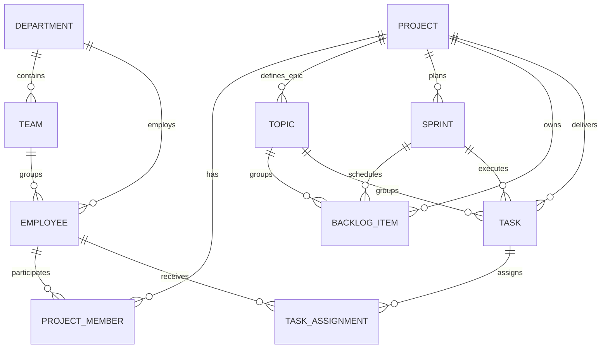
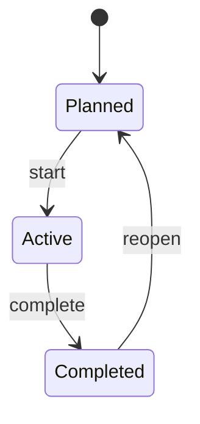

# Mô hình nghiệp vụ

## Quan hệ tổ chức và Agile

## Ý nghĩa thống nhất

- **Project:** mục tiêu/sản phẩm lớn do một hoặc nhiều phòng ban thực hiện.
- **Topic/Epic:** nhóm chức năng lớn nằm trong Project. Product Backlog có thể gắn Epic để gom các User Story liên quan.
- **Backlog Item/User Story:** yêu cầu có giá trị nghiệp vụ, ưu tiên và story point; có thể được đưa vào Sprint rồi chuyển thành Task.
- **Sprint:** timebox chứa tổng hợp công việc được cam kết. Sprint thuộc đúng một Project.
- **Task:** đơn vị thực thi có người phụ trách, trạng thái, deadline và story point.
- **Department/Team:** phạm vi tổ chức. Team Leader có quyền quản lý Task trong phạm vi truy cập dự án; Employee thông thường chỉ đọc thông tin quản lý và cộng tác theo quyền.

## Invariant quan trọng

1. Task, Sprint, Backlog và Epic được gắn với cùng một Project.
2. Không gắn công việc vào Sprint đã hoàn tất/đóng nếu chưa reopen theo workflow.
3. Thành viên được giao Task phải có quyền truy cập Project.
4. Tổng story point của Sprint là tổng các item/task được đưa vào Sprint; capacity là giới hạn lập kế hoạch.
5. Xóa nghiệp vụ dùng soft delete khi model hỗ trợ để giữ audit.
6. Employee không tự thay đổi dữ liệu quản lý Task; Admin, Manager hoặc Team Leader hợp lệ mới có quyền mutation.

## Trạng thái dữ liệu

Task sử dụng `To Do`, `In Progress`, `Done`. Frontend phải gửi đúng chuỗi canonical của backend.
