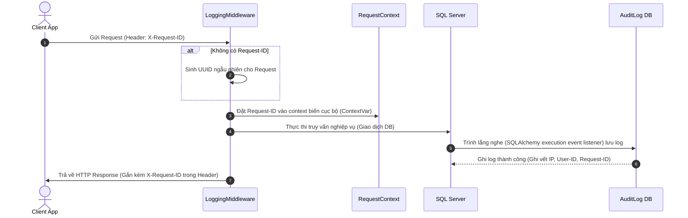

# Hướng Dẫn Kiến Trúc Hệ Thống (Backend Architecture Guide)

Tài liệu này thuyết minh toàn bộ mô hình kiến trúc, cấu trúc thư mục, quy tắc thiết kế cơ sở dữ liệu và hạ tầng ghi nhật ký (logging) của hệ thống `TaskSyncEnterprise`.

---

## 🔍 1. Tổng Quan (Overview) & Mục Đích (Purpose)

Kiến trúc backend của `TaskSyncEnterprise` tuân thủ nguyên lý **Clean Architecture** và các ràng buộc kỹ thuật khắt khe đối với ứng dụng doanh nghiệp:
* **Tương thích MS SQL Server**: Định dạng cột chuỗi unicode và cấu hình thời gian mặc định UTC phù hợp với SQL Server (`SYSUTCDATETIME()`).
* **Xóa Mềm (Soft Delete)**: Tuyệt đối không xóa vật lý bản ghi nghiệp vụ khỏi ổ đĩa. Toàn bộ thực thể kế thừa từ `AuditMixin` đều được đánh dấu cờ xóa mềm.
* **Đồng Bộ Dấu Vết (Telemetry Context)**: Mọi log ghi lại đều được đính kèm `X-Request-ID` độc bản xuyên suốt từ lúc bắt đầu request đến khi kết thúc nghiệp vụ.

---

## 📐 2. Quy Trình Ghi Log Context (Logging Request Context Flow)

---

## 📂 3. Cấu Trúc Thư Mục Dự Án (Backend Directory Structure)

Cấu trúc dự án được phân cấp rõ ràng theo vai trò:
* **`app/main.py`**: Điểm khởi động ứng dụng và cấu hình chuỗi middleware.
* **`app/config.py`**: Quản lý biến môi trường bằng Pydantic Settings V2.
* **`app/models/`**: Khai báo ánh xạ cơ sở dữ liệu sử dụng SQLAlchemy 2.0 Mapped/mapped_column.
* **`app/crud/`**: Thực hiện các câu lệnh SQL tối ưu.
* **`app/routers/`**: Khai báo endpoint, kiểm tra quyền truy cập (RBAC).
* **`app/services/`**: Chứa nghiệp vụ phức tạp liên kết nhiều bảng hoặc dịch vụ bên thứ ba (Email, WebSocket).

---

## 🗑️ 4. Cơ Chế Xóa Mềm (Soft Delete) & Ghi Vết Nghiệp Vụ (Audit Logs)

### Thiết Kế Xóa Mềm
Tất cả các bảng dữ liệu nghiệp vụ quan trọng đều kế thừa từ lớp `AuditMixin`:
* `is_deleted`: Cờ Boolean xác định trạng thái xóa (0: Hoạt động, 1: Đã xóa).
* `deleted_at`: Lưu mốc thời gian xóa mềm (`SYSUTCDATETIME()`).
* *Ràng buộc*: Mọi câu lệnh SQL SELECT mặc định luôn tự động lọc bỏ các bản ghi mang `is_deleted = True`.

### Ghi Vết Nghiệp Vụ (Audit Trail)
Sử dụng SQLAlchemy Event Listeners (Trình lắng nghe sự kiện) để ghi vết tự động:
* Khi bất kỳ thao tác `INSERT`, `UPDATE` hay `DELETE` (xóa mềm) diễn ra trên database, trình lắng nghe sẽ tự động tạo một bản ghi vào bảng `audit_logs`.
* Nội dung ghi vết bao gồm: ID người thực hiện, Tên bảng, ID dòng dữ liệu, Trạng thái thay đổi dữ liệu cũ và mới dưới dạng JSON.
