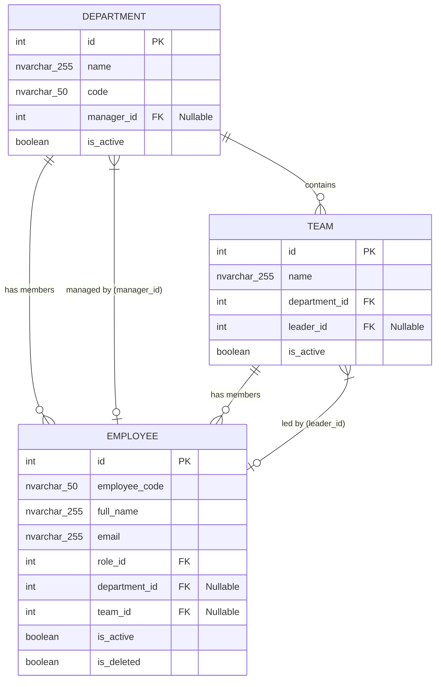
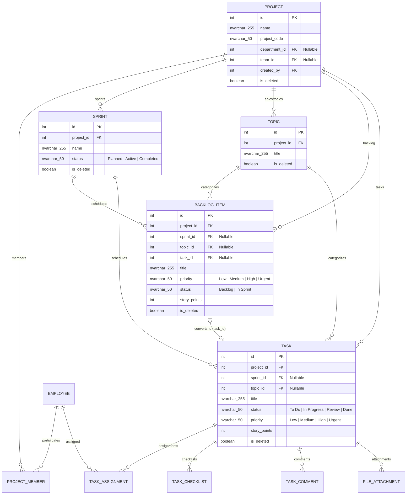

# Quan Hệ Giữa Các Module & Dữ Liệu (Module Relationships)

Tài liệu này mô tả chi tiết sơ đồ quan hệ thực thể (ERD) và cấu trúc liên kết giữa các bảng trong hệ thống **TaskSyncEnterprise**.

---

## 1. Sơ Đồ Thực Thể Cơ Cấu Tổ Chức (Organization ERD)

---

## 2. Sơ Đồ Thực Thể Quản Lý Công Việc Agile (Work Management ERD)

---

## 3. Quy Tắc Toàn Vẹn Dữ Liệu & Ràng Buộc (Integrity Rules)

1. **Chuẩn Unicode MS SQL Server**:
   - Tất cả các trường văn bản tiếng Việt sử dụng kiểu dữ liệu `NVARCHAR` và literal `N'...'` trong SQL.
   - Thời gian sử dụng chuẩn UTC `SYSUTCDATETIME()`.
2. **Xóa Mềm (Soft Deletion)**:
   - Các bảng kế thừa từ `AuditMixin` không bao giờ sử dụng câu lệnh SQL `DELETE` trực tiếp.
   - Khi xóa, cập nhật `is_deleted = True` và ghi lại thời điểm `deleted_at = SYSUTCDATETIME()`.
3. **Phân Rã Quan Hệ N–N**:
   - Quan hệ `Task` và `Employee` thông qua bảng trung gian `TaskAssignment` (`task_id`, `employee_id`).
   - Quan hệ `Project` và `Employee` thông qua bảng trung gian `ProjectMember` (`project_id`, `employee_id`).
4. **Không Có Circular Dependency**:
   - `Department` chứa `Team`, `Team` chứa `Employee`.
   - `Team Leader` là tham chiếu `leader_id` nullable trỏ về `Employee`, không tạo vòng lặp phụ thuộc cứng trong khóa ngoại.
