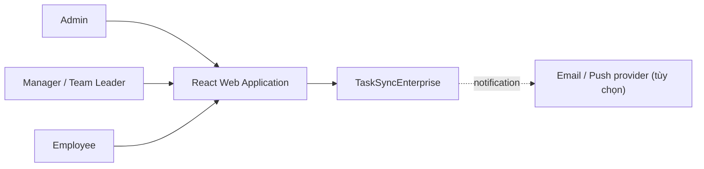
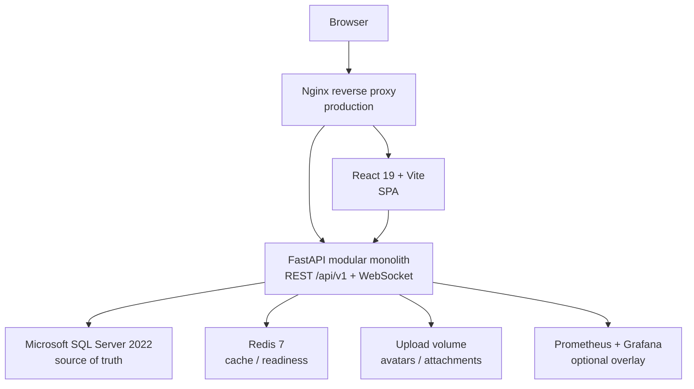
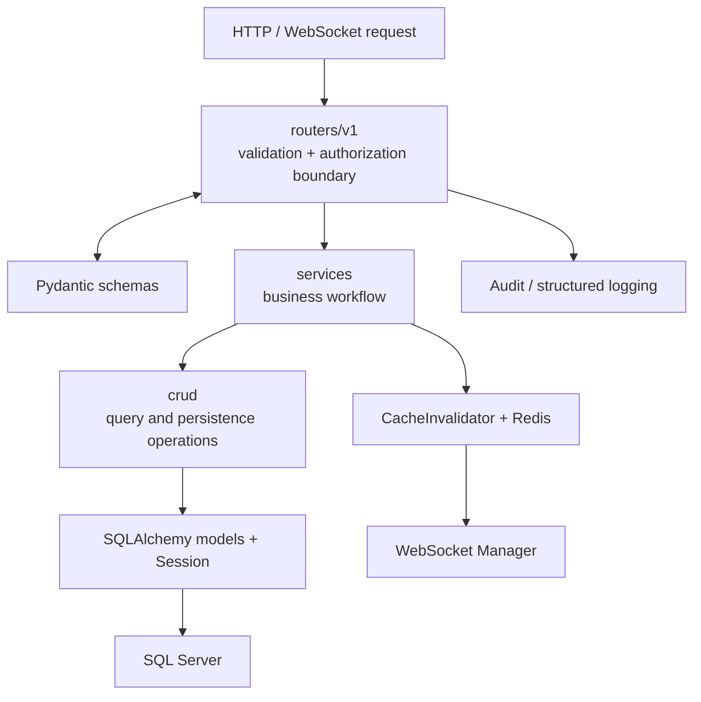
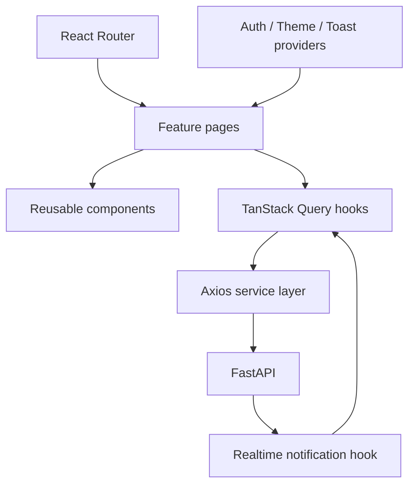
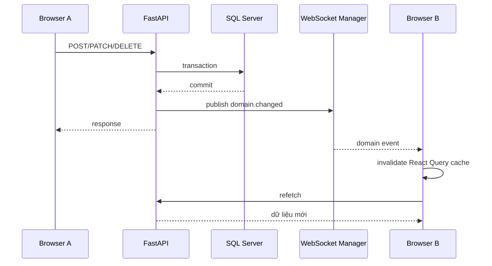
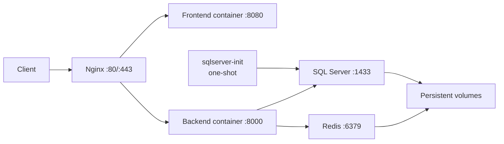

# Kiến trúc phần mềm

## 1. Phong cách kiến trúc

TaskSyncEnterprise là một **modular monolith** theo kiến trúc phân lớp:

- **Client–Server:** React SPA gọi REST API và WebSocket.
- **Layered Architecture:** Router → Service/CRUD → ORM → Database.
- **Domain-oriented modules:** Project, Task, Sprint, Backlog, Organization, Collaboration, Vacation.
- **Event-driven realtime:** mutation phát domain event; trình duyệt nhận qua WebSocket và làm mới query cache.
- **Cache-aside:** dữ liệu chính nằm ở SQL Server; Redis chỉ tăng tốc và hỗ trợ trạng thái vận hành, không phải nguồn dữ liệu chuẩn.

Kiến trúc này phù hợp với quy mô hiện tại: triển khai đơn giản như monolith nhưng ranh giới module đủ rõ để tách service sau này.

## 2. System Context

## 3. Container Diagram

Ở local, Browser gọi Vite `:5173`, Vite/axios gọi FastAPI `:8000`. Ở production, Nginx là điểm vào duy nhất.

## 4. Backend Layer Diagram

Quy tắc: RBAC phải được kiểm tra ở backend; việc ẩn nút trên frontend chỉ là UX.

## 5. Frontend Layer Diagram

Query key là hợp đồng đồng bộ dữ liệu. Event như `task.changed`, `topic.changed`, `feedback.changed`, `file.changed` và `vacation.changed` phải invalidate đúng query key.

## 6. Luồng ghi dữ liệu và realtime

Event chỉ phát sau commit thành công. Nếu Redis tắt, publish WebSocket vẫn phải hoạt động; tuy nhiên endpoint readiness hiện đánh dấu Redis là dependency cần thiết.

## 7. Deployment Diagram

`sqlserver-init` bảo đảm database tồn tại trước khi backend khởi động. Alembic vẫn chịu trách nhiệm tạo/cập nhật schema.

## 8. Ranh giới mở rộng

- Tách Notification thành worker/service khi lượng event lớn.
- Tách Reporting/AI inference khỏi request API vì đây là tác vụ nặng.
- Dùng object storage thay upload volume khi triển khai nhiều replica.
- Dùng outbox pattern nếu cần bảo đảm domain event không mất giữa commit database và publish.
