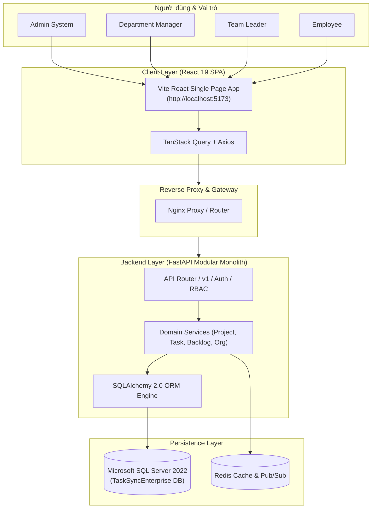
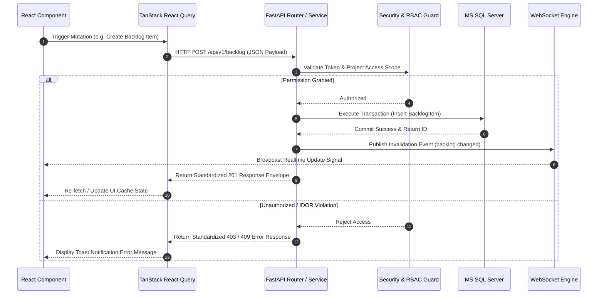
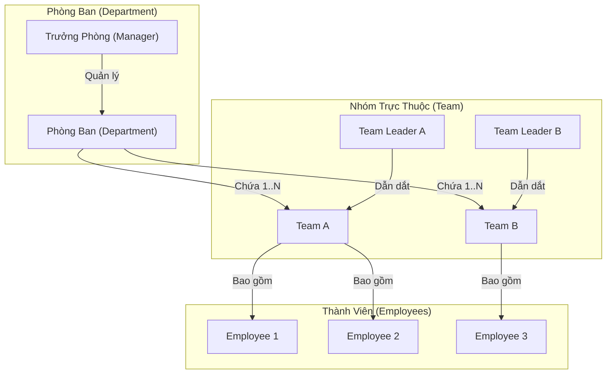
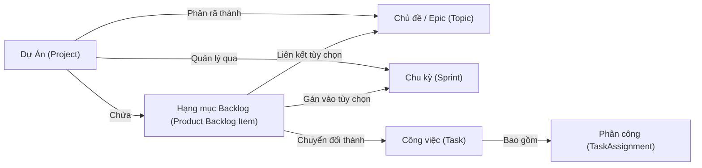
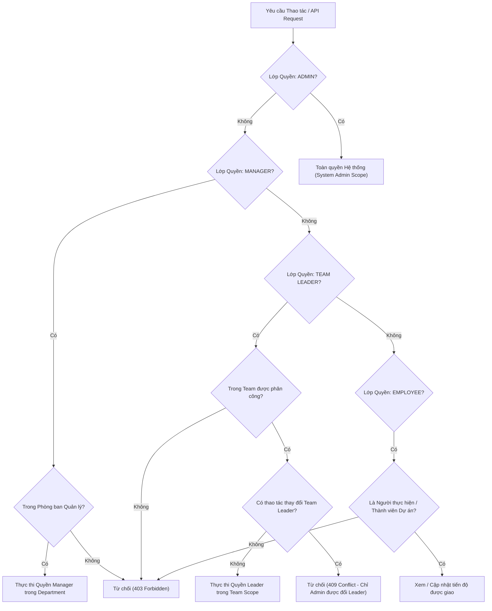
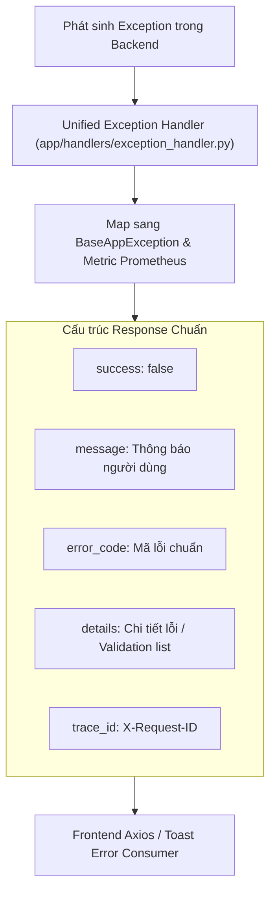
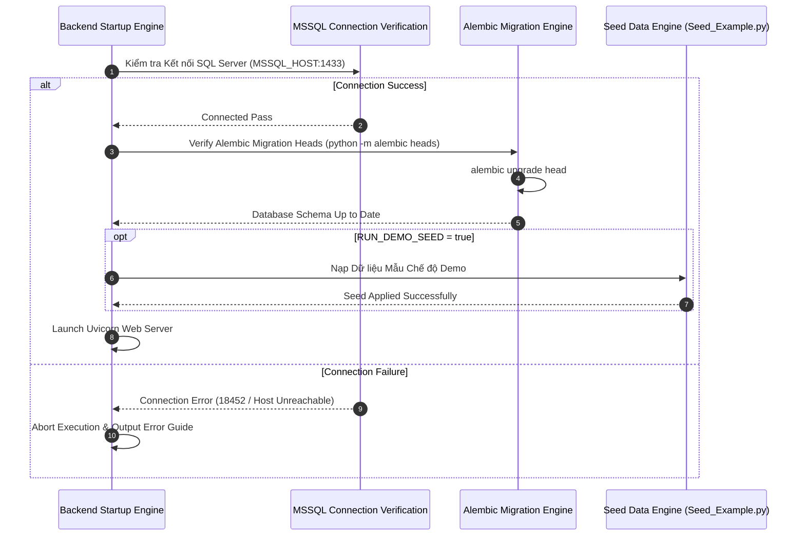

# Kiến trúc Hệ thống TaskSyncEnterprise

## 1. Tổng quan Kiến trúc

**TaskSyncEnterprise** là nền tảng quản lý công việc và dự án enterprise theo mô hình **Modular Monolith**. Kiến trúc phân lớp rõ ràng nhằm bảo đảm hiệu năng cao, dễ mở rộng và tuân thủ các chuẩn an toàn thông tin doanh nghiệp.

### Các thành phần chính:
- **Frontend Layer**: React 19 + TypeScript + Vite + TailwindCSS v4 + TanStack React Query.
- **API Boundary Layer**: FastAPI + Pydantic v2 (REST API v1 + WebSockets).
- **Core Business Layer**: Services, Domain Validators, Cache Invalidation Engine.
- **Persistence & Data Layer**: Microsoft SQL Server 2022 (Source of Truth) + SQLAlchemy 2.0 ORM + Alembic Migration Engine.
- **Caching & Realtime Layer**: Redis 7.x + Standardized WebSocket Manager.

---

## 2. System Context Diagram

---

## 3. Frontend / Backend / Database Data Flow

---

## 4. Organization Workflow: Department – Team – Employee

---

## 5. Work Management Domain Flow: Project – Sprint – Epic – Backlog – Task

---

## 6. RBAC Policy & Team Leader Delegated Scope

---

## 7. API Error Handling & Envelope Flow

---

## 8. Startup, Alembic Migrations & Seed Flow

