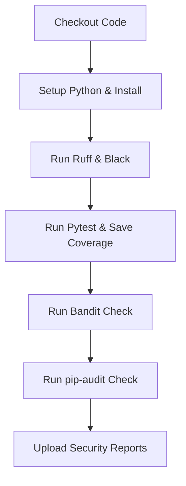

# Hướng Dẫn Vận Hành Hệ Thống Quét Bảo Mật (Security Scan Guide)

Tài liệu này hướng dẫn chi tiết cách vận hành, cấu hình, xử lý cảnh báo giả (false positive) và khắc phục lỗ hổng phụ thuộc trong hệ thống quét bảo mật của dự án `TaskSyncEnterprise` (Phase 3.8.2).

---

## 🎯 1. Tổng Quan Công Cụ Quét Bảo Mật

Hệ thống CI tự động chạy các công cụ quét bảo mật tĩnh và kiểm tra phụ thuộc sau:
1.  **Bandit:** Trình phân tích bảo mật tĩnh (SAST) dành riêng cho Python. Quét mã nguồn để phát hiện các lỗi lập trình mất an toàn (ví dụ: hardcoded mật khẩu, SQL injection, sử dụng thuật toán băm yếu).
2.  **pip-audit:** Trình kiểm tra lỗ hổng phụ thuộc (SCA) đối chiếu với cơ sở dữ liệu PyPI và OSV để phát hiện các thư viện bên thứ ba đang bị cảnh báo bảo mật (CVE).

---

## 💻 2. Hướng Dẫn Tự Chạy Quét Bảo Mật Cục Bộ (Local Verification)

Nhà phát triển được khuyến nghị chạy các lệnh quét bảo mật dưới đây cục bộ trước khi push code lên Git.

### Kiểm Tra Lỗi Bảo Mật Tĩnh (Bandit)
Di chuyển terminal vào thư mục `backend/` và thực thi:

```bash
# Kích hoạt môi trường ảo
.venv\Scripts\activate

# Chạy Bandit với cấu hình từ pyproject.toml
bandit -c pyproject.toml -r .
```

*   **Đọc kết quả:**
    *   Lệnh trên sẽ tự động đọc danh mục quét (`targets = ["app"]`) và các thư mục cần bỏ qua (`exclude_dirs = ["tests", ".venv", "alembic"]`) từ `pyproject.toml`.
    *   Nếu phát hiện lỗi, Bandit sẽ phân loại theo cấp độ từ **Low**, **Medium** đến **High**.

### Kiểm Tra Lỗ Hổng Dependency (pip-audit)
Thực thi tại thư mục `backend/`:

```bash
# Quét danh sách package trong requirements.txt và bỏ qua lỗ hổng đã được xác nhận (Minerva timing attack của ecdsa)
pip-audit -r requirements.txt --ignore-vuln PYSEC-2026-1325
```

---

## 🏗️ 3. Quy Trình Chạy Trên GitHub Actions CI

Trong CI, Bandit và pip-audit được tích hợp tuần tự ngay sau khi chạy xong Pytest và upload coverage:



### Cách Hệ Thống Xử Lý Lỗi (Fail-Build Policy)
*   **Bandit:** Chạy 2 bước:
    1.  Xuất báo cáo dạng JSON (`bandit-report.json`) không chặn build (sử dụng `--exit-zero`).
    2.  Thực hiện quét nghiêm ngặt chỉ chặn build khi phát hiện lỗi mức độ **High** (sử dụng `bandit -c pyproject.toml -r . -lll`).
*   **pip-audit:** Quét toàn bộ file `requirements.txt`. Bỏ qua lỗ hổng timing attack đã được chấp nhận bảo mật (`PYSEC-2026-1325`), chặn build nếu phát hiện bất kỳ CVE chưa được chấp nhận nào khác.

---

## 🔍 4. Xem Báo Cáo & Xử Lý False Positives

### Xem Báo Cáo Trên GitHub Actions
Các file báo cáo kết quả quét được tự động nén và tải lên mục **Artifacts** của lượt chạy CI dưới dạng:
*   `backend-bandit-report` (Định dạng JSON)
*   `backend-pip-audit-report` (Định dạng JSON)

### Cách Bỏ Qua Lỗi Nhận Diện Nhầm (Bandit False Positive)
Nếu phát hiện một dòng code bị Bandit báo lỗi nhưng thực chất là an toàn (ví dụ: chuỗi ký tự ngẫu nhiên trùng với tên biến password):
1.  **Sử dụng comment `# nosec`:** Chèn thêm `# nosec` ở cuối dòng code bị cảnh báo để Bandit bỏ qua dòng đó:
    ```python
    default_salt = "random_salt_value"  # nosec B105
    ```
2.  **Cấu hình loại trừ toàn bộ mã lỗi:** Cập nhật mục `skips` trong `pyproject.toml` nếu cần tắt bỏ hoàn toàn một rule cụ thể:
    ```toml
    [tool.bandit]
    skips = ["B101"]
    ```

### Cách Bỏ Qua Lỗ Hổng Thư Viện Chấp Nhận Được (pip-audit Ignore)
Nếu một thư viện bị phát hiện có lỗi bảo mật nhưng chưa có bản vá chính thức hoặc nằm ngoài phạm vi ảnh hưởng:
*   Bổ sung thêm cờ `--ignore-vuln <VULNERABILITY_ID>` trong file workflow `.github/workflows/ci.yml`.

---

## 🆙 5. Cách Cập Nhật Vá Lỗi Dependency (Remediation)

Khi `pip-audit` chặn build và thông báo thư viện bị dính lỗi bảo mật:

1.  **Kiểm tra phiên bản sửa lỗi:** Xem cột `Fix Versions` trong log CI hoặc tìm kiếm ID lỗ hổng trên mạng để biết phiên bản an toàn gần nhất.
2.  **Cập nhật `requirements.txt`:** Sửa lại phiên bản của thư viện đó trong `backend/requirements.txt` trỏ tới phiên bản an toàn.
3.  **Kiểm tra sự tương thích:** Chạy lại toàn bộ test suite cục bộ (`pytest tests/`) để đảm bảo việc nâng cấp thư viện không làm hỏng business logic của ứng dụng.
4.  **Cập nhật môi trường ảo:** Chạy `pip install -r requirements.txt` cục bộ để cập nhật máy cá nhân.

## Accepted Vulnerability: PYSEC-2026-1325

- Package: `ecdsa==0.19.2`
- Dependency chain: `python-jose==3.5.0 -> ecdsa==0.19.2`
- Current application algorithm: `HS256`
- The application does not use `ES256`, `SigningKey`, `sign_digest`, or `ECDH`.
- The affected ECDSA signing path is therefore not used by TaskSyncEnterprise.
- The vulnerability is temporarily accepted until `python-jose` is replaced,
  its dependency tree changes, or asymmetric ECDSA signing is introduced.
- This acceptance must be reviewed before enabling ES256 or ECDH.

PYSEC-2026-1325
ecdsa 0.19.2
python-jose 3.5.0
HS256 only
No ES256 / SigningKey / sign_digest / ECDH usage