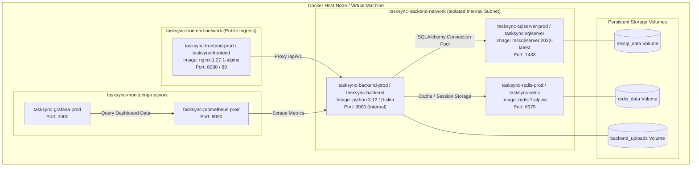

# TaskSyncEnterprise — Container Deployment Architecture Diagram

This diagram documents the containerized multi-tier deployment stack managed via Docker Compose.

```mermaid
graph TB
    subgraph HostVM ["Docker Host Node / Virtual Machine"]
        subgraph FrontendNet ["tasksync-frontend-network (Public Ingress)"]
            FrontendContainer["tasksync-frontend-prod / tasksync-frontend<br/>Image: nginx:1.27.1-alpine<br/>Port: 8080 / 80"]
        end

        subgraph BackendNet ["tasksync-backend-network (Isolated Internal Subnet)"]
            BackendContainer["tasksync-backend-prod / tasksync-backend<br/>Image: python:3.12.10-slim<br/>Port: 8000 (Internal)"]
            SQLServerContainer["tasksync-sqlserver-prod / tasksync-sqlserver<br/>Image: mssql/server:2022-latest<br/>Port: 1433"]
            RedisContainer["tasksync-redis-prod / tasksync-redis<br/>Image: redis:7-alpine<br/>Port: 6379"]
        end

        subgraph MonitoringNet ["tasksync-monitoring-network"]
            Prometheus["tasksync-prometheus-prod<br/>Port: 9090"]
            Grafana["tasksync-grafana-prod<br/>Port: 3000"]
        end

        subgraph Volumes ["Persistent Storage Volumes"]
            MssqlVolume[("mssql_data Volume")]
            RedisVolume[("redis_data Volume")]
            UploadsVolume[("backend_uploads Volume")]
        end
    end

    FrontendContainer -->|Proxy /api/v1| BackendContainer
    BackendContainer -->|SQLAlchemy Connection Pool| SQLServerContainer
    BackendContainer -->|Cache / Session Storage| RedisContainer

    SQLServerContainer --- MssqlVolume
    RedisContainer --- RedisVolume
    BackendContainer --- UploadsVolume

    Prometheus -->|Scrape Metrics| BackendContainer
    Grafana -->|Query Dashboard Data| Prometheus
```
