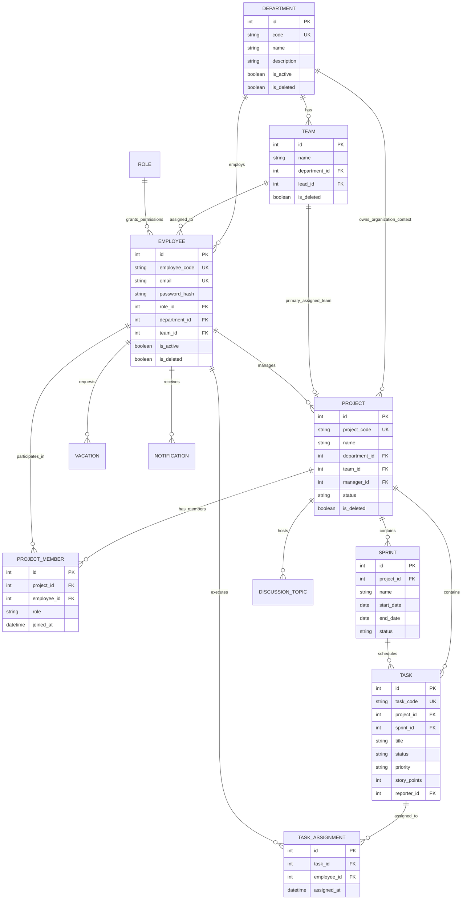

# TaskSyncEnterprise — Database ERD Diagram

This Entity-Relationship Diagram defines the enterprise data model for Administration and Work Management domains.

```mermaid
erDiagram
    DEPARTMENT ||--o{ TEAM : "has"
    DEPARTMENT ||--o{ EMPLOYEE : "employs"
    TEAM ||--o{ EMPLOYEE : "assigned_to"
    ROLE ||--o{ EMPLOYEE : "grants_permissions"

    DEPARTMENT ||--o{ PROJECT : "owns_organization_context"
    TEAM ||--o| PROJECT : "primary_assigned_team"
    EMPLOYEE ||--o{ PROJECT : "manages"

    PROJECT ||--o{ PROJECT_MEMBER : "has_members"
    EMPLOYEE ||--o{ PROJECT_MEMBER : "participates_in"
    PROJECT ||--o{ SPRINT : "contains"
    PROJECT ||--o{ TASK : "contains"

    SPRINT ||--o{ TASK : "schedules"
    TASK ||--o{ TASK_ASSIGNMENT : "assigned_to"
    EMPLOYEE ||--o{ TASK_ASSIGNMENT : "executes"
    EMPLOYEE ||--o{ VACATION : "requests"
    EMPLOYEE ||--o{ NOTIFICATION : "receives"
    PROJECT ||--o{ DISCUSSION_TOPIC : "hosts"

    DEPARTMENT {
        int id PK
        string code UK
        string name
        string description
        boolean is_active
        boolean is_deleted
    }

    TEAM {
        int id PK
        string name
        int department_id FK
        int lead_id FK
        boolean is_deleted
    }

    EMPLOYEE {
        int id PK
        string employee_code UK
        string email UK
        string password_hash
        int role_id FK
        int department_id FK
        int team_id FK
        boolean is_active
        boolean is_deleted
    }

    PROJECT {
        int id PK
        string project_code UK
        string name
        int department_id FK
        int team_id FK
        int manager_id FK
        string status
        boolean is_deleted
    }

    PROJECT_MEMBER {
        int id PK
        int project_id FK
        int employee_id FK
        string role
        datetime joined_at
    }

    SPRINT {
        int id PK
        int project_id FK
        string name
        date start_date
        date end_date
        string status
    }

    TASK {
        int id PK
        string task_code UK
        int project_id FK
        int sprint_id FK
        string title
        string status
        string priority
        int story_points
        int reporter_id FK
    }

    TASK_ASSIGNMENT {
        int id PK
        int task_id FK
        int employee_id FK
        datetime assigned_at
    }
```
