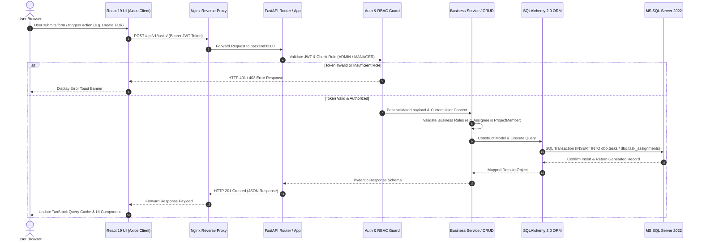

# TaskSyncEnterprise — Request Flow Sequence Diagram

This sequence diagram details the end-to-end request lifecycle from the React UI to SQL Server.

```mermaid
sequenceDiagram
    autonumber
    actor User as User Browser
    participant React as React 19 UI (Axios Client)
    participant Nginx as Nginx Reverse Proxy
    participant FastAPI as FastAPI Router / App
    participant Auth as Auth & RBAC Guard
    participant Service as Business Service / CRUD
    participant ORM as SQLAlchemy 2.0 ORM
    participant DB as MS SQL Server 2022

    User->>React: User submits form / triggers action (e.g. Create Task)
    React->>Nginx: POST /api/v1/tasks/ (Bearer JWT Token)
    Nginx->>FastAPI: Forward Request to backend:8000
    FastAPI->>Auth: Validate JWT & Check Role (ADMIN / MANAGER)
    
    alt Token Invalid or Insufficient Role
        Auth-->>React: HTTP 401 / 403 Error Response
        React-->>User: Display Error Toast Banner
    else Token Valid & Authorized
        Auth->>Service: Pass validated payload & Current User Context
        Service->>Service: Validate Business Rules (e.g. Assignee is ProjectMember)
        Service->>ORM: Construct Model & Execute Query
        ORM->>DB: SQL Transaction (INSERT INTO dbo.tasks / dbo.task_assignments)
        DB-->>ORM: Confirm Insert & Return Generated Record
        ORM-->>Service: Mapped Domain Object
        Service-->>FastAPI: Pydantic Response Schema
        FastAPI-->>Nginx: HTTP 201 Created (JSON Response)
        Nginx-->>React: Forward Response Payload
        React-->>User: Update TanStack Query Cache & UI Component
    end
```
