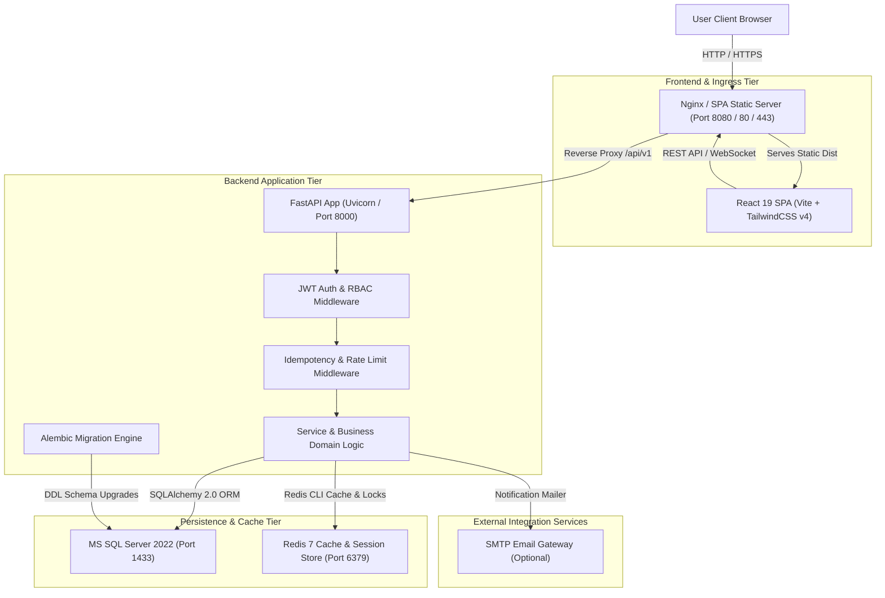

# TaskSyncEnterprise — System Component Diagram

This diagram visualizes the high-level system architecture, client entry points, API routing, and backend component dependencies.

```mermaid
graph TD
    User["User Client Browser"]
    
    subgraph FrontendLayer ["Frontend & Ingress Tier"]
        Nginx["Nginx / SPA Static Server (Port 8080 / 80 / 443)"]
        ReactApp["React 19 SPA (Vite + TailwindCSS v4)"]
    end

    subgraph BackendTier ["Backend Application Tier"]
        FastAPI["FastAPI App (Uvicorn / Port 8000)"]
        AuthMiddleware["JWT Auth & RBAC Middleware"]
        IdempotencyMw["Idempotency & Rate Limit Middleware"]
        ServiceLayer["Service & Business Domain Logic"]
        AlembicRunner["Alembic Migration Engine"]
    end

    subgraph DataTier ["Persistence & Cache Tier"]
        MSSQL["MS SQL Server 2022 (Port 1433)"]
        Redis["Redis 7 Cache & Session Store (Port 6379)"]
    end

    subgraph ExternalTier ["External Integration Services"]
        SMTP["SMTP Email Gateway (Optional)"]
    end

    User -->|HTTP / HTTPS| Nginx
    Nginx -->|Serves Static Dist| ReactApp
    ReactApp -->|REST API / WebSocket| Nginx
    Nginx -->|Reverse Proxy /api/v1| FastAPI

    FastAPI --> AuthMiddleware
    AuthMiddleware --> IdempotencyMw
    IdempotencyMw --> ServiceLayer

    ServiceLayer -->|SQLAlchemy 2.0 ORM| MSSQL
    ServiceLayer -->|Redis CLI Cache & Locks| Redis
    ServiceLayer -->|Notification Mailer| SMTP
    AlembicRunner -->|DDL Schema Upgrades| MSSQL
```
