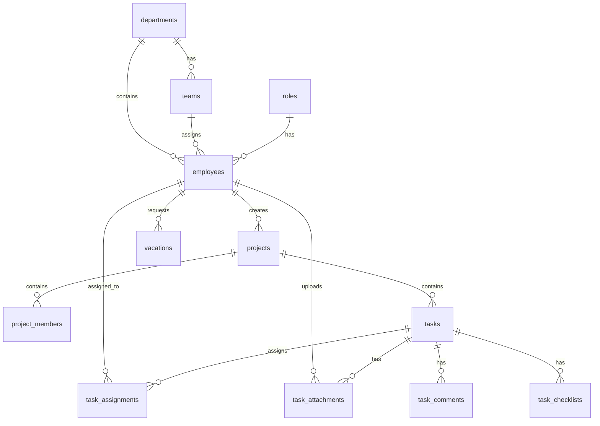

# TaskSyncEnterprise — Enterprise Project Discovery Report

**Author:** Lead Enterprise Architect & Chief Software Architect  
**Date:** July 7, 2026  
**Mode:** READ-ONLY ANALYSIS MODE (No repository modifications executed)

---

## Table of Contents
1. [Architecture Report](#1-architecture-report)
2. [Database Report](#2-database-report)
3. [Backend Report](#3-backend-report)
4. [Frontend Report](#4-frontend-report)
5. [Security Report](#5-security-report)
6. [Technical Debt Report](#6-technical-debt-report)
7. [Risk Assessment](#7-risk-assessment)
8. [Phase Priority Roadmap](#8-phase-priority-roadmap)

---

## 1. Architecture Report

### Repository Overview & Folder Structure
The repository splits its logic into two isolated layers inside the root directory:
*   `backend/`: ASGI python application running FastAPI, SQLAlchemy, and Alembic migrations.
*   `frontend/`: SPA React application compiled via Vite.
*   `docs/`: Configuration and architectural reports.

### Technology Stack & Dependency Mappings
*   **Backend Framework:** FastAPI (`0.139.0` installed in local virtual environment). Runs under Uvicorn ASGI server.
*   **Database Access Layer:** SQLAlchemy (`2.0.51`) declarations mapping to MS SQL Server utilizing the `pymssql` driver. Database schema migrations managed through Alembic.
*   **Frontend Library:** React (`19.2.7`) with component renders. TailwindCSS (`4.3.1`) atomic utilities integrated using Vite's `@tailwindcss/vite` compiler.
*   **Routing System:** React Router Dom (`7.18.0`) handles SPA navigation.
*   **Data Fetching Client:** Axios (`1.18.1`) coupled with TanStack React Query (`5.101.1`) for backend syncing.

### Architectural Principles Review

#### SOLID Design Pattern Compliance
*   **Single Responsibility Principle (SRP):** Generally respected in the backend. Endpoints map to routers (e.g., [tasks.py](file:///e:/TaskSyncEnterprise/backend/app/routers/v1/tasks.py)), database logic resides in CRUD modules (e.g., [crud/task.py](file:///e:/TaskSyncEnterprise/backend/app/crud/task.py)), and model schemas map to Pydantic (e.g., [schemas/task.py](file:///e:/TaskSyncEnterprise/backend/app/schemas/task.py)). However, the frontend layout component [MainLayout.jsx](file:///e:/TaskSyncEnterprise/frontend/src/layouts/MainLayout.jsx) violates SRP by handling navigation rendering, sidebar toggles, notification fetch intervals, user auth parsing, and project creation modals in a single 598-line component.
*   **Open/Closed Principle (OCP):** Partially violated in the backend authorization guards. The role-checking system inside [deps.py](file:///e:/TaskSyncEnterprise/backend/app/core/deps.py#L52-L83) uses a hardcoded dictionary map:
    ```python
    role_map = { 1: "admin", 2: "manager", 3: "employee" }
    ```
    Adding new system roles requires modifying this core dependency helper directly instead of extending it.
*   **Interface Segregation Principle (ISP):** Complied with via split Pydantic schemas (e.g., `TaskCreate`, `TaskUpdate`, `TaskResponse` inside [schemas/task.py](file:///e:/TaskSyncEnterprise/backend/app/schemas/task.py)).
*   **Dependency Inversion Principle (DIP):** Violated across the services layer. Routers directly import and call static methods on database helpers and services rather than relying on dependency-injected interfaces. For instance, [tasks.py](file:///e:/TaskSyncEnterprise/backend/app/routers/v1/tasks.py#L257) directly imports the concrete `StorageService` to save attachments.

#### DRY (Don't Repeat Yourself) & KISS (Keep It Simple, Stupid)
*   **Code Duplication (DRY Violation):** The model file [app/models/core.py](file:///e:/TaskSyncEnterprise/backend/app/models/core.py) contains duplicate declarations of `Role`, `Department`, `Team`, `Employee`, and `Project`. These definitions duplicate the individual model files:
    *   [models/role.py](file:///e:/TaskSyncEnterprise/backend/app/models/role.py)
    *   [models/department.py](file:///e:/TaskSyncEnterprise/backend/app/models/department.py)
    *   [models/team.py](file:///e:/TaskSyncEnterprise/backend/app/models/team.py)
    *   [models/employee.py](file:///e:/TaskSyncEnterprise/backend/app/models/employee.py)
    *   [models/project.py](file:///e:/TaskSyncEnterprise/backend/app/models/project.py)
*   **Layout Remounting Bottleneck:** KISS is violated in the routing schema ([AppRouter.jsx](file:///e:/TaskSyncEnterprise/frontend/src/router/AppRouter.jsx)). Every route wraps `<MainLayout>` directly around its child:
    ```jsx
    <Route path="/dashboard" element={<ProtectedRoute><MainLayout><DashboardPage /></MainLayout></ProtectedRoute>} />
    ```
    This causes the entire layout, sidebar, and notification elements to unmount and remount on every transition, triggering multiple heavy API fetches (`/projects`, `/tasks`, `/employees`, `/notifications`) on every route click.

---

## 2. Database Report

### Database Structure & Schema Details
The system targets Microsoft SQL Server under the default `dbo` schema.



### Table Relationships and Keys
*   **roles:** Primary key `id`.
*   **departments:** Primary key `id`.
*   **teams:** Primary key `id`. Foreign key `department_id` references `departments.id`.
*   **employees:** Primary key `id`. Foreign keys: `department_id` references `departments.id`, `team_id` references `teams.id`, `role_id` references `roles.id`, and self-referencing `manager_id` references `employees.id`.
*   **projects:** Primary key `id`. Foreign key `created_by` references `employees.id`.
*   **tasks:** Primary key `id`. Foreign key `project_id` references `projects.id`.
*   **task_assignments:** Foreign keys `task_id` references `tasks.id`, `employee_id` references `employees.id`.
*   **task_attachments:** Foreign key `task_id` references `tasks.id`, `uploaded_by_id` references `employees.id`.
*   **vacations:** Foreign key `requested_by` references `employees.id`, `approved_by` references `employees.id` (nullable).
*   **audit_logs:** Foreign key `employee_id` references `employees.id` (nullable).

### Constraints, Indexes, and Defaults
*   **Unique Constraints:** Imposed on `roles.role_name`, `departments.department_code`, `departments.name`, `teams.team_code`, `employees.email`, `employees.employee_code`, and `projects.project_code`.
*   **Indexes:**
    *   `ix_dbo_audit_logs_action` on `audit_logs(action)`
    *   `ix_dbo_audit_logs_employee_email` on `audit_logs(employee_email)`
    *   `ix_dbo_audit_logs_id` on `audit_logs(id)`
    *   `ix_dbo_notifications_id` on `notifications(id)`
*   **Datetime Defaults (GETDATE vs UTC Mismatch):** Models in `backend/app/models/` set `created_at` default values using SQL Server's local time function: `server_default=text("GETDATE()")` in [employee.py](file:///e:/TaskSyncEnterprise/backend/app/models/employee.py#L93), [project.py](file:///e:/TaskSyncEnterprise/backend/app/models/project.py#L75), [role.py](file:///e:/TaskSyncEnterprise/backend/app/models/role.py#L30), and others. This differs from the standard UTC default `SYSUTCDATETIME()`.
*   **SQL Server Unicode Constants:** Model properties default strings are declared without Unicode `N''` literals in standard models, which may cause character corruption on database engines configured with non-Unicode default collations.

### Seed Data Discrepancies
*   **Script analyzed:** [seed_v2.py](file:///e:/TaskSyncEnterprise/backend/seed_v2.py).
*   Creates IT department, three roles (`admin`, `manager`, `employee`), and two users:
    1.  `admin@gmail.com` (password: `123456`, role: `admin`)
    2.  `demo1@gmail.com` (password: `123456`, role: `employee`)
*   Creates one project: `PRJ_IT_001` (IT Project V2).
*   **Documentation mismatch:** [README.md](file:///e:/TaskSyncEnterprise/README.md#L143-L152) claims the seed script automatically generates a `manager` account and 3 tasks for the project. No manager account or tasks are implemented in `seed_v2.py`.

---

## 3. Backend Report

### API Endpoint Inventory
The following routers are mounted dynamically under the `/api/v1` namespace inside [app/main.py](file:///e:/TaskSyncEnterprise/backend/app/main.py#L49-L65):

| Prefix | Router Module | Secured Endpoints | Public Endpoints | Purpose |
|---|---|---|---|---|
| `/health` | `health.py` | None | `GET /` | Health checks. |
| `/auth` | `auth.py` | `POST /change-password`, `GET /me` | `POST /login`, `POST /refresh`, `POST /logout` | Authentication. |
| `/roles` | `roles.py` | `GET /`, `POST /`, `PUT /{id}`, `DELETE /{id}` | None | Roles. |
| `/departments` | `departments.py` | `GET /`, `GET /{id}`, `POST /`, `PUT /{id}`, `DELETE /{id}` | None | Departments. |
| `/teams` | `teams.py` | `GET /`, `GET /{id}`, `POST /`, `PUT /{id}`, `DELETE /{id}` | None | Teams. |
| `/employees` | `employees.py` | `GET /`, `GET /{id}`, `POST /`, `PUT /{id}`, `DELETE /{id}`, `PATCH /{id}/avatar` | None | Employees. |
| `/projects` | `projects.py` | `GET /`, `GET /{id}`, `POST /`, `PUT /{id}`, `DELETE /{id}` | None | Projects. |
| `/tasks` | `tasks.py` | `GET /`, `GET /{id}`, `POST /`, `PUT /{id}`, `PATCH /{id}`, `DELETE /{id}`, `GET /my-tasks`, `PUT /my-task/{id}`, `POST /{id}/attachments`, `DELETE /{id}/attachments/{aid}` | None | Tasks and attachments. |
| `/audit-logs` | `audit.py` | `GET /` | None | System activity logs. |
| `/dashboard` | `dashboard.py`| `GET /progress` | None | Dashboard stats. |
| `/vacations` | `vacations.py`| `GET /`, `GET /{id}`, `POST /`, `PATCH /{id}` | None | Leave requests. |
| `/notifications`| `notifications.py`| `GET /`, `PATCH /{id}/read` | None | Notifications. |

### Authentication & Authorization
*   **Methodology:** Stateless JWT tokens passed via HTTP `Authorization: Bearer <token>` headers.
*   **Access Verification Guard:** [deps.py:get_current_user](file:///e:/TaskSyncEnterprise/backend/app/core/deps.py#L16-L48) decodes token payloads, validates expiration, checks blacklist database registrations, and yields the employee record.
*   **Role Validation Checks:** Done via nested checking wrapper `require_roles([allowed_roles])` which maps roles to variables `RequireAdmin`, `RequireManager`, and `RequireEmployee`.

### Middleware, Logging & Exception Handling
*   **Middlewares:**
    *   `LoggingMiddleware` ([core/middleware.py](file:///e:/TaskSyncEnterprise/backend/app/core/middleware.py)): Captures the request path, method, response status, and processing latency. Writes to console standard output.
    *   `CORSMiddleware` ([main.py](file:///e:/TaskSyncEnterprise/backend/app/main.py#L32-L39)): Whitelists hosts declared in Pydantic's `BACKEND_CORS_ORIGINS`.
*   **Exception Handlers:** Programmatically wired via `register_exception_handlers` inside [core/errors.py](file:///e:/TaskSyncEnterprise/backend/app/core/errors.py). Catches standard Pydantic validation errors, FastAPI HTTPExceptions, and database SQL exceptions, returning standard JSON envelopes.

---

## 4. Frontend Report

### UI Inventory & Pages
The React single page application maps routes to components using [AppRouter.jsx](file:///e:/TaskSyncEnterprise/frontend/src/router/AppRouter.jsx):

| Route Path | Page Component File | Required Access | Primary Functionality |
|---|---|---|---|
| `/login` | `pages/auth/LoginPage.jsx` | Public | Authentication form (storing user and token). |
| `/change-password` | `pages/auth/ChangePasswordPage.jsx` | Authenticated | Mandatory first login redirect/update form. |
| `/dashboard` | `pages/dashboard/DashboardPage.jsx` | Authenticated | Charts, widgets, check-in, recent updates. |
| `/projects` | `pages/projects/ProjectPage.jsx` | Authenticated | List grid, search filters, manager creation modal. |
| `/projects/:id` | `pages/projects/ProjectDetailPage.jsx`| Authenticated | Kanban board, project metadata, member listings. |
| `/tasks` | `pages/tasks/TaskPage.jsx` | Authenticated | Grid/list view of tasks across projects. |
| `/calendar` | `pages/calendar/CalendarPage.jsx` | Authenticated | Deadline tracking mapped onto a monthly grid. |
| `/departments` | `pages/departments/DepartmentPage.jsx` | Authenticated | Corporate organization tree. |
| `/employees` | `pages/employees/EmployeePage.jsx` | Authenticated | Employee directory. |
| `/notifications` | `pages/notifications/NotificationsPage.jsx` | Authenticated| Notification history tracking. |
| `/vacations` | `pages/vacations/VacationPage.jsx` | Authenticated | Leave status overview and manager request reviews. |
| `/settings` | `pages/settings/SettingsPage.jsx` | Authenticated | Theme toggles and account configurations. |
| `/profile` | `pages/profile/ProfilePage.jsx` | Authenticated | Employee details card. |

### Routing and Guards
*   **Implementation:** Client-side router declared with standard `<BrowserRouter>` wrapper.
*   **Auth Guard:** `<ProtectedRoute>` checks for the presence of local storage tokens. Redirects to `/login` if unauthenticated.
*   **First-Time Login Guard:** Users with `is_first_login` set to `true` are programmatically redirected to `/change-password` inside [LoginPage.jsx](file:///e:/TaskSyncEnterprise/frontend/src/pages/auth/LoginPage.jsx#L42-L46) to force a credentials update.

### State Management & API Services
*   **State Management:** Driven by local component react states (`useState`, `useMemo`, `useCallback`) and state propagation via props.
*   **Unused Library:** `@tanstack/react-query` is initialized and wrapped in [main.jsx](file:///e:/TaskSyncEnterprise/frontend/src/main.jsx) but never called in any component (no `useQuery` or `useMutation` implementations).
*   **API Service Layer:** Isolated instances of Axios configured inside [api/axios.js](file:///e:/TaskSyncEnterprise/frontend/src/api/axios.js).

---

## 5. Security Report

### JWT and Token Lifecycle
*   **Access Token Lifetime:** Set to 60 minutes (`ACCESS_TOKEN_EXPIRE_MINUTES = 60` in settings).
*   **Refresh Token:** Lifetime set to 7 days (`REFRESH_TOKEN_EXPIRE_DAYS = 7`). Expired refresh tokens are invalidated.
*   **Blacklist Support:** Included. Logged-out access tokens are added to `TokenBlacklist` database table.
*   **Vulnerability (Storage):** Tokens are stored inside `localStorage` ([tokenService.js](file:///e:/TaskSyncEnterprise/frontend/src/services/tokenService.js)), exposing them to extraction via Cross-Site Scripting (XSS).

### Role-Based Access Control (RBAC) & IDOR
*   **Role Mapping Check:** Securely guarded in the backend via dependencies.
*   **Critical IDOR Vulnerability (Task Details):** `GET /api/v1/tasks/{task_id}` has no ownership checks. Any authenticated employee can fetch details of any task, including tasks on projects they are not assigned to.
*   **Manager Authority Hijack IDOR:** Writing routes (`PUT`, `DELETE`) for projects and tasks in [projects.py](file:///e:/TaskSyncEnterprise/backend/app/routers/v1/projects.py#L76-L101) check `RequireManager` but do not verify if the manager is the owner or member of the project. Any Manager can modify or delete projects owned by another manager.
*   **Logout Unprotected Route:** `POST /api/v1/auth/logout` relies on `oauth2_scheme` dependency instead of `get_current_user` to validate the session, meaning validation checks are bypassed on logout.

### Client-Input Vulnerabilities
*   **SQL Injection:** Mitigated. Queries are written using SQLAlchemy ORM statement builders (`select()`), preventing string-concatenated SQL queries.
*   **XSS (Cross-Site Scripting):** Frontend uses React's default text rendering curly brackets (`{}`) which escapes characters. No occurrences of `dangerouslySetInnerHTML` are found.
*   **CSRF (Cross-Site Request Forgery):** Bypassed because the frontend uses Authorization headers in API queries instead of session cookies.
*   **File Upload Validation Flaw (RCE Risk):**
    *   [storage_service.py:save_avatar](file:///e:/TaskSyncEnterprise/backend/app/services/storage_service.py#L28-L57) enforces image extensions (`.jpg`, `.jpeg`, `.png`, `.webp`).
    *   [storage_service.py:save_attachment](file:///e:/TaskSyncEnterprise/backend/app/services/storage_service.py#L60-L87) **does not validate file extensions**. An attacker can upload malicious files (e.g., Python scripts, executable attachments) to the `/uploads/attachments/` directory.

---

## 6. Technical Debt Report

### Dead Code & Duplicate Files
*   **app/models/core.py:** Fully dead code. Declares duplicate versions of `Role`, `Department`, `Team`, `Employee`, and `Project` that are not imported anywhere in the backend application.
*   **Duplicate ORM Base Imports:** Standard models import `Base` from [app.database](file:///e:/TaskSyncEnterprise/backend/app/database.py) but core.py imports from `app.models.base`.

### Mismatched Settings & Requirements
*   **Seed Data Mismatch:** [seed_v2.py](file:///e:/TaskSyncEnterprise/backend/seed_v2.py) lacks Manager seeding and task insertions described in [README.md](file:///e:/TaskSyncEnterprise/README.md).
*   **Requirements file omission:** `backend/requirements.txt` is missing critical packages:
    *   `python-jose` (causes import errors on JWT actions in [auth.py](file:///e:/TaskSyncEnterprise/backend/app/routers/v1/auth.py#L147)).
    *   `email-validator` (causes import errors on Pydantic schema validation in [employee.py](file:///e:/TaskSyncEnterprise/backend/app/schemas/employee.py#L3)).
    *   `httpx` (causes `RuntimeError` when running tests using FastAPI's `TestClient` in [conftest.py](file:///e:/TaskSyncEnterprise/backend/tests/conftest.py#L35)).

### Broken Testing Infrastructure
*   **SQLite Syntax crash:** The testing configuration inside [conftest.py](file:///e:/TaskSyncEnterprise/backend/tests/conftest.py#L10-L15) targets SQLite. However, all models declare the `dbo` schema prefix (`metadata = MetaData(schema="dbo")`). This causes SQLite to fail on setup:
    `sqlite3.OperationalError: unknown database dbo`
*   **Pytest Discovery Failures:** Scripts designed for direct execution (e.g., [test_my_tasks_http.py](file:///e:/TaskSyncEnterprise/backend/tests/test_my_tasks_http.py) and [test_stress.py](file:///e:/TaskSyncEnterprise/backend/tests/test_stress.py)) are placed inside the `tests/` directory and named with the `test_` prefix. Pytest attempts to run them as unit tests, causing import and setup crashes (e.g., `fixture 'email' not found`).

---

## 7. Risk Assessment

### 🚨 Critical Severity Risks

#### 1. Insecure Upload File Extensions (RCE Risk)
*   **Context:** `save_attachment` allows any file extension upload.
*   **Impact:** Users can upload executable files or scripts. If the static file server executes files under `/uploads`, this could lead to Remote Code Execution (RCE).
*   **Evidence:** [storage_service.py#L60-L87](file:///e:/TaskSyncEnterprise/backend/app/services/storage_service.py#L60-L87)

#### 2. Local Storage Token Vulnerability (XSS Access)
*   **Context:** JWT access and refresh tokens are stored in `localStorage`.
*   **Impact:** Any successful XSS injection can read and hijack active credentials.
*   **Evidence:** [tokenService.js#L1-L13](file:///e:/TaskSyncEnterprise/frontend/src/services/tokenService.js)

#### 3. Broken Test Suite (Integration Risk)
*   **Context:** Schema constraints break SQLite test runs.
*   **Impact:** Developers cannot run automated tests to check code changes.
*   **Evidence:** `sqlite3.OperationalError: unknown database dbo` in [conftest.py](file:///e:/TaskSyncEnterprise/backend/tests/conftest.py)

---

### ⚠️ Medium Severity Risks

#### 1. Task Endpoint IDOR
*   **Context:** Any employee can query details and view attachments of any task via `GET /api/v1/tasks/{task_id:int}`.
*   **Impact:** Information disclosure across department/project boundaries.
*   **Evidence:** [tasks.py#L46-L55](file:///e:/TaskSyncEnterprise/backend/app/routers/v1/tasks.py#L46-L55)

#### 2. Manager Route Authorization Bypass
*   **Context:** Projects and tasks writing actions only verify role ID, not creator/assignment fields.
*   **Impact:** Any manager can edit or delete projects belonging to other departments.
*   **Evidence:** [projects.py#L76-L101](file:///e:/TaskSyncEnterprise/backend/app/routers/v1/projects.py#L76-L101)

#### 3. Layout Performance Degradation
*   **Context:** `MainLayout` remounts on every route transition.
*   **Impact:** Sluggish client response times and excessive database query load.
*   **Evidence:** [AppRouter.jsx](file:///e:/TaskSyncEnterprise/frontend/src/router/AppRouter.jsx)

---

## 8. Phase Priority Roadmap

To resolve the identified architectural gaps and secure the platform before feature implementation, we propose the following phased roadmap:

```
[Phase 1: Remediation] ──► [Phase 2: Database Harmonization] ──► [Phase 3: Frontend Refactoring]
```

### Phase 1: Critical Security & Infrastructure Remediation (Immediate Priority)
*   **Task 1:** Implement allowed file extensions validation in `StorageService.save_attachment` (reject executables, scripts, HTML files).
*   **Task 2:** Move JWT storage from frontend `localStorage` to HttpOnly secure cookies.
*   **Task 3:** Fix unit test engine. Modify `conftest.py` to strip schema mappings when running against SQLite, or configure a local SQL Server testing container for CI/CD runs.
*   **Task 4:** Fix `requirements.txt` to include missing libraries (`python-jose`, `email-validator`, `httpx`).

### Phase 2: Database & Model Harmonization (Medium Priority)
*   **Task 1:** Remove dead model file `backend/app/models/core.py`.
*   **Task 2:** Refactor model entities using legacy styles (`vacation.py`, `notification.py`, `audit.py`) to modern `Mapped` and `mapped_column` patterns.
*   **Task 3:** Standardize `created_at` timestamp default generator across all schemas to use UTC `SYSUTCDATETIME()`.
*   **Task 4:** Update `seed_v2.py` script to match README specification.

### Phase 3: Frontend Layout & State Optimization (Medium Priority)
*   **Task 1:** Refactor React Router to use nested routes with `<Outlet />`. Mount `<MainLayout>` once as a parent layout to prevent unmounting and duplicated API requests on transitions.
*   **Task 2:** Transition API queries from manual `useEffect` fetches to TanStack React Query (`useQuery` and `useMutation`) hooks to utilize caching and status tracking.
