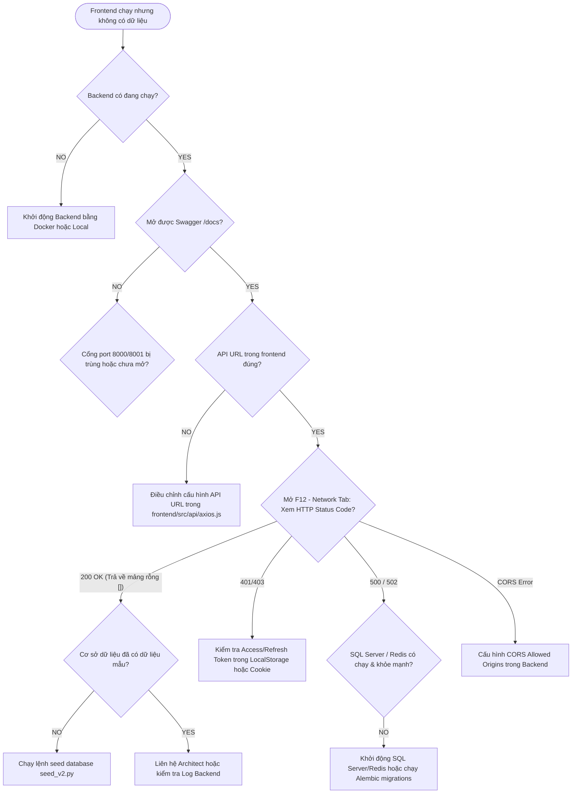

# Hướng Dẫn Khắc Phục Sự Cố Frontend Không Có Dữ Liệu (Frontend Data Troubleshooting Guide)

Tài liệu này cung cấp quy trình và danh sách kiểm tra (checklist) để nhà phát triển chẩn đoán lỗi khi ứng dụng React Frontend đã khởi chạy thành công (trên trình duyệt hiển thị giao diện) nhưng không tải được dữ liệu, bảng trống hoặc các chức năng gọi API bị lỗi.

---

## 🌲 1. Sơ Đồ Cây Quyết Định Chẩn Đoán (Diagnostic Decision Tree)

Dưới đây là lưu đồ hướng dẫn từng bước để xác định nguyên nhân gốc rễ:



---

## 📝 2. Danh Sách Kiểm Tra Chi Tiết (Troubleshooting Checklist)

Hãy đi lần lượt qua các checklist dưới đây để xác định và xử lý lỗi:

### ⚙️ A. Kiểm Tra Trạng Thái Backend & Hạ Tầng

*   [ ] **Backend có chạy không?**
    *   *Cách kiểm tra:* Truy cập trực tiếp đường dẫn [http://localhost:8000/health](http://localhost:8000/health) hoặc [http://127.0.0.1:8001/health](http://127.0.0.1:8001/health) từ trình duyệt.
    *   *Khắc phục:* Nếu không phản hồi, hãy khởi động backend.
*   [ ] **Swagger UI có mở được không?**
    *   *Cách kiểm tra:* Truy cập [http://localhost:8000/docs](http://localhost:8000/docs) (Docker) hoặc [http://localhost:8001/docs](http://localhost:8001/docs) (nếu chạy local cấu hình cổng khác).
*   [ ] **SQL Server có đang chạy không?**
    *   *Cách kiểm tra:* Chạy lệnh `docker ps` xem container `tasksync-sqlserver` có ở trạng thái `Up (healthy)` không.
    *   *Khắc phục:* `docker compose up -d sqlserver`
*   [ ] **Redis có đang chạy không?**
    *   *Cách kiểm tra:* Chạy `docker ps` kiểm tra container `tasksync-redis`.
    *   *Khắc phục:* `docker compose up -d redis`
*   [ ] **Trạng thái Docker tổng thể:**
    *   *Cách kiểm tra:* Chạy lệnh:
        ```powershell
        docker compose ps
        ```
        Đảm bảo tất cả các container cần thiết đều có trạng thái xanh (`Up`).

### 🌐 B. Cấu Hình Đường Dẫn API & Kết Nối (API URL & CORS)

*   [ ] **Đường dẫn API URL cấu hình chính xác chưa?**
    *   *Cảnh báo đặc biệt:* File cấu hình Axios tại [frontend/src/api/axios.js](file:///e:/TaskSyncEnterprise/frontend/src/api/axios.js) đang được hardcode địa chỉ:
        ```javascript
        const api = axios.create({
          baseURL: "http://127.0.0.1:8001/api/v1",
        });
        ```
        Nếu Backend đang chạy bằng Docker Compose (mặc định map ra cổng `8000` của máy Host), hoặc chạy local ở cổng `8000`, thì Frontend gọi tới `8001` sẽ bị lỗi kết nối hoặc trả về `ERR_CONNECTION_REFUSED`.
    *   *Cách khắc phục:* Đảm bảo cổng trong file `axios.js` khớp hoàn toàn với cổng thực tế mà backend đang lắng nghe (Ví dụ sửa thành `http://localhost:8000/api/v1` nếu backend chạy Docker).
*   [ ] **Lỗi CORS (Cross-Origin Resource Sharing)?**
    *   *Triệu chứng:* Console của trình duyệt xuất hiện dòng chữ đỏ: `Access to XMLHttpRequest at '...' from origin 'http://localhost:5173' has been blocked by CORS policy`.
    *   *Cách khắc phục:* Kiểm tra cấu hình `BACKEND_CORS_ORIGINS` trong file `.env` hoặc file cấu hình backend [backend/app/config.py](file:///e:/TaskSyncEnterprise/backend/app/config.py). Đảm bảo origin của frontend (mặc định là `http://localhost:5173` hoặc `http://127.0.0.1:5173`) được khai báo cho phép.

### 🔑 C. Xác Thực & Trạng Thái Token (Authentication & Token State)

*   [ ] **Kiểm tra JWT Token trong Client Storage:**
    *   *Cách kiểm tra:* Nhấn `F12` trên trình duyệt -> Chọn tab **Application** (Chrome) hoặc **Storage** (Firefox) -> Kiểm tra mục **Local Storage** hoặc **Session Storage** của trang `http://localhost:5173`.
    *   *Mục tiêu:* Xác nhận xem `access_token` và `refresh_token` có tồn tại và chưa bị hết hạn.
*   [ ] **Kiểm tra luồng Auto-Refresh Token:**
    *   *Triệu chứng:* Khi Access Token hết hạn, Axios Interceptor sẽ tự động gọi API `/auth/refresh`. Nếu API refresh trả về lỗi hoặc credentials bị hủy, người dùng sẽ bị đẩy về trang `/login`.

### 🗄️ D. Trạng Thái Cơ Sở Dữ Liệu & Seed Data

*   [ ] **Cơ sở dữ liệu đã chạy migrations chưa?**
    *   *Cách kiểm tra:* Backend logs báo lỗi thiếu bảng (`Table not found`).
    *   *Khắc phục:* Chạy migrations Alembic để tạo cấu trúc bảng:
        ```powershell
        # Docker Compose
        docker compose exec backend alembic upgrade head
        ```
*   [ ] **Cơ sở dữ liệu đã có dữ liệu mẫu (Seed Data)?**
    *   *Triệu chứng:* Mọi request GET danh sách (như `/tasks`, `/employees`) trả về HTTP 200 nhưng dữ liệu trống trơn `[]`.
    *   *Khắc phục:* Chạy script seed dữ liệu mẫu theo tài liệu [SEED_GUIDE.md](file:///e:/TaskSyncEnterprise/docs/database/SEED_GUIDE.md):
        ```powershell
        # Docker Compose
        docker compose exec backend python seed_v2.py
        ```

---

## 🛠️ 3. Phân Tích Mã Lỗi HTTP Trên Network Tab (HTTP Status Code Analysis)

Khi mở `F12` và chuyển sang tab **Network**, bấm vào các API request bị đỏ (lỗi) để xem mã trạng thái trả về và phân tích:

### 🔴 HTTP 401 Unauthorized
*   **Nguyên nhân:** Token không hợp lệ, bị thiếu tiêu đề `Authorization: Bearer <token>`, hoặc Refresh Token đã hết hạn/bị thu hồi.
*   **Giải pháp:** Xóa sạch LocalStorage và SessionStorage, F5 reload trang để đăng nhập lại từ đầu.

### 🔴 HTTP 403 Forbidden
*   **Nguyên nhân:** Đăng nhập thành công nhưng tài khoản hiện tại không có quyền truy cập chức năng này (Ví dụ: Nhân viên thường cố gắng xem danh sách Audit Log vốn dành riêng cho Admin).
*   **Giải pháp:** Đăng nhập bằng tài khoản có vai trò cao hơn (`admin@gmail.com` hoặc `manager@gmail.com` với mật khẩu mặc định `123456`).

### 🔴 HTTP 404 Not Found
*   **Nguyên nhân:** Sai đường dẫn API Endpoint (ví dụ gọi nhầm `/api/v1/task` thay vì `/api/v1/tasks`).
*   **Giải pháp:** Kiểm tra lại định nghĩa route trên cả Frontend (Service file) và Backend (Router file).

### 🔴 HTTP 500 Internal Server Error
*   **Nguyên nhân:** Lỗi xảy ra bên trong mã nguồn Backend (ví dụ: lỗi SQL Server, lỗi logic Python không bẫy exception).
*   **Giải pháp:** Kiểm tra nhật ký log của container backend để biết chi tiết:
    ```powershell
    docker compose logs --tail 100 backend
    ```

### 🔴 HTTP 502 Bad Gateway
*   **Nguyên nhân:** Thường xảy ra khi Web Server/Reverse Proxy không kết nối được tới Backend process (Uvicorn).
*   **Giải pháp:** Đảm bảo tiến trình Uvicorn trong container hoặc máy local đang chạy ổn định và không bị crash do lỗi khởi động.
