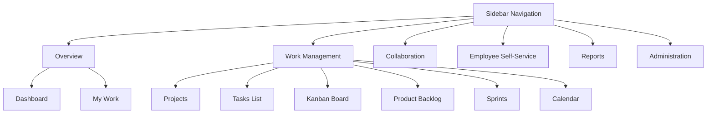

# TaskSyncEnterprise — Navigation & RBAC Specifications

This document outlines the menu routing hierarchy and client-side access control boundaries.

---

## 🗺️ Product Domain Layout

Sidebar menus are grouped into distinct semantic domains:

---

## 🔒 Role-Based Access Control (RBAC) Boundaries

| Route Prefix | Resource Type | Allowed Roles | Frontend Guard Action |
|---|---|---|---|
| `/my-work` | Personal Portal | All Authenticated | Always visible. |
| `/projects` | Project List | All Authenticated | Creation button visible to PM / Admin only. |
| `/tasks` | Main Tasks List | All Authenticated | Inline status editing allowed for assignees. |
| `/vacations` | Leave Dashboard | All Authenticated | Approval action buttons visible to Manager/HR/Admin only. |
| `/audit` | Audit logs | Admin only | Route blocked. Menu hidden from standard users. |
| `/settings` | System Config | PM / Admin | Modifying allowed for authorized roles. |
