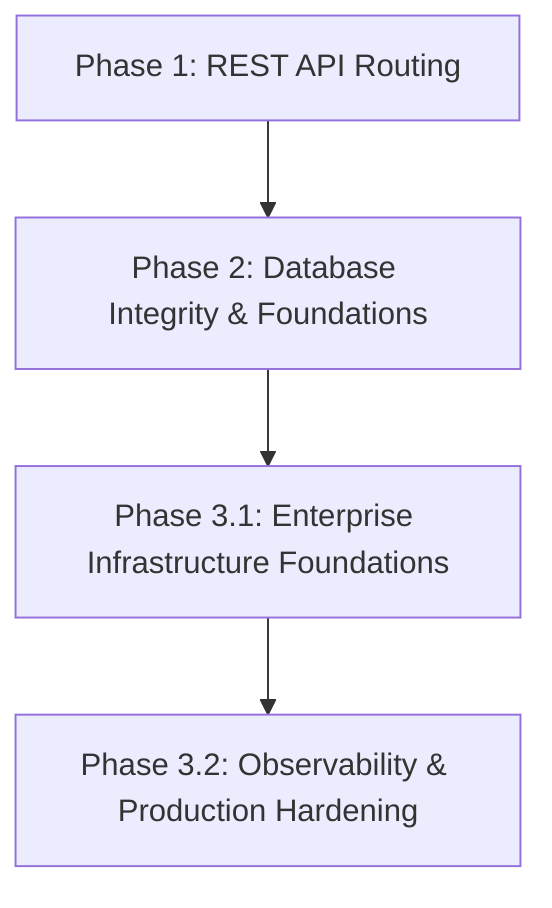

# Chương Trình Học Tập TaskSyncEnterprise

Chào mừng bạn đến với tài liệu hướng dẫn học tập và phát triển của **TaskSyncEnterprise**. Đây là tài liệu nội bộ dành cho các kỹ sư và lập trình viên để nắm vững kiến thức xây dựng hệ thống phần mềm doanh nghiệp chất lượng cao bằng FastAPI và SQL Server.

---

## 🗺️ Bản Đồ Lộ Trình Học Tập (Learning Roadmap)

---

## 📂 Danh Mục Tài Liệu Học Tập

### [Phase 1: Thiết Kế Định Tuyến REST API](file:///e:/TaskSyncEnterprise/docs/learning/phase-1/README.md)
*   **[01. Thuật Ngữ Cơ Bản (Glossary)](file:///e:/TaskSyncEnterprise/docs/learning/phase-1/01_Glossary.md):** Giải thích các thuật ngữ nền tảng như Middleware, Dependency Injection, JWT, Repository Pattern.

### [Phase 2: Thiết Kế Cơ Sở Dữ Liệu & Ràng Buộc Dữ Liệu](file:///e:/TaskSyncEnterprise/docs/learning/phase-2/README.md)
*   **[01. Database Design & Default Constraints](file:///e:/TaskSyncEnterprise/docs/learning/phase-2/01_database_design.md):** Ràng buộc mặc định, khóa chính, và quản lý múi giờ UTC (`SYSUTCDATETIME()`).
*   **[02. Relationships & Cascading Rules](file:///e:/TaskSyncEnterprise/docs/learning/phase-2/02_relationships.md):** Thiết lập quan hệ 1-N, N-N và các ràng buộc toàn vẹn dữ liệu.
*   **[03. SQLAlchemy & Database Migrations](file:///e:/TaskSyncEnterprise/docs/learning/phase-2/03_sqlalchemy_migrations.md):** Quản lý phiên bản cơ sở dữ liệu bằng Alembic và cách drop mặc định trên SQL Server.
*   **[04. API Security Testing & Encryption](file:///e:/TaskSyncEnterprise/docs/learning/phase-2/04_api_security_testing.md):** Viết unit test cho bảo mật API, mã hóa mật khẩu trực tiếp bằng `bcrypt`.

### [Phase 3.1: Cấu Trúc Nền Tảng Hạ Tầng Doanh Nghiệp](file:///e:/TaskSyncEnterprise/docs/learning/phase-3.1/README.md)
*   **[01. Backend Foundation](file:///e:/TaskSyncEnterprise/docs/learning/phase-3.1/01_Backend_Foundation.md):** Kiến trúc hạ tầng, phân lớp Controller-Service-Repository.
*   **[02. Configuration Management](file:///e:/TaskSyncEnterprise/docs/learning/phase-3.1/02_Configuration_Management.md):** Quản lý cấu hình tập trung an toàn thông qua Pydantic Settings.
*   **[03. Enterprise Logging](file:///e:/TaskSyncEnterprise/docs/learning/phase-3.1/03_Enterprise_Logging.md):** Thiết kế ghi nhật ký quay vòng (Rotating File Handlers) và luồng Request ID.
*   **[04. Health Checks](file:///e:/TaskSyncEnterprise/docs/learning/phase-3.1/04_Health_Checks.md):** Triển khai endpoint kiểm tra sức khỏe hệ thống (Liveness, Readiness).
*   **[05. Production Hardening](file:///e:/TaskSyncEnterprise/docs/learning/phase-3.1/05_Production_Hardening.md):** Bảo mật lớp HTTP, Trusted Hosts và OWASP Headers.

### [Phase 3.2: Hệ Thống Quan Sát, Đo Lường & Giám Sát](file:///e:/TaskSyncEnterprise/docs/learning/phase-3.2/README.md)
*   **[01. Enterprise Configuration Layer](file:///e:/TaskSyncEnterprise/docs/learning/phase-3.2/01_Enterprise_Configuration.md):** Phân chia cấu hình thành core settings, constants, và paths.
*   **[02. Global Exception Handling](file:///e:/TaskSyncEnterprise/docs/learning/phase-3.2/02_Global_Exception_Handling.md):** Xây dựng phễu xử lý lỗi toàn cục và định dạng mã lỗi nhất quán.
*   **[03. Enterprise Response Architecture](file:///e:/TaskSyncEnterprise/docs/learning/phase-3.2/03_Enterprise_Response.md):** Đóng gói chuẩn hóa dữ liệu trả về cho API, hỗ trợ phân trang Generics.
*   **[04. Observability & Monitoring Layer](file:///e:/TaskSyncEnterprise/docs/learning/phase-3.2/04_Enterprise_Observability.md):** Theo dõi hiệu năng hệ thống, giám sát pool SQL Server, và phát hiện câu lệnh SQL chạy chậm.
