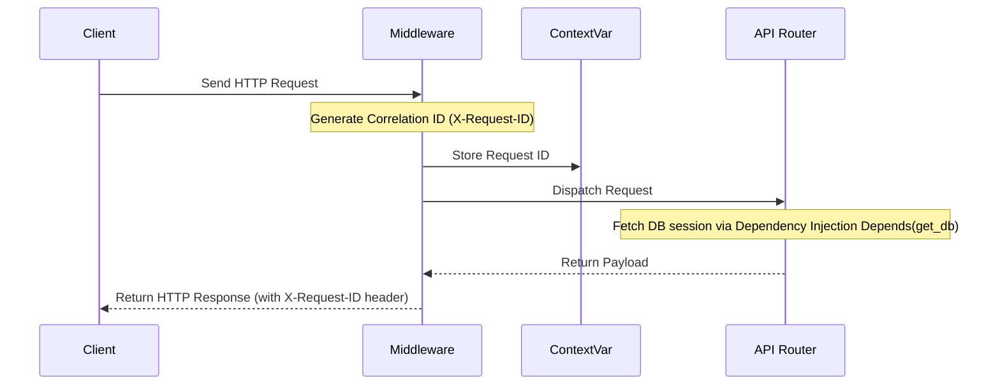

# Bảng Thuật Ngữ Hệ Thống (Glossary)

## Mục tiêu
Định nghĩa và giải thích các thuật ngữ chuyên môn nền tảng trong phát triển phần mềm backend doanh nghiệp, thiết lập ngôn ngữ chung giữa các kỹ sư phát triển, DevOps và kiến trúc sư hệ thống.

## Kiến thức nền
Khi xây dựng một hệ thống quy mô doanh nghiệp lớn, việc hiểu rõ các mẫu thiết kế (design patterns), cơ chế vận hành của container (docker/kubernetes) và bảo mật hạ tầng là điều bắt buộc để đảm bảo hệ thống an toàn và dễ bảo trì.

## Giải thích chi tiết

### 1. Middleware
Là phần mềm trung gian chạy ngầm trong mỗi vòng đời Request-Response. Middleware đánh chặn các request gửi đến trước khi chúng đến được API Router, và xử lý response trả về trước khi gửi lại cho Client.

### 2. Dependency Injection (DI)
Mẫu thiết kế trong đó một đối tượng nhận các phụ thuộc (dependencies) của nó từ bên ngoài truyền vào thay vì tự khởi tạo chúng. Trong FastAPI, Dependency Injection được thực hiện qua từ khóa `Depends()`.

### 3. Configuration
Các thiết lập điều khiển hành vi của ứng dụng mà không cần thay đổi mã nguồn (ví dụ: chuỗi kết nối database, thời hạn token, log levels).

### 4. Liveness & Readiness Probes
*   **Liveness:** Cơ chế kiểm tra xem tiến trình ứng dụng còn sống hay không. Nếu kiểm tra thất bại, container sẽ bị khởi động lại.
*   **Readiness:** Cơ chế kiểm tra xem ứng dụng đã sẵn sàng tiếp nhận request chưa. Nếu thất bại, load balancer sẽ ngừng chuyển hướng traffic đến container đó.

### 5. Structured Logging & Correlation ID
*   **Structured Logging:** Ghi nhật ký hệ thống dưới dạng cấu trúc (JSON) thay vì text thuần túy.
*   **Correlation ID (Request ID):** Chuỗi ký tự duy nhất (UUID) gán cho mỗi HTTP request để theo vết toàn bộ hành trình xử lý của nó qua các file log.

### 6. ContextVar
Biến ngữ cảnh an toàn cho đa luồng và bất đồng bộ (thread-safe, request-scoped), giúp quản lý các trạng thái riêng biệt của từng request mà không bị rò rỉ dữ liệu giữa các request đồng thời.

### 7. Graceful Shutdown
Quá trình tắt máy an toàn: ngừng nhận request mới, hoàn thành nốt các tác vụ đang dở, giải phóng kết nối database pool và ghi lại lịch sử log cuối cùng trước khi dừng hẳn.

## Luồng hoạt động

## Ví dụ trong TaskSyncEnterprise
*   **Middleware:** [LoggingMiddleware](file:///e:/TaskSyncEnterprise/backend/app/core/middleware.py#L12) đo lường thời gian xử lý của mỗi request.
*   **Dependency Injection:** `Depends(get_db)` tiêm phiên làm việc của SQLAlchemy Session vào các API xử lý thông tin nhân viên hoặc dự án.
*   **Liveness/Readiness:** Các endpoint `/health/live` và `/health/ready` cung cấp trạng thái cho hệ thống kiểm tra hạ tầng tự động.

## Khi nào sử dụng
*   Sử dụng **Middleware** khi cần thực hiện các tác vụ chung như ghi log, kiểm tra bảo mật Header hoặc cấu hình CORS.
*   Sử dụng **ContextVar** khi cần truyền tải các biến ngữ cảnh (như Request ID) xuyên suốt các tầng code mà không muốn truyền tham số thủ công qua từng hàm.

## Sai lầm thường gặp
*   **Nhầm lẫn giữa Liveness và Readiness:** Đặt logic ping cơ sở dữ liệu vào kiểm tra Liveness. Nếu database gặp sự cố tạm thời, liveness fail sẽ khiến container bị restart liên tục một cách vô ích, thay vì chỉ tạm dừng nhận traffic thông qua Readiness fail.
*   **Rò rỉ dữ liệu qua ContextVar:** Quên reset ContextVar sau khi kết thúc request, dẫn đến dữ liệu của request trước có thể bị đọc bởi request sau.

## Best Practices
1. Luôn lưu trữ cấu hình nhạy cảm (mật khẩu database, khóa bí mật JWT) dưới dạng biến môi trường hoặc file `.env`.
2. Định dạng cấu trúc log dưới dạng JSON ở môi trường production để các công cụ như ELK, Grafana Loki dễ dàng phân tích dữ liệu.

## Checklist ghi nhớ
- [x] Liveness kiểm tra tiến trình container.
- [x] Readiness kiểm tra tài nguyên bên ngoài (database, storage).
- [x] Reset ContextVar trong khối lệnh `finally` của Middleware.

## Tổng kết
Hiểu rõ bảng thuật ngữ này giúp bạn thiết kế mã nguồn hệ thống rõ ràng, chuẩn hóa và tuân thủ tốt các kiến trúc phát triển ứng dụng đám mây (cloud-native) hiện đại.
