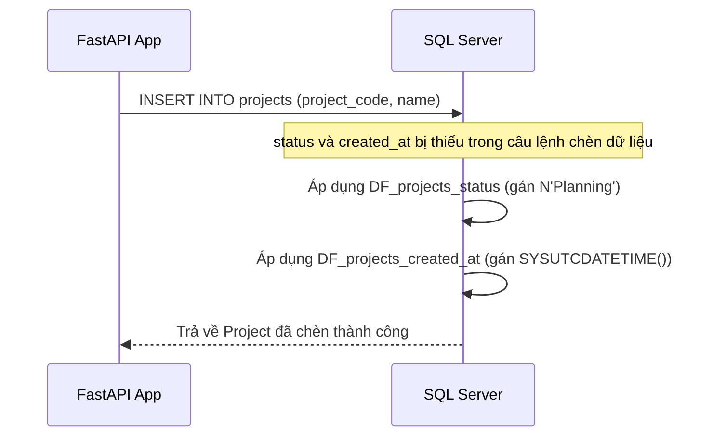

# Thiết Kế Cơ Sở Dữ Liệu & Ràng Buộc Mặc Định

## Mục tiêu
Hướng dẫn chi tiết về nền tảng thiết kế cơ sở dữ liệu quan hệ, tập trung vào khóa chính (Primary Key), ràng buộc giá trị mặc định (Default Constraint) và ghi nhận thời gian chuẩn hóa theo múi giờ UTC sử dụng `SYSUTCDATETIME()` trên MS SQL Server.

## Kiến thức nền
Trong một ứng dụng doanh nghiệp lớn, việc dữ liệu bị sai lệch múi giờ hoặc mất đồng nhất khi chèn bản ghi là nguyên nhân chính gây ra các lỗi báo cáo nghiêm trọng. Cơ sở dữ liệu phải là chốt chặn cuối cùng bảo vệ tính toàn vẹn của thông tin.

## Giải thích chi tiết

### 1. Khóa chính (Primary Key - PK)
Khóa chính là một cột (hoặc nhóm cột) dùng để định danh duy nhất cho mỗi dòng trong bảng. Nó không được phép chứa giá trị `NULL` và mọi giá trị phải là duy nhất. Khóa chính giúp duy trì tính toàn vẹn thực thể (entity integrity), cho phép cập nhật, xóa và truy vấn chính xác tuyệt đối.

### 2. Ràng buộc mặc định (Default Constraints)
Là quy tắc ở mức cơ sở dữ liệu tự động gán giá trị mặc định cho một cột khi câu lệnh `INSERT` không cung cấp dữ liệu. Điều này giúp giảm tải logic mặc định ở phía ứng dụng và đảm bảo tính nhất quán của dữ liệu.

### 3. Ghi nhận thời gian chuẩn hóa: `SYSUTCDATETIME()`
MS SQL Server cung cấp hai hàm ghi nhận thời gian hệ thống chính:
*   `GETDATE()`: Trả về thời gian hiện tại của hệ điều hành máy chủ cài đặt database (phụ thuộc múi giờ cục bộ).
*   `SYSUTCDATETIME()`: Trả về thời gian hiện tại theo chuẩn UTC với độ chính xác cao (phần thập phân của giây lên đến 7 chữ số).

Bằng cách chuẩn hóa sử dụng `SYSUTCDATETIME()`, mọi mốc thời gian trong database của bạn sẽ thống nhất theo một múi giờ tuyệt đối (UTC). Ứng dụng phía frontend sẽ chịu trách nhiệm chuyển đổi mốc thời gian này sang múi giờ của người dùng để hiển thị.

## Luồng hoạt động



## Ví dụ trong TaskSyncEnterprise

### Định nghĩa bảng bằng SQL thuần:
```sql
CREATE TABLE dbo.projects (
    id INT IDENTITY(1,1) NOT NULL,
    project_code NVARCHAR(50) NOT NULL,
    name NVARCHAR(200) NOT NULL,
    status NVARCHAR(30) CONSTRAINT DF_projects_status DEFAULT N'Planning' NOT NULL,
    created_at DATETIME2 CONSTRAINT DF_projects_created_at DEFAULT SYSUTCDATETIME() NOT NULL,
    CONSTRAINT PK_projects PRIMARY KEY (id)
);
```

### Định nghĩa Model trong SQLAlchemy 2.0 ORM:
```python
from datetime import datetime
from sqlalchemy import String, DateTime, text
from sqlalchemy.orm import Mapped, mapped_column

class Project(Base):
    __tablename__ = "projects"
    
    id: Mapped[int] = mapped_column(primary_key=True, autoincrement=True)
    project_code: Mapped[str] = mapped_column(String(50))
    name: Mapped[str] = mapped_column(String(200))
    
    # Định nghĩa Default Constraints sử dụng server_default
    status: Mapped[str] = mapped_column(String(30), server_default=text("N'Planning'"))
    created_at: Mapped[datetime] = mapped_column(DateTime, server_default=text("SYSUTCDATETIME()"))
```

## Khi nào sử dụng
*   Sử dụng `server_default` thay vì `default` của Python khi bạn muốn ràng buộc mặc định này được thực thi ở mức cơ sở dữ liệu, đảm bảo dữ liệu chèn từ bất kỳ nguồn nào (scripts, các tool quản trị database như SSMS) đều có giá trị mặc định giống nhau.
*   Sử dụng tiền tố `N` (ví dụ: `N'Planning'`) cho tất cả các giá trị chuỗi mặc định lưu trữ bằng kiểu dữ liệu Unicode (`NVARCHAR`).

## Sai lầm thường gặp
*   **Thiếu tiền tố Unicode `N` trên SQL Server:** Ví dụ chèn mặc định là `DEFAULT 'Đang xử lý'` sẽ khiến các chữ tiếng Việt có dấu bị lỗi font/mất dấu khi cơ sở dữ liệu thực hiện chuyển đổi ký tự.
*   **Sử dụng `GETDATE()` thay cho `SYSUTCDATETIME()`:** Làm phân tán múi giờ của hệ thống khi dịch chuyển server sang vùng địa lý khác.

## Best Practices
1. Luôn lưu trữ mốc thời gian dạng UTC ở phía backend và chỉ format theo timezone cục bộ của người dùng ở giao diện frontend.
2. Luôn chỉ định rõ ràng tên ràng buộc mặc định (ví dụ: `DF_projects_status`) thay vì để SQL Server tự sinh tên ngẫu nhiên, giúp việc bảo trì và chạy migration sau này dễ dàng hơn.

## Checklist ghi nhớ
- [x] Sử dụng `server_default` để ràng buộc ở mức database.
- [x] Định dạng mặc định thời gian là `SYSUTCDATETIME()`.
- [x] Sử dụng tiền tố `N` cho chuỗi Unicode mặc định.

## Tổng kết
Thiết kế cơ sở dữ liệu với khóa chính tường minh và các ràng buộc mặc định chặt chẽ là viên gạch đầu tiên giúp giảm thiểu bug và đảm bảo dữ liệu ứng dụng luôn sạch sẽ, nhất quán.
