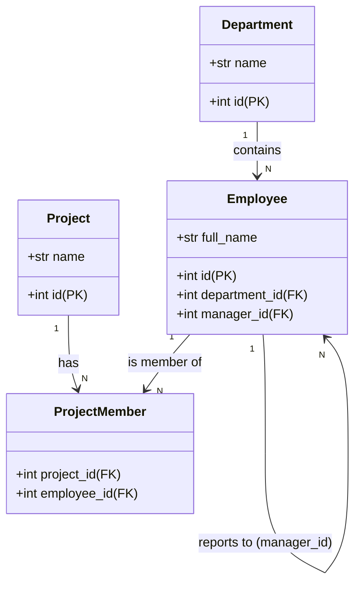

# Thiết Kế Quan Hệ Cơ Sở Dữ Liệu & Ánh Xạ Thực Thể (ER Mapping)

## Mục tiêu
Hướng dẫn cách thiết kế, thực thi và tối ưu hóa các mối quan hệ giữa các bảng (Quan hệ Một-Nhiều, Nhiều-Nhiều, và Tự tham chiếu) bằng cách sử dụng các ràng buộc khóa ngoại (Foreign Key) trên SQL Server và SQLAlchemy ORM.

## Kiến thức nền
Trong một hệ thống Quản lý tác vụ doanh nghiệp, các thực thể không tồn tại độc lập. Chúng ta phải liên kết chúng để phản ánh chính xác các quy tắc nghiệp vụ trong thế giới thực và ngăn chặn rác dữ liệu (orphan records).

## Giải thích chi tiết

### 1. Quan hệ Một-Nhiều (1:N)
Một dòng trong Bảng A có thể liên kết với nhiều dòng trong Bảng B, nhưng mỗi dòng trong Bảng B chỉ được liên kết với duy nhất một dòng trong Bảng A.
*   **Ví dụ:** Một Phòng ban (Department) có nhiều Nhân viên (Employee), nhưng mỗi Nhân viên chỉ thuộc về một Phòng ban duy nhất.

### 2. Quan hệ Nhiều-Nhiều (N:M)
Nhiều dòng trong Bảng A liên kết với nhiều dòng trong Bảng B.
*   **Ví dụ:** Một Dự án (Project) có nhiều Nhân viên tham gia, và một Nhân viên có thể tham gia nhiều Dự án khác nhau.
*   **Cách triển khai:** Cần một bảng trung gian gọi là **Association Table** (ví dụ: `project_members`) chứa các khóa ngoại trỏ về khóa chính của cả hai bảng.

### 3. Quan hệ Tự tham chiếu (Self-Referential)
Bảng chứa khóa ngoại trỏ ngược lại khóa chính của chính nó.
*   **Ví dụ:** Cơ cấu báo cáo của tổ chức. Mỗi Nhân viên (Employee) có một trường `manager_id` trỏ đến `id` của một Nhân viên khác (chính là Quản lý của họ).

## Luồng hoạt động



## Ví dụ trong TaskSyncEnterprise

### Tạo bảng trung gian Nhiều - Nhiều bằng SQL:
```sql
CREATE TABLE dbo.project_members (
    project_id INT NOT NULL,
    employee_id INT NOT NULL,
    joined_at DATETIME2 DEFAULT SYSUTCDATETIME() NOT NULL,
    CONSTRAINT PK_project_members PRIMARY KEY (project_id, employee_id),
    CONSTRAINT FK_members_projects FOREIGN KEY (project_id) REFERENCES dbo.projects (id),
    CONSTRAINT FK_members_employees FOREIGN KEY (employee_id) REFERENCES dbo.employees (id)
);
```

### Ánh xạ quan hệ trong SQLAlchemy 2.0 ORM:
```python
from typing import List, Optional
from sqlalchemy import ForeignKey
from sqlalchemy.orm import Mapped, mapped_column, relationship

class Employee(Base):
    __tablename__ = "employees"
    
    id: Mapped[int] = mapped_column(primary_key=True)
    full_name: Mapped[str]
    
    # Quan hệ Một - Nhiều trỏ về Department
    department_id: Mapped[Optional[int]] = mapped_column(ForeignKey("dbo.departments.id"))
    department: Mapped[Optional["Department"]] = relationship("Department", back_populates="employees")
    
    # Quan hệ Tự tham chiếu (Self-Referential) trỏ về Manager
    manager_id: Mapped[Optional[int]] = mapped_column(ForeignKey("dbo.employees.id"))
    manager: Mapped[Optional["Employee"]] = relationship("Employee", remote_side=[id], back_populates="subordinates")
    subordinates: Mapped[List["Employee"]] = relationship("Employee", back_populates="manager")
```

## Khi nào sử dụng
*   Sử dụng **Joined Loading** (`lazy="joined"`) khi truy vấn các mối quan hệ Một-Một (1-1) hoặc Nhiều-Một (N-1) để lấy toàn bộ dữ liệu trong một câu lệnh SQL duy nhất bằng phép `JOIN`.
*   Sử dụng **Selectin Loading** (`lazy="selectin"`) khi cần tải các bộ sưu tập dữ liệu lớn Một-Nhiều (1-N) hoặc Nhiều-Nhiều (N-M) để tránh làm phình to tập kết quả trả về từ database.

## Sai lầm thường gặp
*   **Lỗi N+1 Query:** Để SQLAlchemy tự động tải dữ liệu theo kiểu ngầm định (Lazy Loading) trong vòng lặp. Ví dụ, tải 100 nhân viên, sau đó chạy thêm 100 câu lệnh SELECT riêng lẻ chỉ để lấy tên phòng ban của từng người.
*   **Xóa bản ghi gây lỗi ràng buộc khóa ngoại (Constraint Voilation):** Xóa một Dự án khi bảng `project_members` vẫn còn chứa dữ liệu liên kết. Cần cấu hình quy tắc xóa lan truyền (`ON DELETE CASCADE`) hoặc xử lý ngoại lệ trong code.

## Best Practices
1. Luôn sử dụng `selectinload` hoặc `joinedload` tường minh khi truy vấn dữ liệu quan hệ trong API để kiểm soát số lượng câu lệnh SQL thực thi.
2. Không bao giờ sử dụng logic kiểm tra quan hệ thuần túy ở tầng Python để thay thế cho ràng buộc khóa ngoại vật lý trong cơ sở dữ liệu.

## Checklist ghi nhớ
- [x] Sử dụng `remote_side` để cấu hình quan hệ tự tham chiếu.
- [x] Sử dụng `selectinload` cho quan hệ danh sách (1-N, N-M).
- [x] Sử dụng `joinedload` cho quan hệ đối tượng đơn lẻ (N-1, 1-1).

## Tổng kết
Ánh xạ quan hệ đúng đắn bằng SQLAlchemy 2.0 giúp bạn truy vấn dữ liệu hiệu quả, duy trì tính toàn vẹn tham chiếu của database và tối ưu hóa đáng kể tốc độ phản hồi của API.
