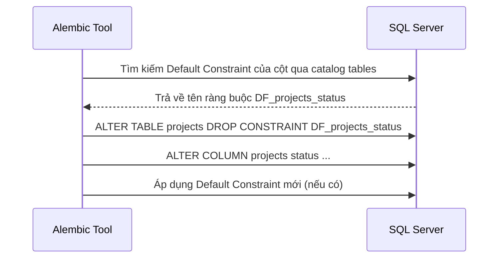

# Quản Lý Phiên Bản Cơ Sở Dữ Liệu bằng Alembic & SQL Server

## Mục tiêu
Hướng dẫn quản lý thay đổi schema cơ sở dữ liệu (version control) bằng thư viện Alembic trên hệ quản trị cơ sở dữ liệu MS SQL Server, tập trung vào cách xử lý khóa mặc định (default constraint locks) và kiểm tra tính nhất quán.

## Kiến thức nền
Thực hiện thay đổi cơ sở dữ liệu thủ công bằng các câu lệnh SQL tự do trên môi trường production là nguyên nhân chính gây ra lỗi hệ thống và mất mát dữ liệu. Database Migration cung cấp cơ chế tự động hóa và đảo ngược thay đổi an toàn.

## Giải thích chi tiết

### 1. Database Migrations
Là hệ thống quản lý phiên bản cho cơ sở dữ liệu quan hệ, được biểu diễn bằng các tập tin script Python để nâng cấp (`upgrade`) hoặc hạ cấp (`downgrade`) cấu trúc bảng.

### 2. Sự cố đặc thù trên SQL Server: Khóa mặc định (Default Constraint Locks)
Không giống như PostgreSQL hay MySQL cho phép bạn thay đổi giá trị mặc định trực tiếp, MS SQL Server bao bọc giá trị mặc định của mỗi cột bên trong các khóa ẩn gọi là **Default Constraints** với tên tự sinh ngẫu nhiên (ví dụ: `DF__projects__statu__5D0B3C21`).

Nếu bạn cố gắng sửa đổi hoặc xóa cột đó mà không xóa Default Constraint trước, SQL Server sẽ từ chối với thông báo lỗi:
```text
pymssql.exceptions.OperationalError: (1781, b'Column already has a DEFAULT bound to it.')
```

### 3. Giải pháp: Dynamic Constraint Dropping (Xóa ràng buộc động)
Vì tên ràng buộc được sinh ra tự động ở từng môi trường khác nhau, chúng ta phải truy vấn bảng danh mục hệ thống của SQL Server (`sys.default_constraints` và `sys.columns`) để lấy tên ràng buộc thực tế, sau đó thực thi lệnh drop động trước khi sửa cột.

## Luồng hoạt động



## Ví dụ trong TaskSyncEnterprise

### Hàm drop ràng buộc động trong file revision Alembic:
```python
from alembic import op
import sqlalchemy as sa

def drop_default_constraint(table_name: str, column_name: str) -> None:
    """Hàm tự động tìm kiếm và xóa Default Constraint trên MS SQL Server."""
    sql = f"""
    DECLARE @ConstraintName nvarchar(200)
    SELECT @ConstraintName = d.name 
    FROM sys.default_constraints d 
    JOIN sys.columns c ON d.parent_column_id = c.column_id AND d.parent_object_id = c.object_id
    WHERE d.parent_object_id = object_id('dbo.{table_name}') 
      AND c.name = '{column_name}'

    IF @ConstraintName IS NOT NULL
        EXEC('ALTER TABLE dbo.{table_name} DROP CONSTRAINT [' + @ConstraintName + ']')
    """
    op.execute(sql)

def upgrade() -> None:
    # 1. Xóa Default Constraint cũ trước khi thay đổi kiểu dữ liệu cột
    drop_default_constraint('projects', 'status')
    
    # 2. Thay đổi cấu trúc cột kèm giá trị mặc định mới
    op.alter_column('projects', 'status',
               existing_type=sa.VARCHAR(length=30),
               server_default=sa.text("N'Planning'"),
               existing_nullable=False)
```

## Khi nào sử dụng
*   Sử dụng Alembic bất cứ khi nào bạn thay đổi cấu trúc bảng (thêm/xóa/sửa cột, chỉ mục, khóa ngoại).
*   Sử dụng cơ chế xóa ràng buộc động khi chạy lệnh `op.alter_column` hoặc `op.drop_column` trên hệ quản trị SQL Server.

## Sai lầm thường gặp
*   **Viết cứng tên ràng buộc:** Ghi cứng tên hash ngẫu nhiên của database local vào file script migration. Khi chạy trên server khác, migration sẽ lỗi vì tên hash ngẫu nhiên được sinh ra ở server đó hoàn toàn khác.
*   **Bỏ qua hàm `downgrade()`:** Chỉ lập trình hàm `upgrade()`, làm cho việc khôi phục phiên bản trước khi triển khai lỗi (deployment rollback) là bất khả thi.

## Best Practices
1. Luôn chạy thử lệnh nâng cấp (`alembic upgrade head`) và hạ cấp (`alembic downgrade -1`) trên máy cá nhân trước khi gửi code lên git.
2. Kiểm tra tính đồng bộ của database schema và model bằng lệnh `alembic check` trong quy trình CI/CD.

## Checklist ghi nhớ
- [x] Không bao giờ sửa trực tiếp database trên production.
- [x] Luôn gọi lệnh xóa ràng buộc động trước khi drop/sửa cột trên SQL Server.
- [x] Luôn hoàn thiện cả hai hàm `upgrade` và `downgrade`.

## Tổng kết
Quản lý migration bài bản giúp đội ngũ phát triển đồng bộ cấu trúc database dễ dàng, đảm bảo các bản cập nhật hệ thống được triển khai tự động và an toàn.
