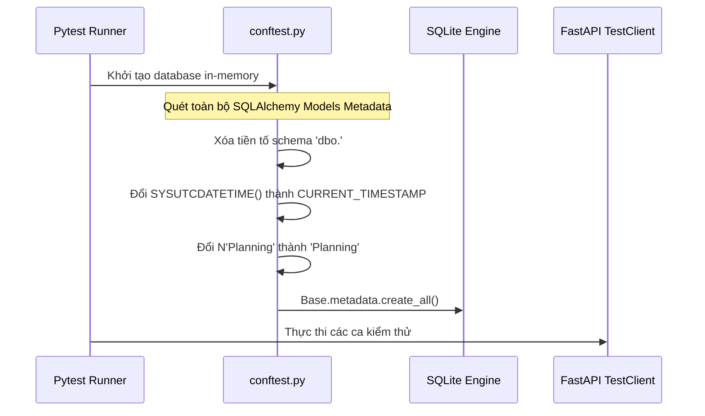

# Bảo Mật Định Tuyến API, Mã Hóa Mật Khẩu & Viết Unit Test

## Mục tiêu
Hướng dẫn bảo mật định tuyến API bằng phân quyền dựa trên vai trò (RBAC), khắc phục giới hạn 72-byte của thuật toán `bcrypt` bằng cách viết mã hóa trực tiếp, xây dựng bộ chuyển đổi (adapter) để chạy unit test độc lập với database, và tiền khởi tạo thư mục lưu trữ file tĩnh.

## Kiến thức nền
Việc kiểm thử tự động hệ thống doanh nghiệp đòi hỏi tốc độ chạy test nhanh và tính cô lập cao (isolation). Đồng thời, bảo mật mật khẩu ở mức lưu trữ là yêu cầu tối quan trọng của mọi tiêu chuẩn tuân thủ an toàn thông tin (như OWASP, ISO 27001).

## Giải thích chi tiết

### 1. Phân quyền dựa trên vai trò (Role-Based Access Control - RBAC)
Là cơ chế hạn chế quyền truy cập vào các API cụ thể dựa trên chức vụ/vai trò của người dùng hiện tại (ví dụ: Admin, Manager, Employee). 

### 2. Giới hạn 72-byte của Bcrypt
Thuật toán băm `bcrypt` tiêu chuẩn có giới hạn thiết kế: độ dài mật khẩu đầu vào tối đa là 72 byte. Các thư viện cũ như `passlib` phiên bản cũ bọc ngoài `bcrypt` thường gặp lỗi `ValueError: password cannot be longer than 72 bytes` khi chạy trên môi trường Python 3.12+ mới. Giải pháp là sử dụng thư viện `bcrypt` chính thức và tự băm/so khớp dạng byte thủ công.

### 3. Độc lập Cơ sở dữ liệu khi chạy Test (Database-Agnostic Testing)
Chạy unit test trên SQLite in-memory trong khi môi trường production chạy trên SQL Server. Do SQLite không hỗ trợ cú pháp đặc thù của SQL Server (như tiền tố Unicode `N''` hay hàm `SYSUTCDATETIME()`), chúng ta phải dùng code Python để viết lại metadata động trước khi tạo bảng kiểm thử.

## Luồng hoạt động



## Ví dụ trong TaskSyncEnterprise

### 1. Mã hóa mật khẩu bằng thư viện `bcrypt` trực tiếp:
```python
import bcrypt

def verify_password(plain_password: str, hashed_password: str) -> bool:
    try:
        # Chuyển chuỗi sang dạng bytes trước khi verify
        return bcrypt.checkpw(plain_password.encode("utf-8"), hashed_password.encode("utf-8"))
    except Exception:
        return False

def get_password_hash(password: str) -> str:
    salt = bcrypt.gensalt()
    return bcrypt.hashpw(password.encode("utf-8"), salt).decode("utf-8")
```

### 2. Viết lại Metadata trong `tests/conftest.py` để tương thích SQLite:
```python
import pytest
from sqlalchemy import create_engine, text
from sqlalchemy.orm import sessionmaker
from sqlalchemy.sql.schema import DefaultClause
from app.database import Base

engine = create_engine("sqlite:///:memory:")
TestingSessionLocal = sessionmaker(bind=engine)

@pytest.fixture(scope="function")
def db():
    # Adapter chuyển đổi metadata động cho SQLite
    for table in Base.metadata.tables.values():
        table.schema = None  # Xóa tiền tố 'dbo'
        for column in table.columns:
            if column.server_default is not None and isinstance(column.server_default, DefaultClause):
                arg = column.server_default.arg
                default_val = arg.text if hasattr(arg, "text") else str(arg)
                
                # Chuyển đổi hàm của SQL Server sang hàm tương đương của SQLite
                if "GETDATE()" in default_val or "SYSUTCDATETIME()" in default_val:
                    column.server_default.arg = text("CURRENT_TIMESTAMP")
                elif default_val.startswith("N'") and default_val.endswith("'"):
                    column.server_default.arg = text(default_val[1:])  # Xóa ký tự N

    Base.metadata.create_all(bind=engine)
    db = TestingSessionLocal()
    try:
        yield db
    finally:
        db.close()
        Base.metadata.drop_all(bind=engine)
```

## Khi nào sử dụng
*   Sử dụng cơ chế mã hóa trực tiếp bằng thư viện `bcrypt` cho tất cả chức năng đăng ký, đổi mật khẩu và xác thực người dùng.
*   Sử dụng adapter viết lại metadata khi bạn muốn viết unit test chạy nhanh và độc lập với hệ quản trị SQL Server ở môi trường local hoặc CI/CD.

## Sai lầm thường gặp
*   **Chạy test trên database production hoặc database dùng chung:** Làm xáo trộn dữ liệu thực tế và khiến kết quả test bị ảnh hưởng lẫn nhau nếu chạy song song.
*   **Lưu trữ mật khẩu dạng cleartext hoặc băm MD5/SHA1 đơn giản:** Dễ dàng bị giải mã bằng phương pháp vét cạn (brute-force) hoặc tra bảng mã băm (rainbow table).

## Best Practices
1. Luôn sử dụng biến môi trường hoặc cấu hình động để tự động chuyển hướng kết nối database của ứng dụng sang database test khi chạy lệnh `pytest`.
2. Tiền khởi tạo thư mục lưu trữ file tĩnh (`uploads/avatars`, `uploads/attachments`) ngay khi ứng dụng khởi chạy để tránh gặp lỗi không tìm thấy đường dẫn ghi file (FileNotFoundError).

## Checklist ghi nhớ
- [x] Không chèn mật khẩu thô vào database.
- [x] Xóa tiền tố `dbo` của metadata khi chạy test trên SQLite.
- [x] Sử dụng `bcrypt` dạng bytes trực tiếp.

## Tổng kết
Viết unit test độc lập kết hợp với băm mật khẩu chuẩn hóa là thước đo phản ánh mức độ trưởng thành về quy trình phát triển và chất lượng bảo mật của một dự án backend doanh nghiệp.
