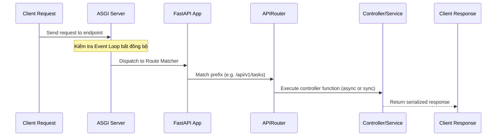

# Kiến Trúc Nền Tảng Backend (Backend Foundation)

## Mục tiêu
Hiểu sâu sắc về hạ tầng backend của TaskSyncEnterprise dựa trên nền tảng **FastAPI** và **ASGI**, bao gồm cấu trúc định tuyến, cơ chế đăng ký router động và quản lý vòng đời gói tin HTTP.

## Kiến thức nền
Phát triển ứng dụng web hiện đại đòi hỏi khả năng xử lý đồng thời (concurrency) cao và khả năng tự động hóa tài liệu hóa API. FastAPI là sự kết hợp hoàn hảo giữa cú pháp Python tinh gọn và hiệu năng xử lý bất đồng bộ mạnh mẽ.

## Giải thích chi tiết

### 1. ASGI (Asynchronous Server Gateway Interface)
Là tiêu chuẩn kế thừa của WSGI (Web Server Gateway Interface) truyền thống. Trong khi WSGI là đồng bộ (synchronous - xử lý các request tuần tự theo từng luồng), ASGI hỗ trợ cơ chế lập trình bất đồng bộ (`async`/`await`), WebSockets và kết nối dài hạn (HTTP/2), giúp ứng dụng tận dụng tối đa sức mạnh của lõi CPU.

### 2. FastAPI APIRouter
Công cụ đắc lực để chia nhỏ các endpoint API thành các module nghiệp vụ riêng biệt (ví dụ: Auth, Tasks, Employees). Điều này giúp cô lập mã nguồn, tăng khả năng làm việc nhóm song song và duy trì sự tinh gọn cho tệp chạy chính `main.py`.

## Luồng hoạt động



## Ví dụ trong TaskSyncEnterprise
Trong [main.py](file:///e:/TaskSyncEnterprise/backend/app/main.py#L16-L30), các router được đăng ký và tải động theo danh sách dưới tiền tố phiên bản API:

```python
from app.routers.v1 import (
    health,
    roles,
    departments,
    # ... các router khác
)

routers = [
    health.router,
    roles.router,
    # ... danh sách
]

for r in routers:
    app.include_router(r, prefix=settings.API_V1_STR)
```

## Khi nào sử dụng
*   Sử dụng `async def` cho các endpoint thực hiện các tác vụ I/O bound (gọi API bên thứ ba, truy vấn database bất đồng bộ).
*   Sử dụng `def` thường cho các tác vụ CPU bound hoặc xử lý đồng bộ để tránh chặn (block) toàn bộ Event Loop của hệ thống.

## Sai lầm thường gặp
*   **Chạy mã chặn (blocking I/O) trong hàm `async def`:** Ví dụ, sử dụng thư viện `requests` đồng bộ hoặc chạy tính toán nặng trực tiếp trong hàm async. Điều này sẽ khóa chặt Event Loop và làm tê liệt khả năng xử lý đa nhiệm của toàn bộ server.

## Best Practices
1. Luôn nhóm các endpoint liên quan dưới một tiền tố rõ ràng (như `/api/v1/auth`).
2. Tách biệt hoàn toàn phần xử lý yêu cầu HTTP (Router) khỏi logic nghiệp vụ thực tế (Service Layer).

## Checklist ghi nhớ
- [x] ASGI hỗ trợ đầy đủ lập trình bất đồng bộ (Asynchronous).
- [x] Router chỉ chịu trách nhiệm parse request và serialize response.
- [x] Sử dụng thẻ `tags` để nhóm API trên trang Swagger UI.

## Tổng kết
Hạ tầng backend linh hoạt dựa trên ASGI và FastAPI Router giúp TaskSyncEnterprise có hiệu năng cao, mở rộng tính năng nhanh chóng và dễ dàng tích hợp vào hệ thống microservices.
