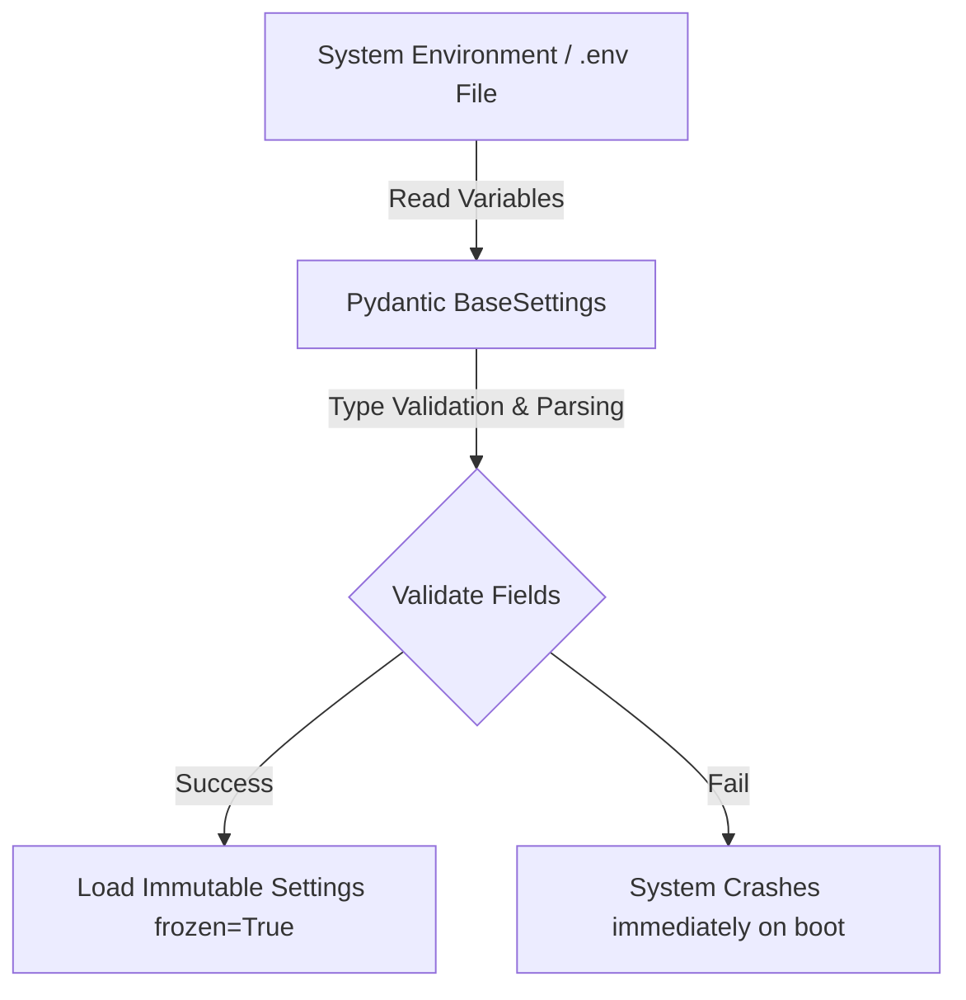

# Quản Lý Cấu Hình & Biến Môi Trường (Configuration & Environment Management)

## Mục tiêu
Hướng dẫn quản lý cấu hình hệ thống tập trung và an toàn bằng cách sử dụng **Pydantic Settings V2**, cơ chế bất biến (immutable configurations), và bảo mật các dữ liệu nhạy cảm thông qua `SecretStr`.

## Kiến thức nền
Ghi cứng (hardcode) các biến cấu hình hoặc thông tin bảo mật nhạy cảm vào mã nguồn là một lỗ hổng bảo mật nghiêm trọng. Theo triết lý phát triển ứng dụng đám mây hiện đại (12-Factor App), cấu hình hệ thống phải được lưu trữ độc lập trong môi trường (Environment Variables).

## Giải thích chi tiết

### 1. Pydantic Settings V2
Là thư viện đắc lực đọc các biến môi trường từ hệ điều hành hoặc tập tin cấu hình `.env`, tự động chuyển đổi chúng sang các kiểu dữ liệu tương ứng trong Python (như số nguyên, boolean, danh sách) và thực hiện xác thực tính hợp lệ.

### 2. Tính bất biến (Immutability / Frozen Settings)
Để tránh các bug ở tầng view thay đổi nhầm cấu hình hệ thống khi đang chạy (ví dụ: thay đổi địa chỉ database hoặc chuỗi JWT key), cấu hình cần được đóng băng (`frozen=True`) nhằm bảo vệ tính toàn vẹn suốt vòng đời tiến trình.

### 3. Kiểu dữ liệu `SecretStr`
Giúp bảo vệ các chuỗi nhạy cảm (như mật khẩu database, khóa bí mật JWT). Khi in đối tượng cấu hình hoặc xuất nhật ký log, giá trị của `SecretStr` sẽ tự động hiển thị ẩn dưới dạng chuỗi sao (`**********`), ngăn chặn rò rỉ thông tin.

## Luồng hoạt động



## Ví dụ trong TaskSyncEnterprise
Trong [settings.py](file:///e:/TaskSyncEnterprise/backend/app/core/settings.py), cấu hình được định nghĩa tập trung:

```python
from pydantic import Field, SecretStr
from pydantic_settings import BaseSettings, SettingsConfigDict

class Settings(BaseSettings):
    model_config = SettingsConfigDict(
        env_file=".env",
        frozen=True  # Đảm bảo cấu hình bất biến tại runtime
    )

    SECRET_KEY: SecretStr = Field(...)
    ACCESS_TOKEN_EXPIRE_MINUTES: int = Field(default=60)
```
Để sử dụng giá trị nhạy cảm này, chúng ta cần gọi `.get_secret_value()` một cách tường minh, ví dụ:
`settings.SECRET_KEY.get_secret_value()`

## Khi nào sử dụng
*   Luôn sử dụng `BaseSettings` cho tất cả cấu hình của backend.
*   Sử dụng `SecretStr` cho mật khẩu kết nối database, khóa mã hóa JWT, thông tin xác thực SMTP hoặc các khóa API kết nối dịch vụ bên ngoài.

## Sai lầm thường gặp
*   **Ghi log trực tiếp dữ liệu nhạy cảm:** In toàn bộ đối tượng cấu hình ra log mà không bọc các khóa nhạy cảm trong `SecretStr`, làm hiển thị mật khẩu thô trong nhật ký hệ thống.
*   **Thay đổi cấu hình tại runtime:** Thiết lập giá trị mới cho một cấu hình trong router. Luôn xem cấu hình là dữ liệu chỉ đọc (read-only).

## Best Practices
1. Luôn khai báo giá trị mặc định an toàn cho các môi trường thử nghiệm và yêu cầu cấu hình tường minh trên môi trường production.
2. Thực thi kiểm tra kết nối (ví dụ: ping database) ngay tại thời điểm khởi chạy để kiểm chứng cấu hình hợp lệ trước khi bắt đầu tiếp nhận traffic (Fail-Fast Boot).

## Checklist ghi nhớ
- [x] Cấu hình luôn đọc từ biến môi trường hoặc file `.env`.
- [x] Sử dụng `SecretStr` để bảo mật thông tin nhạy cảm.
- [x] Khóa cấu hình bất biến bằng cài đặt `frozen=True`.

## Tổng kết
Quản lý cấu hình thông qua Pydantic Settings V2 giúp TaskSyncEnterprise hoạt động an toàn, linh hoạt thích ứng với các môi trường triển khai (Kubernetes, Cloud, Docker) mà không cần thay đổi mã nguồn.
