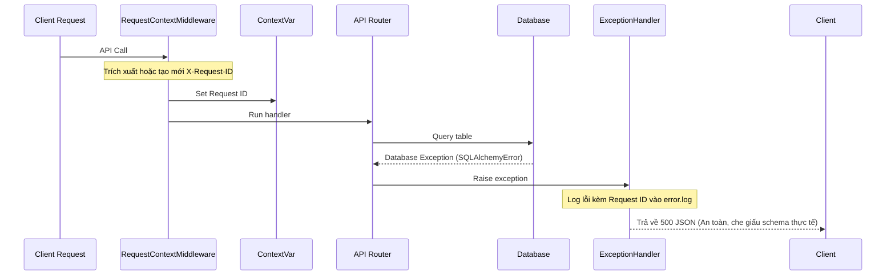

# Hệ Thống Ghi Nhật Ký Doanh Nghiệp & Xử Lý Ngoại Lệ (Enterprise Logging & Exception Handling)

## Mục tiêu
Thiết lập hệ thống ghi nhật ký quay vòng (Log Rotation) cấp doanh nghiệp, truyền dẫn mã liên vết (Correlation ID) qua ngữ cảnh luồng (ContextVar) và xây dựng bộ lọc ngoại lệ an toàn ngăn rò rỉ dữ liệu cấu trúc database.

## Kiến thức nền
Khi vận hành một hệ thống có hàng ngàn lượt truy cập đồng thời, các luồng log text thông thường sẽ bị trộn lẫn, gây khó khăn cho việc gỡ lỗi (debug). Đồng thời, việc để lộ chi tiết lỗi hệ thống (như stack trace hoặc cấu trúc SQL) ra ngoài API là lỗ hổng an ninh nghiêm trọng.

## Giải thích chi tiết

### 1. Mã liên vết (Correlation ID / Request ID)
Là chuỗi ký tự định danh duy nhất (UUID) được tạo ra ngay khi request đi qua cổng ngõ của server. Chuỗi ID này được gán vào mọi dòng log phát sinh trong suốt vòng đời xử lý request đó. Nếu người dùng gặp lỗi, họ chỉ cần chụp lại mã ID này gửi cho đội hỗ trợ để tra cứu chính xác log.

### 2. ContextVar (Ngữ cảnh luồng)
Cơ chế lưu trữ biến ngữ cảnh an toàn cho lập trình bất đồng bộ. Vì FastAPI xử lý nhiều request đồng thời trên cùng một Event Loop, chúng ta không thể dùng biến toàn cục thông thường vì sẽ gây rò rỉ chéo dữ liệu giữa các request. `contextvars` giúp cô lập mã Request ID cho từng tiến trình xử lý độc lập.

### 3. Log Rotation (Nhật ký quay vòng)
Là cơ chế giới hạn dung lượng file ghi log (ví dụ: tối đa 10MB/file). Khi vượt quá giới hạn, hệ thống sẽ đổi tên file log cũ thành file backup và tạo mới file log trống để tiếp tục ghi, tránh làm tràn ổ cứng máy chủ.

## Luồng hoạt động



## Ví dụ trong TaskSyncEnterprise
Trong [logger.py](file:///e:/TaskSyncEnterprise/backend/app/logging/logger.py), bộ lọc ghi nhận thông tin `CorrelationIdFilter` liên kết ngữ cảnh biến vào dòng log:

```python
import contextvars
import logging

request_id_ctx = contextvars.ContextVar("request_id", default="-")

class CorrelationIdFilter(logging.Filter):
    def filter(self, record: logging.LogRecord) -> bool:
        record.request_id = request_id_ctx.get()
        return True
```
Trong [exception_handler.py](file:///e:/TaskSyncEnterprise/backend/app/handlers/exception_handler.py), lỗi SQL được chặn lại để bảo mật cấu trúc bảng:

```python
@app.exception_handler(SQLAlchemyError)
async def sqlalchemy_exception_handler(request: Request, exc: SQLAlchemyError):
    request_id = request_id_ctx.get()
    error_logger.error(f"Database failure: {exc}", exc_info=True)
    return JSONResponse(
        status_code=500,
        content={
            "success": False,
            "message": "Đã xảy ra lỗi tương tác cơ sở dữ liệu hệ thống.",
            "request_id": request_id,
            "data": None
        }
    )
```

## Khi nào sử dụng
*   Sử dụng **Correlation ID** cho tất cả các log nghiệp vụ để dễ dàng lọc và tìm kiếm lỗi.
*   Sử dụng **Log Rotation** cho môi trường Production để giới hạn dung lượng file ghi log của server.

## Sai lầm thường gặp
*   **Báo lỗi SQL chi tiết về Client:** Gửi trực tiếp thông báo lỗi của SQL Server (như tên bảng, tên cột bị trùng, cú pháp sai) về client. Kẻ tấn công có thể dựa vào các thông tin cấu trúc này để thực hiện SQL Injection.
*   **Không giới hạn file log:** Ghi log vào một file duy nhất không giới hạn dung lượng, khiến ổ đĩa của server bị đầy sau một thời gian vận hành và làm sập ứng dụng.

## Best Practices
1. Luôn ghi log kèm theo Request ID ở mọi tầng kiến trúc (Middleware, Controller, Service, Repository).
2. Tách biệt file ghi log hoạt động thông thường (`app.log`), log lỗi hệ thống (`error.log`), và log tuân thủ quy trình nghiệp vụ (`audit.log`).

## Checklist ghi nhớ
- [x] Request ID được lưu trữ an toàn bằng `ContextVar`.
- [x] Xóa bỏ stack trace hệ thống trước khi phản hồi lỗi về client.
- [x] Cấu hình dung lượng tối đa và số lượng file backup cho log handler.

## Tổng kết
Hệ thống ghi nhật ký quy chuẩn kết hợp xử lý ngoại lệ an toàn là tiêu chuẩn bắt buộc giúp các ứng dụng doanh nghiệp lớn vận hành trơn tru và dễ dàng bảo trì, giám sát.
