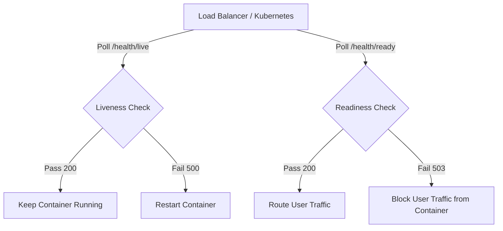

# Kiểm Tra Sức Khỏe Hệ Thống & Chẩn Đoán Khởi Chạy (Health Checks & Runtime Diagnostics)

## Mục tiêu
Thiết kế và triển khai hệ thống kiểm tra sức khỏe (Health Check) phân tách rõ ràng giữa Liveness và Readiness Probes, xây dựng cấu trúc kiểm thử dependencies theo khối độc lập và thiết lập bộ đo lường hiệu năng khởi chạy.

## Kiến thức nền
Trong môi trường điện toán đám mây hiện đại (như Docker, Kubernetes hay AWS ECS), việc hạ tầng tự động phát hiện lỗi và tự phục hồi (self-healing) phụ thuộc hoàn toàn vào kết quả phản hồi của các endpoint `/health`.

## Giải thích chi tiết

### 1. Liveness Probe (Kiểm tra sự sống)
Trả lời câu hỏi: *"Tiến trình của ứng dụng còn chạy bình thường không?"*. Nếu liveness check thất bại (ví dụ: do ứng dụng bị treo luồng - deadlock), container sẽ bị khởi động lại (restart) tự động.
*   **Nguyên tắc:** Phải thực hiện cực kỳ nhanh, chỉ kiểm tra tiến trình ứng dụng nội bộ, tuyệt đối không truy vấn cơ sở dữ liệu hay gọi API bên thứ ba.

### 2. Readiness Probe (Kiểm tra mức độ sẵn sàng)
Trả lời câu hỏi: *"Ứng dụng đã sẵn sàng nhận traffic từ người dùng chưa?"*. Nếu readiness check thất bại (ví dụ: database bị quá tải hoặc ổ đĩa bị đầy), load balancer sẽ ngừng chuyển traffic đến container này và chuyển sang container khác. Container gặp sự cố sẽ **không bị khởi động lại**, giúp nó có thời gian tự phục hồi kết nối.

### 3. Thời gian chờ (Timeout)
Mọi kiểm tra kết nối hạ tầng bên ngoài phải đi kèm giới hạn thời gian chờ cực ngắn (ví dụ: 3 giây) để tránh tình trạng kiểm tra sức khỏe làm treo luồng xử lý chính.

## Luồng hoạt động



## Ví dụ trong TaskSyncEnterprise
Trong [checks.py](file:///e:/TaskSyncEnterprise/backend/app/health/checks.py), kiểm tra database được cấu hình thời gian chờ:

```python
class DatabaseCheck:
    @staticmethod
    def run() -> tuple[bool, str]:
        from sqlalchemy import create_engine
        val_engine = create_engine(
            settings.SQLALCHEMY_DATABASE_URI,
            connect_args={"login_timeout": settings.HEALTH_TIMEOUT, "timeout": settings.HEALTH_TIMEOUT}
        )
        try:
            with val_engine.connect() as conn:
                conn.execute(text("SELECT 1"))
            return True, "Database connection is healthy."
        except Exception as e:
            return False, str(e)
        finally:
            val_engine.dispose()
```
Trong [health.py](file:///e:/TaskSyncEnterprise/backend/app/routers/health.py), mã lỗi HTTP được trả về tương ứng:

```python
@router.get("/ready", response_model=ReadinessResponse)
def readiness_probe(response: Response):
    is_ready, report = health_service.get_readiness()
    if not is_ready:
        response.status_code = status.HTTP_503_SERVICE_UNAVAILABLE
    return report
```

## Khi nào sử dụng
*   Luôn cấu hình **Liveness Probe** (`/health/live`) cho các bộ quản lý container (Kubernetes, AWS ECS) để tự động khởi động lại ứng dụng khi bị treo.
*   Luôn cấu hình **Readiness Probe** (`/health/ready`) trước khi chạy deploy phiên bản mới để tránh tình trạng người dùng truy cập vào container khi database migration chưa chạy xong.

## Sai lầm thường gặp
*   **Truy vấn Database trong Liveness Check:** Nếu SQL Server gặp sự cố quá tải tạm thời (ví dụ: khóa bảng), tất cả các container sẽ báo Liveness thất bại đồng thời. Hệ thống điều phối sẽ khởi động lại toàn bộ các container cùng một lúc, gây ra sập hệ thống trên diện rộng thay vì chỉ tạm dừng định tuyến traffic.

## Best Practices
1. Luôn cấu hình kết nối database trong health check với `login_timeout` ngắn (ví dụ: từ 2 đến 3 giây).
2. Tách biệt kiểm tra logic ghi dữ liệu lên ổ cứng (`StorageCheck`) khỏi các kiểm tra đơn giản về RAM/CPU.

## Checklist ghi nhớ
- [x] Liveness check KHÔNG được query database.
- [x] Readiness check kiểm tra database, file storage và cấu hình.
- [x] Trả về mã lỗi HTTP 503 khi hệ thống chưa sẵn sàng.

## Tổng kết
Phân tách rõ ràng giữa Liveness và Readiness giúp hạ tầng đám mây tự sửa lỗi và điều phối tải thông minh, đảm bảo tính sẵn sàng cao (High Availability) cho hệ thống doanh nghiệp.
