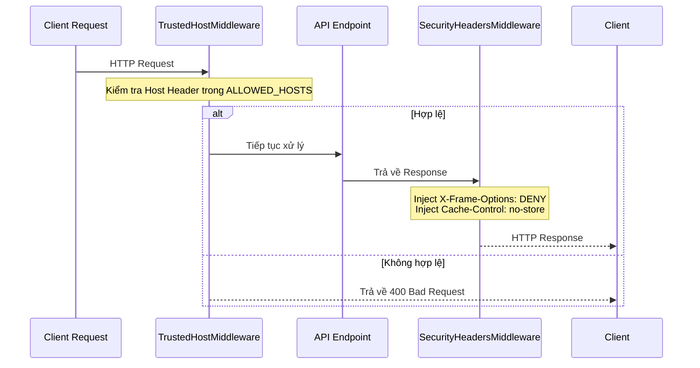

# Tối Ưu Hóa Bảo Mật & Đánh Giá Sẵn Sàng Vận Hành (Production Hardening & Readiness Audit)

## Mục tiêu
Hướng dẫn triển khai các biện pháp bảo mật nâng cao cho môi trường Production, bao gồm xác thực máy chủ (Trusted Hosts), chèn mã bảo mật OWASP Headers vào phản hồi HTTP, vô hiệu hóa bộ nhớ đệm trình duyệt cho các dữ liệu nhạy cảm, và giải phóng tài nguyên an toàn khi tắt ứng dụng.

## Kiến thức nền
Khi đưa ứng dụng lên internet, hệ thống sẽ liên tục đối mặt với các cuộc dò quét tự động. Cấu hình bảo mật mặc định của các framework thường rất lỏng lẻo. Chúng ta phải chủ động gia cố ứng dụng ở mọi lớp hạ tầng.

## Giải thích chi tiết

### 1. Tấn công HTTP Host Header Injection
HTTP request header chứa một trường `Host` chỉ định domain đích của server. Nếu ứng dụng backend tin cậy hoàn toàn giá trị này để sinh các đường link chuyển hướng (redirect) hoặc sinh link reset mật khẩu gửi qua email, kẻ tấn công có thể thay đổi giá trị `Host` thành tên miền độc hại của chúng, dẫn tới việc chiếm đoạt tài khoản người dùng.
*   **Giải pháp:** Sử dụng `TrustedHostMiddleware` để giới hạn danh sách domain hợp lệ.

### 2. Các Header Bảo Mật của OWASP
Trình duyệt web hiện đại hỗ trợ nhiều tính năng bảo mật thông qua cấu hình HTTP Response Header:
*   `X-Frame-Options: DENY`: Ngăn chặn website bị nhúng vào bên trong các thẻ `<iframe>` của trang web khác, bảo vệ người dùng khỏi tấn công đánh lừa nhấp chuột (Clickjacking).
*   `X-Content-Type-Options: nosniff`: Yêu cầu trình duyệt tuân thủ chính xác định dạng file trả về, ngăn chặn việc thực thi các đoạn mã độc giả dạng tệp tin hình ảnh.
*   `Referrer-Policy`: Kiểm soát lượng thông tin URL giới thiệu được gửi kèm khi người dùng click link liên kết ngoài.

### 3. Graceful Shutdown (Tắt máy an toàn)
Khi có sự kiện tắt ứng dụng (ví dụ: deploy phiên bản mới thay thế), ứng dụng không được ngắt đột ngột. Nó cần ngắt tiếp nhận kết nối mới, chờ các tác vụ xử lý đang dở hoàn thành nốt, đóng các kết nối database pool, ghi lại nhật ký log cuối cùng, rồi mới thoát tiến trình.

## Luồng hoạt động



## Ví dụ trong TaskSyncEnterprise
Trong [middleware.py](file:///e:/TaskSyncEnterprise/backend/app/core/middleware.py), các header bảo mật và vô hiệu hóa bộ nhớ đệm được chèn tự động:

```python
class SecurityHeadersMiddleware(BaseHTTPMiddleware):
    async def dispatch(self, request: Request, call_next) -> Response:
        response = await call_next(request)
        
        # 1. Các Header bảo mật chuẩn OWASP
        response.headers["X-Frame-Options"] = "DENY"
        response.headers["X-Content-Type-Options"] = "nosniff"
        response.headers["Referrer-Policy"] = "strict-origin-when-cross-origin"
        
        # 2. Vô hiệu hóa cache cho các API động
        if request.url.path.startswith(settings.API_V1_STR):
            response.headers["Cache-Control"] = "no-store, no-cache, must-revalidate, max-age=0"
            response.headers["Pragma"] = "no-cache"
            
        return response
```
Trong [shutdown.py](file:///e:/TaskSyncEnterprise/backend/app/lifecycle/shutdown.py), giải phóng database pool được thực thi:

```python
def run_shutdown() -> None:
    app_logger.info("Closing database engine pool...")
    engine.dispose()
    logging.shutdown()
```

## Khi nào sử dụng
*   Luôn bật `SecurityHeadersMiddleware` và `TrustedHostMiddleware` cho mọi môi trường triển khai thực tế.
*   Cấu hình `ALLOWED_HOSTS` chi tiết trong production (ví dụ: `ALLOWED_HOSTS = ["api.tasksync.com"]`), tuyệt đối không dùng giá trị mặc định wildcard `["*"]`.

## Sai lầm thường gặp
*   **Ngắt tiến trình thô bạo (Hard Kill):** Sử dụng lệnh `SIGKILL` (`kill -9`) để dừng container thay vì gửi tín hiệu tắt an toàn `SIGTERM`. Điều này làm đứt gãy các tiến trình ghi file, làm hỏng dữ liệu dở dang hoặc giữ trạng thái treo kết nối trên database server.

## Best Practices
1. Luôn cấu hình `Cache-Control: no-store` cho tất cả các API trả về thông tin nhạy cảm của nhân viên để ngăn chặn lưu cache ở máy tính công cộng.
2. Kiểm tra thứ tự đăng ký Middleware trong [main.py](file:///e:/TaskSyncEnterprise/backend/app/main.py#L67-L87): Middleware xử lý CORS và bảo mật Header phải nằm ở ngoài cùng của chuỗi xử lý.

## Checklist ghi nhớ
- [x] Giới hạn `ALLOWED_HOSTS` bằng tên miền chính thức trong production.
- [x] Chèn `X-Frame-Options: DENY` bảo vệ clickjacking.
- [x] Đóng database engine pool `engine.dispose()` khi tắt app.

## Tổng kết
Thực hiện tối ưu hóa bảo mật và dọn dẹp tài nguyên an toàn giúp ứng dụng TaskSyncEnterprise đạt độ tin cậy cao, vượt qua các đợt kiểm thử an ninh chuyên sâu và đảm bảo hạ tầng vận hành ổn định lâu dài.
