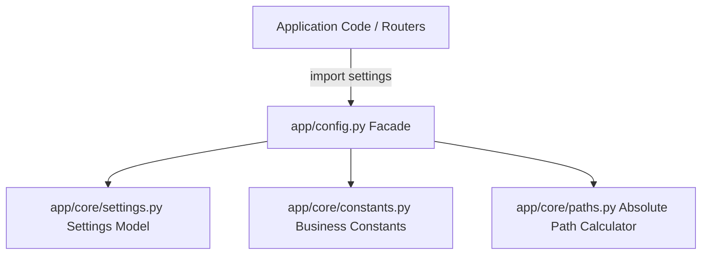

# Phân Lớp Cấu Hình Doanh Nghiệp (Enterprise Configuration Layer)

## Mục tiêu
Kiến trúc và tổ chức lại hệ thống cấu hình từ một file đơn lẻ thành một cấu trúc phân lớp chuyên biệt (Settings, Constants, Paths) kết hợp mẫu thiết kế Facade (`config.py`) nhằm đảm bảo tính sạch sẽ, dễ bảo trì và dễ mở rộng.

## Kiến thức nền
Khi hệ thống doanh nghiệp phình to, số lượng biến cấu hình có thể lên đến hàng trăm biến. Việc gom chung hằng số nghiệp vụ (như phân quyền, trạng thái), cấu hình môi trường (như DB credentials, CORS origins) và đường dẫn file vật lý vào một file duy nhất sẽ gây khó khăn cho việc quản lý và gây ra các phụ thuộc vòng (circular imports).

## Giải thích chi tiết

### 1. Cấu hình môi trường (Settings)
Chứa các tham số thay đổi theo từng môi trường triển khai (Local, Staging, Production). Được quản lý bằng `pydantic-settings` và đọc trực tiếp từ biến môi trường hoặc tệp tin `.env`.

### 2. Hằng số nghiệp vụ (Constants)
Chứa các giá trị bất biến, quy định quy tắc nghiệp vụ cố định của hệ thống (ví dụ: giới hạn số dòng phân trang tối đa, định dạng ngày tháng hiển thị, danh sách vai trò vai trò Admin/Manager/Employee).

### 3. Đường dẫn thư mục (Paths)
Chứa các logic tính toán đường dẫn thư mục vật lý động trên ổ cứng (như thư mục upload avatar, log files, static pages) tương đối theo thư mục gốc của dự án.

### 4. Thiết kế Facade Pattern (`config.py`)
Đóng vai trò là điểm tiếp xúc duy nhất cho toàn bộ ứng dụng khi cần đọc cấu hình. Toàn bộ mã nguồn bên ngoài chỉ cần import duy nhất một đối tượng `settings` từ `app.config` mà không cần biết chi tiết cấu trúc thư mục bên dưới.

## Luồng hoạt động



## Ví dụ trong TaskSyncEnterprise

### 1. Phân chia đường dẫn động ([paths.py](file:///e:/TaskSyncEnterprise/backend/app/core/paths.py)):
```python
from pathlib import Path

# Tự động tính toán đường dẫn gốc của project
PROJECT_ROOT = Path(__file__).resolve().parent.parent.parent.parent

# Các đường dẫn con định dạng động
LOG_DIR_PATH = PROJECT_ROOT / "logs"
UPLOAD_DIR_PATH = PROJECT_ROOT / "uploads"
```

### 2. File cấu hình facade ([config.py](file:///e:/TaskSyncEnterprise/backend/app/config.py)):
```python
from app.core.settings import Settings
from app.core.constants import *
from app.core.paths import *

# Khởi tạo instance duy nhất cho toàn bộ hệ thống
settings = Settings()
```

## Khi nào sử dụng
*   Luôn áp dụng phân lớp này ngay khi dự án có nhiều loại cấu hình hỗn hợp.
*   Sử dụng Facade pattern để ẩn đi sự phức tạp của hạ tầng bên dưới, giảm thiểu số lượng dòng import ở đầu các file controller.

## Sai lầm thường gặp
*   **Ghi cứng đường dẫn tuyệt đối (Absolute Path):** Khai báo đường dẫn dạng `C:\TaskSyncEnterprise\uploads`. Khi deploy lên server Linux hoặc máy tính của đồng nghiệp, ứng dụng sẽ bị crash ngay lập tức vì không tìm thấy đường dẫn.
*   **Đặt hằng số trong database mà không cần thiết:** Đặt các giá trị bất biến (như danh sách các phân quyền chuẩn) vào database, gây phát sinh các câu lệnh query thừa thãi.

## Best Practices
1. Luôn sử dụng thư viện `pathlib.Path` để xử lý đường dẫn, giúp code tương thích tốt trên cả Windows, Linux và macOS.
2. Thiết lập cơ chế kiểm tra sự tồn tại và tự tạo thư mục (mkdir) cho các thư mục upload hoặc log ngay khi ứng dụng khởi chạy.

## Checklist ghi nhớ
- [x] Không lưu thông tin bảo mật nhạy cảm trong file constants.
- [x] Toàn bộ code chỉ import cấu hình từ `app.config`.
- [x] Mọi đường dẫn thư mục đều được resolve tương đối từ thư mục gốc của dự án.

## Tổng kết
Tổ chức hệ thống cấu hình phân lớp giúp loại bỏ sự phụ thuộc vòng, đảm bảo mã nguồn sạch sẽ và giúp DevOps dễ dàng thay đổi cấu hình triển khai ở mọi môi trường.
