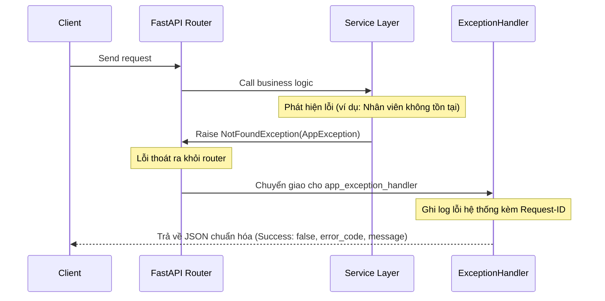

# Hệ Thống Xử Lý Ngoại Lệ Toàn Cục (Global Exception Handling)

## Mục tiêu
Thiết kế và xây dựng một đường ống xử lý lỗi tập trung (Global Exception Handling Pipeline) cho toàn bộ ứng dụng, chuẩn hóa định dạng lỗi trả về và ngăn chặn rò rỉ thông tin nhạy cảm của hệ thống.

## Kiến thức nền
Khi viết code, việc rải rác các khối lệnh `try/except` ở khắp mọi nơi sẽ làm bẩn code, lặp lại logic xử lý và khó khăn khi muốn thay đổi định dạng phản hồi lỗi. Chúng ta cần một cơ chế tập trung ở ngoài cùng để tự động bắt tất cả các ngoại lệ và định dạng lại chúng một cách nhất quán trước khi gửi về client.

## Giải thích chi tiết

### 1. Phễu hứng ngoại lệ (Exception Interception)
FastAPI cung cấp decorator `@app.exception_handler(ExceptionClass)` cho phép đăng ký các hàm xử lý chuyên biệt cho từng loại lỗi. Khi bất kỳ tầng nào của ứng dụng (Repository, Service, Controller) ném ra một ngoại lệ, tiến trình xử lý bình thường sẽ dừng lại và quyền điều khiển được chuyển giao cho handler tương ứng.

### 2. AppException (Ngoại lệ ứng dụng cơ sở)
Lớp lỗi cơ sở kế thừa từ `Exception`, định nghĩa các thuộc tính cơ bản như `status_code` (Mã lỗi HTTP), `message` (Mô tả thân thiện với người dùng), và `error_code` (Mã lỗi nghiệp vụ phục vụ việc tra cứu). Mọi lỗi nghiệp vụ (như `NotFoundException`, `ConflictException`) đều kế thừa từ lớp cơ sở này.

### 3. Mã lỗi nghiệp vụ (Internal Error Codes)
Hệ thống sử dụng các hằng số mã lỗi chuẩn hóa (ví dụ: `ERR_AUTH_EXPIRED`, `ERR_DB_CONSTRAINT`) để giúp lập trình viên frontend dễ dàng bắt lỗi và hiển thị thông báo đa ngôn ngữ tương ứng thay vì kiểm tra chuỗi string thô.

## Luồng hoạt động



## Ví dụ trong TaskSyncEnterprise

### 1. Định nghĩa mã lỗi ([error_codes.py](file:///e:/TaskSyncEnterprise/backend/app/core/error_codes.py)):
```python
# Hằng số mã lỗi nghiệp vụ doanh nghiệp
ERR_VALIDATION = "ERR_VALIDATION_FAILED"
ERR_DATABASE = "ERR_DATABASE_ERROR"
ERR_RESOURCE_NOT_FOUND = "ERR_RESOURCE_NOT_FOUND"
```

### 2. Định nghĩa AppException ([exceptions.py](file:///e:/TaskSyncEnterprise/backend/app/core/exceptions.py)):
```python
class AppException(Exception):
    def __init__(self, message: str, status_code: int = 500, error_code: str = "ERR_SYSTEM_ERROR"):
        super().__init__(message)
        self.message = message
        self.status_code = status_code
        self.error_code = error_code

class NotFoundException(AppException):
    def __init__(self, message: str = "Không tìm thấy tài nguyên yêu cầu."):
        super().__init__(message, status_code=404, error_code=ERR_RESOURCE_NOT_FOUND)
```

### 3. Đăng ký Handler toàn cục ([exception_handler.py](file:///e:/TaskSyncEnterprise/backend/app/handlers/exception_handler.py)):
```python
from fastapi import FastAPI, Request
from fastapi.responses import JSONResponse
from app.core.exceptions import AppException
from app.core.request_context import get_request_id

def register_exception_handlers(app: FastAPI) -> None:
    @app.exception_handler(AppException)
    async def app_exception_handler(request: Request, exc: AppException):
        return JSONResponse(
            status_code=exc.status_code,
            content={
                "success": False,
                "message": exc.message,
                "error_code": exc.error_code,
                "request_id": get_request_id(),
                "data": None
            }
        )
```

## Khi nào sử dụng
*   Luôn ném ra (`raise`) các ngoại lệ kế thừa từ `AppException` trong tầng Service hoặc CRUD khi phát hiện lỗi nghiệp vụ.
*   Bắt và xử lý tập trung mọi lỗi hệ thống (như lỗi database, lỗi thư viện ngoài) ở mức cao nhất để tránh hiện tượng sập server đột ngột.

## Sai lầm thường gặp
*   **Sử dụng khối lệnh try/except rác ở Router:** Viết `try/except` xung quanh mỗi hàm API để trả về phản hồi lỗi thủ công. Điều này làm tăng kích thước code và mất tính đồng bộ trong giao thức API.
*   **Trả về lỗi thô (stack trace) cho Client:** Trả về toàn bộ chi tiết lỗi của hệ điều hành hoặc dòng code Python cụ thể cho người dùng, giúp tin tặc dễ dàng thăm dò hệ thống.

## Best Practices
1. Luôn đính kèm Request ID vào tất cả các phản hồi lỗi để dễ dàng liên vết log.
2. Thiết lập mã lỗi HTTP (HTTP Status Code) phản ánh chính xác ngữ cảnh lỗi (ví dụ: 404 cho thiếu tài nguyên, 409 cho xung đột dữ liệu, 422 cho dữ liệu đầu vào không hợp lệ).

## Checklist ghi nhớ
- [x] Đăng ký phễu xử lý lỗi tại thời điểm khởi tạo ứng dụng `main.py`.
- [x] Mọi lỗi nghiệp vụ tự định nghĩa đều kế thừa từ `AppException`.
- [x] Phản hồi lỗi luôn có định dạng cấu trúc nhất quán.

## Tổng kết
Hệ thống xử lý ngoại lệ toàn cục giúp giữ cho mã nguồn ứng dụng cực kỳ sạch sẽ, loại bỏ hoàn toàn mã lặp và cung cấp trải nghiệm gỡ lỗi chuyên nghiệp cho cả lập trình viên frontend và DevOps.
