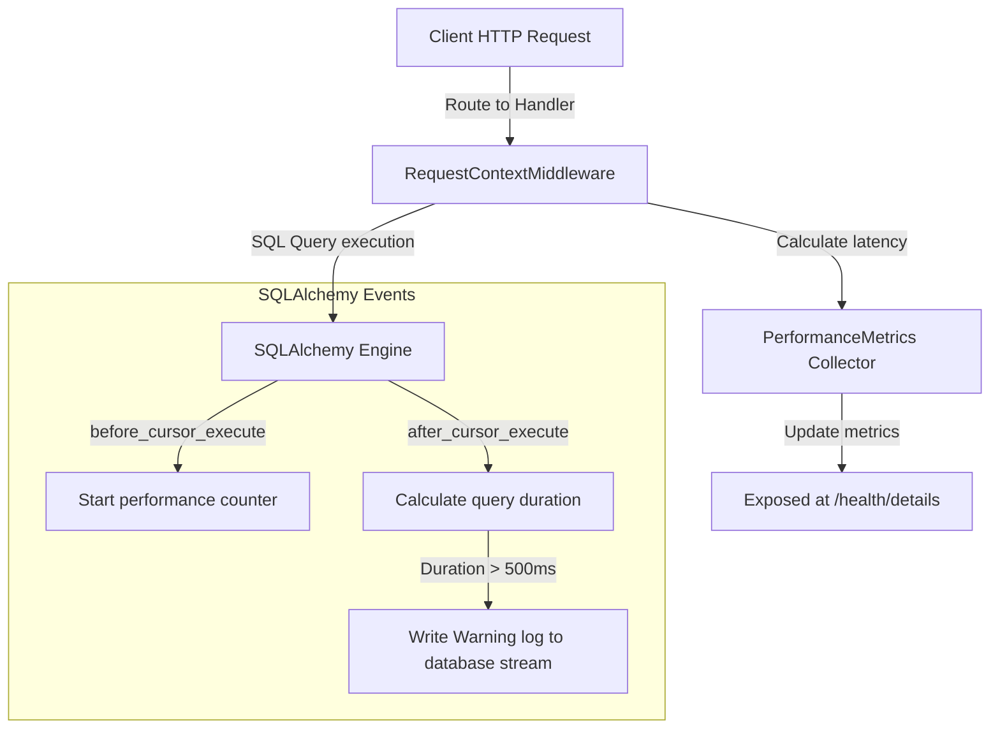

# Hệ Thống Giám Sát, Đo Lường Hiệu Năng & Khả Năng Quan Sát (Observability & Monitoring Layer)

## Mục tiêu
Triển khai hệ thống quan sát toàn diện (Observability) cho ứng dụng backend bao gồm: thu thập chỉ số hiệu năng (Metrics), theo dõi trạng thái kết nối cơ sở dữ liệu (Database Connection Pool), cảnh báo câu lệnh SQL chạy chậm (Slow Queries) và chấm điểm sẵn sàng vận hành (Production Readiness Score).

## Kiến thức nền
Trong vận hành thực tế, việc hệ thống hoạt động "chạy được" là chưa đủ. Các kỹ sư SRE và DevOps cần biết hệ thống đang chạy nhanh hay chậm, tài nguyên kết nối cơ sở dữ liệu có bị nghẽn không, và có câu lệnh SQL nào đang chạy tốn thời gian để tối ưu hóa trước khi database bị treo.

## Giải thích chi tiết

### 1. Thu thập chỉ số hiệu năng (Metrics Collection)
Thu thập các số liệu thống kê thời gian thực về hoạt động của ứng dụng như: tổng số lượng request đã xử lý, số lượng lỗi phát sinh, thời gian phản hồi trung bình (average response time), và thời gian chạy lâu nhất (max response time).

### 2. Giám sát kết nối cơ sở dữ liệu (Database Pool Monitoring)
Theo dõi trạng thái của SQLAlchemy connection pool để đảm bảo ứng dụng không bị cạn kiệt kết nối với SQL Server. Các chỉ số cần theo dõi bao gồm: kích thước pool (pool size), số kết nối đang được sử dụng (checked out), số kết nối nhàn rỗi (checked in) và số kết nối vượt định mức (overflow).

### 3. Phát hiện câu lệnh SQL chạy chậm (Slow Query Detection)
Bộ chặn (Interceptor) lắng nghe các sự kiện thực thi câu lệnh SQL của SQLAlchemy Engine. Bằng cách đo mốc thời gian trước và sau khi thực thi câu lệnh, hệ thống có thể cảnh báo (`WARNING` log) ngay lập tức nếu một câu lệnh chạy vượt ngưỡng cấu hình (ví dụ: >500ms).

### 4. Đánh giá sẵn sàng vận hành (Production Readiness Audit)
Bộ kiểm tra tự động chạy trên môi trường production để đánh giá hệ thống có đủ điều kiện an toàn và hạ tầng để chạy thực tế hay không thông qua việc kiểm tra ghi file logs, kết nối cơ sở dữ liệu, kiểm tra độ an toàn của khóa bí mật (Secret Key) và chấm điểm (Score) từ 0 đến 100.

## Luồng hoạt động



## Ví dụ trong TaskSyncEnterprise

### 1. Sự kiện bắt câu lệnh SQL chạy chậm ([query_monitor.py](file:///e:/TaskSyncEnterprise/backend/app/database/query_monitor.py)):
```python
import time
from sqlalchemy import event
from sqlalchemy.engine import Engine
from app.core.logger import db_logger

@event.listens_for(Engine, "before_cursor_execute")
def before_cursor_execute(conn, cursor, statement, parameters, context, executemany):
    context._query_start_time = time.perf_counter()

@event.listens_for(Engine, "after_cursor_execute")
def after_cursor_execute(conn, cursor, statement, parameters, context, executemany):
    total_time = time.perf_counter() - context._query_start_time
    if total_time > 0.5:  # Ngưỡng 500ms
        db_logger.warning(
            f"SLOW QUERY DETECTED: duration={total_time:.4f}s | SQL: {statement}"
        )
```

### 2. Thu thập hiệu năng trong Middleware ([request_context.py](file:///e:/TaskSyncEnterprise/backend/app/middleware/request_context.py)):
```python
        try:
            response = await call_next(request)
            return response
        finally:
            duration = time.time() - start_time
            is_error = response.status_code >= 500 if 'response' in locals() else True
            
            # Ghi nhận thời gian xử lý và lỗi vào bộ đo lường
            from app.monitoring.metrics import metrics
            metrics.record_request(duration, is_error=is_error)
```

## Khi nào sử dụng
*   Luôn cấu hình lắng nghe sự kiện SQL trên môi trường Production để nhanh chóng phát hiện các truy vấn chưa được đánh chỉ mục (Index).
*   Sử dụng `/health/details` trong hệ thống giám sát nội bộ (Grafana, Datadog) để vẽ biểu đồ tài nguyên kết nối database pool.

## Sai lầm thường gặp
*   **Để ngưỡng Slow Query quá thấp:** Cấu hình cảnh báo slow query ở ngưỡng 10ms sẽ làm tràn ngập cảnh báo rác trong log file cho các truy vấn đơn giản, gây loãng thông tin. Ngưỡng doanh nghiệp chuẩn thường dao động từ 200ms đến 500ms.
*   **Bỏ qua rác bộ nhớ khi lưu Metrics:** Lưu trữ lịch sử toàn bộ hàng triệu request trong bộ nhớ RAM của Python làm tràn bộ nhớ (Out of Memory). Cần giới hạn danh sách lưu trữ (ví dụ: chỉ giữ lại 1000 request gần nhất để tính toán trung bình).

## Best Practices
1. Sử dụng hàm `time.perf_counter()` thay vì `time.time()` khi đo lường hiệu năng code để có độ chính xác cao ở mức nano giây.
2. Tích hợp điểm số Production Readiness vào quy trình tự động hóa CI/CD hoặc kịch bản chạy thử (dry-run) trước khi kích hoạt container.

## Checklist ghi nhớ
- [x] Đăng ký sự kiện SQLAlchemy listener tự động khi import database package.
- [x] Giới hạn số lượng bản ghi lưu trữ của bộ đo lường RAM để bảo vệ tài nguyên.
- [x] Cảnh báo cảnh báo slow query được ghi nhận ở mức độ `WARNING` hoặc `ERROR` log.

## Tổng kết
Hệ thống giám sát hiệu năng SQL và chấm điểm Production Readiness cung cấp cho đội ngũ vận hành bức tranh toàn cảnh về sức khỏe của TaskSyncEnterprise, giúp tối ưu hóa hiệu năng hệ thống chủ động trước khi xảy ra sự cố nghẽn mạng.
