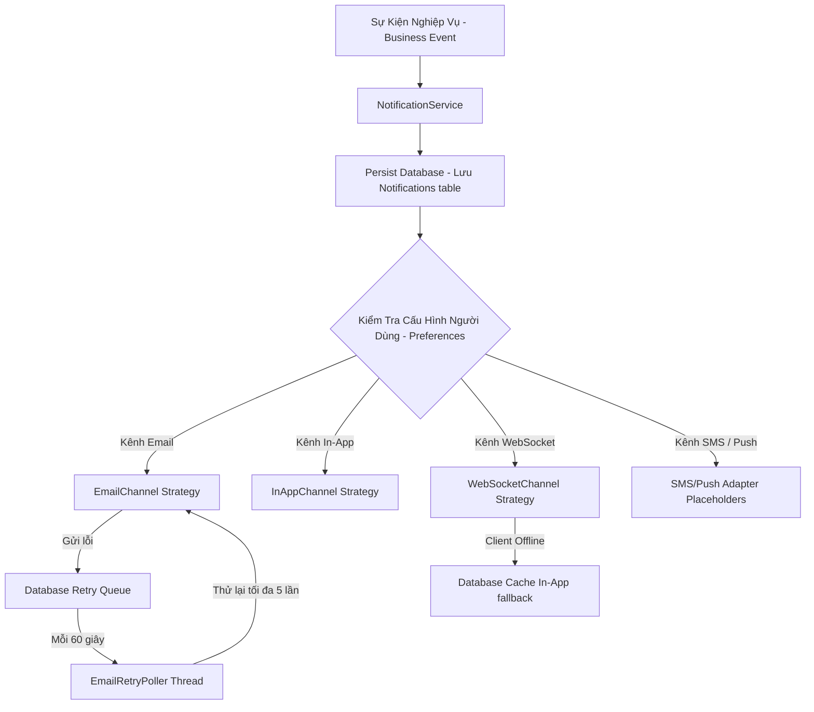
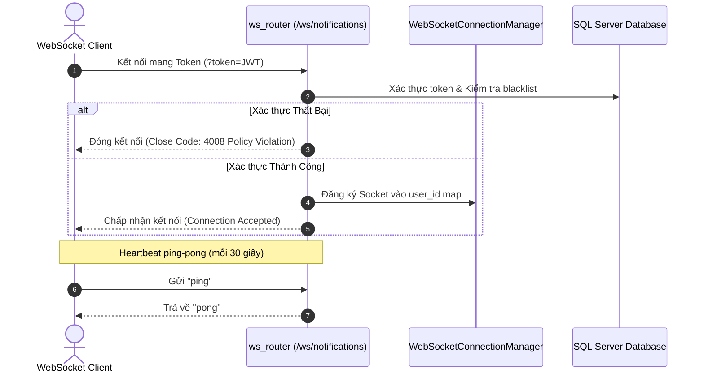

# Hướng Dẫn Hạ Tầng Thông Báo (Notification Infrastructure Guide)

Tài liệu này chi tiết hóa kiến trúc thiết kế, cách thức vận hành và cấu hình của Hệ thống Thông báo Đa kênh (Multi-Channel Notification) và WebSocket trong ứng dụng `TaskSyncEnterprise`.

---

## 🔍 1. Tổng Quan (Overview) & Mục Đích (Purpose)

Hệ thống thông báo chịu trách nhiệm cập nhật trạng thái hoạt động (như gán công việc, phê duyệt nghỉ phép, cảnh báo bảo mật) đến nhân viên theo thời gian thực (real-time).
* **Kiến trúc đa kênh (Strategy Pattern)**: Cách ly phương thức gửi tin thành các Adapter riêng biệt, tách rời luồng nghiệp vụ với hạ tầng chuyển phát.
* **Thời gian thực (WebSockets)**: Cho phép duy trì kết nối song công (full-duplex) để đẩy trực tiếp thông báo đến trình duyệt của người dùng.
* **Độ tin cậy cao (Reliability)**: Chống mất mát thư từ nhờ cơ chế lưu trữ đệm vào Database, kết hợp hàng đợi quét thử lại (Retry Poller daemon thread) khi đối tác gửi thư SMTP gặp sự cố.

---

## 📐 2. Kiến Trúc Chuyển Phát (Delivery Pipeline Flow)



---

## 🔌 3. Kết Nối WebSocket Cổng Đẩy (WebSocket Gateway Flow)



---

## ⚙️ 4. Các Class Quan Trọng (Important Classes) & Cấu Hợp

### Các Class Cốt Lõi
* **`WebSocketConnectionManager`** ([websocket_manager.py](file:///e:/TaskSyncEnterprise/backend/app/services/notification/websocket_manager.py)): Quản lý danh sách kết nối hoạt động của người dùng (hỗ trợ nhiều tab).
* **`EmailRetryPoller`** ([poller.py](file:///e:/TaskSyncEnterprise/backend/app/services/notification/poller.py)): Luồng daemon chạy song song quét và thử lại các thông báo EMAIL bị lỗi (`FAILED`).
* **`NotificationDispatcher`** ([dispatcher.py](file:///e:/TaskSyncEnterprise/backend/app/services/notification/dispatcher.py)): Lấy sự kiện, tạo định dạng tin, tra cứu tùy chọn người dùng và điều phối sang các Strategy Adapter.
* **`EmailChannel`, `InAppChannel`, `WebSocketChannel`, `SystemChannel`**: Các lớp Strategy thực thi hợp đồng chuyển phát.

---

## 🧪 5. Kiểm Thử (Testing) & Khắc Phục Sự Cố (Troubleshooting)

### Chạy Kiểm Thử Tự Động
```bash
.venv\Scripts\python -m pytest tests/test_websocket_notifications.py
```

### Khắc Phục Sự Cố (Troubleshooting)
> [!TIP]
> **Client báo mất kết nối hoặc không nhận được tin đẩy**:
> 1. Kiểm tra mã đóng kết nối (Close Code): Nếu là `4008`, do token JWT truyền trong tham số `?token=` đã hết hạn hoặc bị đưa vào danh sách đen.
> 2. Đảm bảo client gửi bản tin `"ping"` đều đặn mỗi 30 giây để tránh uvicorn ngắt kết nối do quá hạn chờ (idle timeout).

---

## 💡 6. Hạn Chế Đã Biết (Known Limitations) & Định Hướng Tương Lai (Roadmap)

* **Hạn chế hiện tại**: Đăng ký kết nối WebSocket được lưu trực tiếp trên bộ nhớ đệm (RAM) của tiến trình Python. Khi triển khai hệ thống phân tán (nhiều bản sao container chạy song song), các máy chủ không chia sẻ được trạng thái kết nối của người dùng.
* **Cải tiến tương lai (Roadmap)**: Tích hợp cơ chế **Redis Pub/Sub** làm kênh truyền thông điệp trung gian giữa các máy chủ (Cluster Node Synchronization). Khi sự kiện phát ra, Redis Pub/Sub sẽ phát tán đến tất cả các node máy chủ để đảm bảo node đang giữ kết nối của người dùng sẽ đẩy được tin đi.
