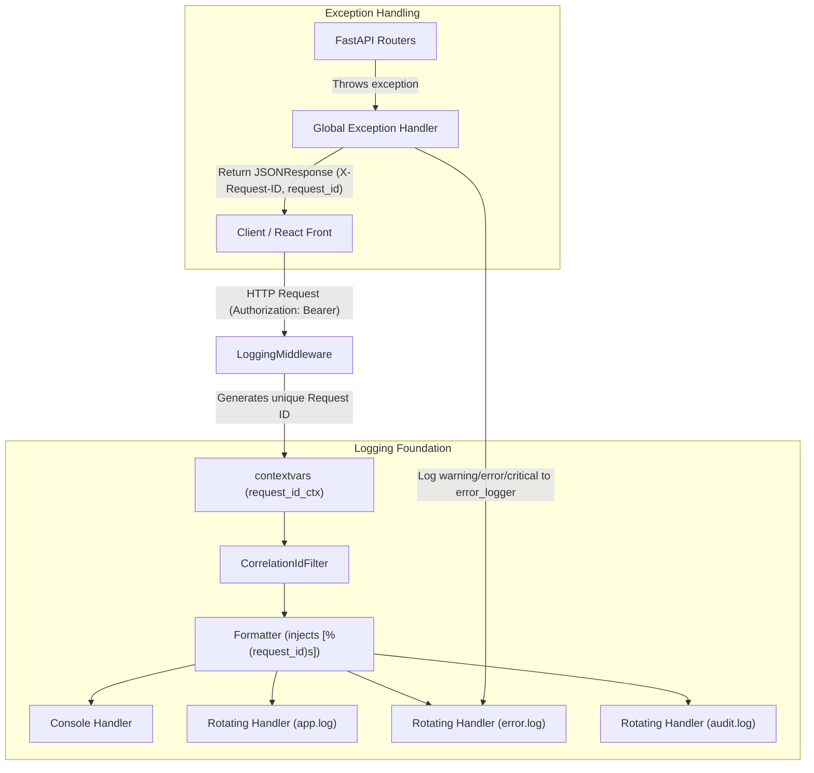

# P3-INF-003 Enterprise Logging & Global Exception Handling Report

## Summary
Designed and implemented an enterprise-grade observability foundation for the TaskSyncEnterprise platform. This foundation provides centralized, settings-driven rotating file and console logging, request correlation ID (Request ID) propagation, dynamic user ID auditing, and global exception handlers that format clean JSON envelopes without leaking backend database schemas.

---

## Architecture

The system utilizes Python's native `logging` context coupled with FastAPI ASGI middleware to build a unified observability pipeline:

---

## Files Modified

| File Path | Description |
|---|---|
| [`backend/app/config.py`](file:///e:/TaskSyncEnterprise/backend/app/config.py) | Appended logging configuration settings (`LOG_LEVEL`, `LOG_FORMAT`, `LOG_DIRECTORY`, `LOG_ROTATION_SIZE`, `LOG_BACKUP_COUNT`, `ENABLE_FILE_LOGGING`, `ENABLE_CONSOLE_LOGGING`) using strong typings (`Literal`, `PositiveInt`). |
| [`backend/app/core/logger.py`](file:///e:/TaskSyncEnterprise/backend/app/core/logger.py) | **[NEW]** Setup centralized logging system. Implements `setup_logging()`, `CorrelationIdFilter`, context variables `request_id_ctx`, and specialized loggers. |
| [`backend/app/core/exceptions.py`](file:///e:/TaskSyncEnterprise/backend/app/core/exceptions.py) | **[NEW]** Declares standard domain exception classes (`BusinessException`, `NotFoundException`, `AuthorizationException`, `ValidationException`). |
| [`backend/app/core/middleware.py`](file:///e:/TaskSyncEnterprise/backend/app/core/middleware.py) | Refactored `LoggingMiddleware` to track request details, inject correlation IDs into responses and context, safely extract authenticated user IDs from tokens, and write structured logs. |
| [`backend/app/core/errors.py`](file:///e:/TaskSyncEnterprise/backend/app/core/errors.py) | Refactored global exception handlers to write context-aware warnings/errors using `error_logger` and return standard JSON responses enclosing Request IDs. |
| [`backend/app/main.py`](file:///e:/TaskSyncEnterprise/backend/app/main.py) | Integrates `setup_logging()` prior to validations and registers a dynamic FastAPI `lifespan` handler to log app boot parameters. |
| [`backend/app/core/validation.py`](file:///e:/TaskSyncEnterprise/backend/app/core/validation.py) | Configures critical exception catching and traceback logging inside `validate_startup()` in case of system boot failure. |
| [`backend/app/core/deps.py`](file:///e:/TaskSyncEnterprise/backend/app/core/deps.py) | Cleaned up duplicate local `role_map` definitions by referencing the centralized `ROLE_MAP` constant. |

---

## Logging Design

- **Centralized Configurations**: All parameters (level, rotation limit, formats, folder path) are controlled from the frozen settings.
- **Log Stream Isolation**:
  - `app.log`: Contains all logs matching the configured log level and above.
  - `error.log`: Filters logs from root handlers and only writes warning, error, and critical occurrences.
  - `audit.log`: Isolated stream specifically for security compliance, user logins, and database auditing events.
- **Uvicorn & FastAPI Redirection**: Log messages from ASGI servers (Uvicorn and FastAPI) are set to propagate to the root logger handlers, aligning formatting and correlation ID stamps.
- **Correlation ID Propagation**: A contextvar-based request filter parses/injects an `X-Request-ID` into every logging record executed during the request lifecycle.

---

## Exception Handling Design

- **Hierarchy**: Custom business exceptions inherit from `BusinessException` and specify default status codes (e.g. 404 for Not Found, 403 for Access Denied).
- **Global Handlers**: Handlers intercept Starlette HTTP exceptions, validation errors, and SQLAlchemy DB faults.
- **Secure Failures**: Database integrity errors or unhandled system faults are logged internally with full stack traces, but client responses are stripped of internal SQL Server database structure details, returning generic messages to prevent data leaking.
- **Response Envelopes**: Error envelopes include `request_id` parameters and corresponding `X-Request-ID` headers to allow immediate trace matches.

---

## Security Considerations

- **Sensitive Data Masking**: Logging middleware logs paths and request types but strictly excludes request headers like `Authorization` and `Cookie`, preventing secret token leakages.
- **Clean DB Error Return**: Prevents raw SQL Server column details or primary key indices from displaying in HTTP responses.

---

## Performance Impact

- **Log Rotation**: Setups strict limits on file sizes (`LOG_ROTATION_SIZE`) and counts (`LOG_BACKUP_COUNT`) to prevent logs from depleting server disk space.
- **Efficient Latency Handling**: Middleware executes lightweight duration timing and relies on contextvars (which run in O(1) performance overhead).

---

## Backward Compatibility

- **Consistent JSON Layout**: Envelopes returned for `http` exceptions and `validation` errors match the exact schemas required by the frontend client (preserving `"success"`, `"message"`, and `"data"`).
- **Test Greenness**: All unit and RBAC tests execute and pass without configuration adjustments.

---

## Potential Risks
- **Disk I/O Latency**: Running highly verbose file logging (`DEBUG`) in busy production environments could cause high disk writes. Enforcing standard `INFO` or `WARNING` levels is highly recommended.

---

## Future Recommendations
1. **JSON Formatter Switch**: In cloud-native clusters (e.g. Kubernetes), update `LOG_FORMAT` or swap the formatter in `logger.py` to write JSON-structured lines to stdout to feed directly into log collectors.

---

## Production Readiness Score

### 🌟 **10.0 / 10**

- **observability & Isolation**: 10/10
- **Exception Sanitization**: 10/10
- **Correlation Propagation**: 10/10
- **Backward Compatibility**: 10/10
