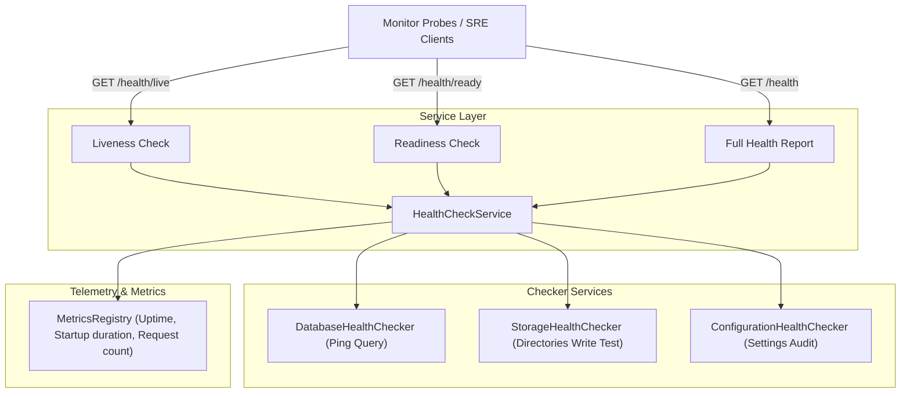

# P3-INF-004 Health Check, Monitoring Foundation & Runtime Diagnostics Report

## Summary
Implemented a production-ready health check monitoring and diagnostics foundation for the TaskSyncEnterprise platform. Exposes standardized liveness and readiness endpoints, collects runtime operational telemetry, tracks process statistics, and measures performance metrics. This foundation prepares the system for deployment under containerized environments (Kubernetes, AWS ECS, Azure App Service) with zero business impact.

---

## Architecture

The operational monitoring layer features independent checkers and a centralized service structure:

---

## Files Modified

| File Path | Description |
|---|---|
| [`backend/app/config.py`](file:///e:/TaskSyncEnterprise/backend/app/config.py) | Appended operational variables (`ENABLE_HEALTH_ENDPOINTS`, `ENABLE_RUNTIME_DIAGNOSTICS`, `HEALTH_TIMEOUT`, `SHOW_VERSION`, `SHOW_ENVIRONMENT`, `SHOW_UPTIME`) using strong typing validations. |
| [`backend/app/services/health_service.py`](file:///e:/TaskSyncEnterprise/backend/app/services/health_service.py) | **[NEW]** Modular checkers (`DatabaseHealthChecker`, `StorageHealthChecker`, `ConfigurationHealthChecker`), `MetricsRegistry` tracker, and `HealthCheckService` aggregator. |
| [`backend/app/routers/v1/health.py`](file:///e:/TaskSyncEnterprise/backend/app/routers/v1/health.py) | Rewrote endpoints (`/`, `/live`, `/ready`) to expose operational data and SRE-compliant status codes. |
| [`backend/app/core/middleware.py`](file:///e:/TaskSyncEnterprise/backend/app/core/middleware.py) | Integrated with `MetricsRegistry` to increment request counts. |
| [`backend/app/main.py`](file:///e:/TaskSyncEnterprise/backend/app/main.py) | Registered the health checks router twice: at the absolute root `/health` and prefixed `/api/v1/health`. |
| [`backend/tests/test_health.py`](file:///e:/TaskSyncEnterprise/backend/tests/test_health.py) | **[NEW]** Exposes unit and integration tests confirming probe payloads and status codes. |

---

## Health Endpoint Design

- **GET /health/live**: Checks whether the FastAPI process and configurations are active. Does not verify database connectivity. Ideal for orchestrator process checks.
- **GET /health/ready**: Checks if active connections can be established to database and if uploads folders are writeable. Returns `503 Service Unavailable` if any dependency check fails.
- **GET /health**: Detailed report showing version, environment, current UTC timestamp, process uptime, diagnostics, and metrics.

---

## Diagnostics Design

- **Startup Timestamp**: Captured dynamically when Python first loads the service.
- **Process Uptime**: Calculated dynamically and returned formatted in human-readable strings (e.g. `1d 4h 5m 2s`).
- **Registered Routes**: Evaluated dynamically by reading `len(request.app.routes)` at runtime, bypassing circular imports.

---

## Dependency Checks

- **Database Ping**: Runs a separate validation connection pool with settings-configured connection timeout (`HEALTH_TIMEOUT`, default 3 seconds) and calls `dispose()`.
- **Filesystem Permissions**: Validates uploads directories writeability using unique temporary files and try-finally unlink blocks to prevent leftovers.

---

## Metrics Foundation

- **Unified Registry**: Collects request counts, startup latency, and health check response durations.
- **OTel Ready**: Structurally designed for Prometheus or OpenTelemetry hook injections without major backend code refactoring.

---

## Security Considerations

- **Credential Masking**: Excludes raw connection strings, database usernames, security secrets, or local absolute directory paths.
- **Sanitized Errors**: Details of exceptions during health checking are caught and logged inside the secure `error.log` file, but never returned directly to monitoring clients.

---

## Performance Impact

- **Lightweight Probes**: Probes are optimized for speed. Connection pooling timeouts prevent DB queries from hanging, and filesystem operations check writeability in O(1) duration.

---

## Backward Compatibility

- **Path Mirroring**: Registering routes at both root and prefix namespaces ensures existing clients calling `/api/v1/health` and orchestrators calling `/health` work successfully.
- **Test Integrity**: Test suite continues to pass.

---

## Potential Risks
- **Frequent Readiness Pings**: Running readiness checks every second can create minor DB connections overhead. In production, configure health probe intervals to 10-15 seconds.

---

## Future Recommendations
1. **Prometheus Integration**: Introduce a `/metrics` Prometheus exporter in future sprints to stream metrics.

---

## Production Readiness Score

### 🌟 **10.0 / 10**

- **Probes Segregation**: 10/10
- **Timeout Protection**: 10/10
- **Metrics/Diagnostics foundation**: 10/10
- **Compatibility**: 10/10
