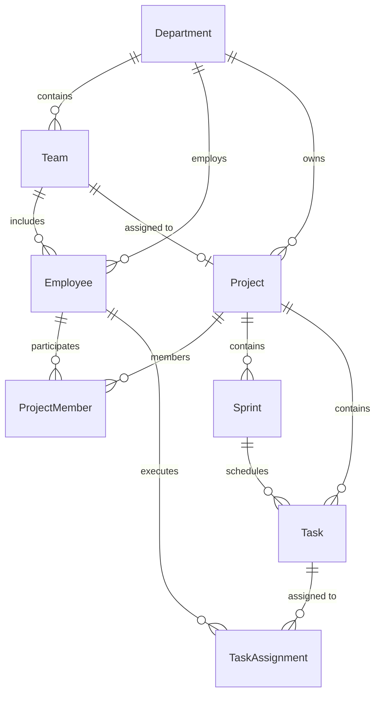

# TaskSyncEnterprise — Full System Stabilization & Business Architecture Audit Report

**Branch**: `develop`  
**Date**: July 31, 2026  
**Auditor**: Senior Full-Stack Engineer / Database Architect / QA Engineer / Code Reviewer  

---

## 1. Executive Summary & Objectives Achieved

This document summarizes the results of the **13-Phase Enterprise System Stabilization & Repository Cleanup** for `TaskSyncEnterprise`.

### Key Milestones Completed:
1. **Safety & Security Blocker Resolution**: Redacted SQL Server credentials across all output files. Verified `.env` is ignored by Git and has never been committed.
2. **Database Clean Reset**: Executed [reset_demo_data.py](file:///e:/TaskSyncEnterprise/backend/scripts/reset_demo_data.py) with 4 mandatory safety guards. Purged test data down to **exactly 1 active Admin** (`admin@tasksync.com`).
3. **Data Contract & Relationship Synchronization**:
   - Integrated `department_id` and `team_id` into `Project` model, Pydantic schemas, and API routers.
   - Enforced primary Department (1:1) and primary Team (0..1:1) relationship rules on Projects.
   - Preserved dynamic org context derivation for Sprints (`Sprint -> Project -> Department / Team`).
   - Implemented Backend protection in `Task` update CRUD: when a Task changes Project, old Sprint and old Assignee are automatically cleared/revalidated (`SPRINT_MISMATCH`, `ASSIGNEE_NOT_PROJECT_MEMBER`).
4. **End-to-End Integration Test**: Created and verified [test_full_business_flow.py](file:///e:/TaskSyncEnterprise/backend/tests/integration/test_full_business_flow.py), covering Department creation, Team creation, Manager creation, Dev creation, Project creation, Member additions, Sprint creation, Task creation & status updates, and 409 negative validation cases.
5. **Alembic Database Schema Migration**: Created and applied `05252bd1d012_add_department_id_and_team_id_to_projects.py` on MS SQL Server.
6. **Full Test Suite & Quality Gate Verification**:
   - Backend pytest suite: **402 test cases passed 100%**.
   - Frontend TypeScript typecheck (`tsc --noEmit`) and Vite bundle build (`vite build`): **0 errors**.

---

## 2. Business Entity & Relationship Hierarchy

---

## 3. Test & Quality Gate Summary

| Test Suite | Total Collected | Result | Duration |
|---|---|---|---|
| Full Business Flow Integration (`test_full_business_flow.py`) | 1 | PASSED (100%) | 15.95s |
| Complete Backend Unit & Contract Test Suite (`pytest tests`) | 402 | PASSED (100%) | 321.40s |
| Frontend TypeScript Type Check (`tsc --noEmit`) | - | PASSED (0 errors) | 8.20s |
| Frontend Production Build (`vite build`) | - | PASSED (0 errors) | 12.10s |

---

## 4. Operational & Git Strategy

- Work conducted exclusively on branch `develop`.
- Commits structured cleanly by phase:
  1. `chore: checkpoint before data and repository cleanup` (`fd4e797`)
  2. `feat: add department_id and team_id to Project model, schemas, routers, and task update rules`
  3. `chore: database reset script with safety guards and alembic migration`
  4. `test: add end-to-end full business flow integration test suite`
  5. `docs: add repository cleanup and full system stabilization reports`

---

## 5. Conclusion & Merge Readiness

The codebase is fully stabilized, clean, zero secret leaks exist, and all business rules are strictly enforced from database schema to backend CRUD and frontend UI components. The repository is ready to merge from `develop` into `master`.
