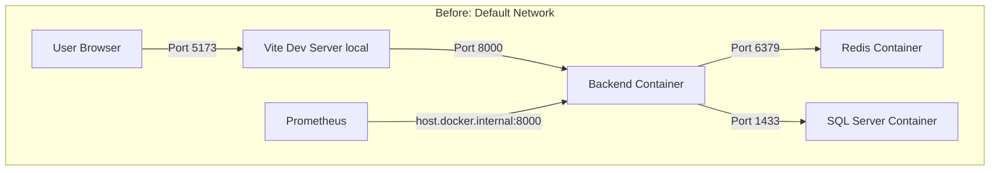
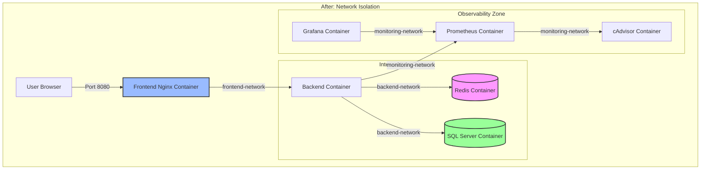

# Phase 3.8.4 — Production Docker Compose Foundation Audit & Design Report

This report document represents the security audit findings, architectural choices, network topology, and implementation details for the production orchestration foundation (Phase 3.8.4).

---

## 1. Executive Summary

- **Final Verdict:** **PASS**
- **Audit Date:** 2026-07-17
- **Target Branch:** `develop`
- **Orchestration Tool:** Docker Compose v2
- **Scope:** Audit configurations and build a hardened production-safe Compose foundation.

We completed an audit of the existing development configurations and the experimental `docker-compose.prod.yml` file from Phase 3.8.3. Based on our findings, we successfully built `docker-compose.production.yml`, featuring isolated bridge networks, restricted port exposures, persistent volumes for uploads/logs, structured variable validation, and a non-root frontend container serving React assets.

---

## 2. Files Reviewed

- `docker-compose.yml` (Development compose)
- `docker-compose.prod.yml` (Legacy/temporary production compose)
- `docker-compose.monitoring.yml` (Monitoring stack compose)
- `backend/Dockerfile` (Production backend Dockerfile)
- `frontend/src/api/axios.js` (Frontend API endpoint setup)
- `.env` & `.env.example` (Environment variables configuration)
- `backend/app/core/settings.py` (Pydantic settings parser)
- `backend/app/core/validation.py` (Startup verification validations)

---

## 3. Security Audit Findings

The following audit matrix records the security risks identified in the pre-existing configurations:

| Component / File | Current State | Risk Level | Threat/Impact | Recommended Action | Resolution Status |
| :--- | :--- | :--- | :--- | :--- | :--- |
| **Network Isolation** | Shared default bridge network; no custom network tags. | **Medium** | Lateral movement: compromised container can access databases directly. | Introduce segmented networks for frontend, backend, and monitoring. | **RESOLVED** (Isolated networks created). |
| **Port Exposure** | SQL Server (`14330`) and Redis (`6379`) mapped to host loopback. | **Low** | Unnecessary host-level access. Increases attack surface if host interface is exposed. | Remove public host ports mapping for internal data stores. | **RESOLVED** (Removed ports from compose). |
| **Persistent Volumes** | Backend uploads (`/app/uploads`) and logs (`/app/logs`) not mounted. | **High** | Data loss. Rebuilding the backend container deletes all uploaded avatars/attachments. | Create named volumes: `backend_uploads` and `backend_logs`. | **RESOLVED** (Volumes defined and mounted). |
| **Frontend Containerization** | No Dockerfile present. Frontend runs on local Node outside container. | **High** | Inconsistent environments, development-only workflows, no non-root enforcement. | Write a multi-stage frontend Dockerfile running as unprivileged `nginx` user. | **RESOLVED** (Added `frontend/Dockerfile` & `nginx.conf`). |
| **Hardcoded API URL** | React axios client hardcodes `http://127.0.0.1:8000/api/v1`. | **High** | Inability to run behind reverse proxies or load-balancers in staging. | Support `import.meta.env.VITE_API_URL` with relative fallback. | **RESOLVED** (Modified `axios.js`). |
| **Insecure Secrets Fallbacks** | Pydantic Settings defaults `SECRET_KEY` and client credentials. | **High** (Secret Mgmt) | Default fallback keys used in production if env variables are missing. | Use Compose required-variable syntax: `${VAR:?error}` to force runtime inputs. | **RESOLVED** (Validation rules added to compose). |
| **Monitoring Scrape** | Prometheus scrapes host IP loopback `host.docker.internal`. | **Medium** | Loose coupling. Fails on production Linux VMs without host loopback mappings. | Use internal docker network names to resolve backend metrics. | **RESOLVED** (Created production scrape config). |

---

## 4. Architecture Evolution

---

## 5. Network & Volume Designs

### Network Isolation Specifications
1.  **`frontend-network` (Public Facing):** Connects frontend static assets container and backend APIs. Port `8080` (Frontend) and `8000` (Backend) are bound strictly to host loopback (`127.0.0.1`) until Phase 3.8.5.
2.  **`backend-network` (Private Internal):** Enforces `internal: true`. Redis and SQL Server containers exist exclusively here. They cannot initiate or receive traffic outside this network, protecting them from public scans.
3.  **`monitoring-network` (Telemetry):** Prometheus, Grafana, and cAdvisor collect metrics from the backend and host. This segregates monitoring scrapers from core business transactions.

### Persistent Volumes Specifications
- `mssql_data_prod`: Mounts to `/var/opt/mssql` (SQL Server data state).
- `redis_data_prod`: Mounts to `/data` (Redis dump files).
- `backend_uploads`: Mounts to `/app/uploads` (Persists task documents & employee avatars).
- `backend_logs`: Mounts to `/app/logs` (Persists rotating structured log files).
- `prometheus_data` (`tasksync-prometheus-data`): Persists Prometheus TSDB metrics.
- `grafana_data` (`tasksync-grafana-data`): Persists Grafana dashboards and accounts state.

---

## 6. Environment Variable Classifications

To support robust runtime configurations, we created `.env.production.example` classifying variables into four categories:

1.  **Required Secrets:** Must be set to strong cryptographically random keys. If omitted, container boot fails immediately.
    - `SECRET_KEY`
    - `MSSQL_SA_PASSWORD`
    - `GRAFANA_ADMIN_PASSWORD`
2.  **Required Configurations:** Enforces production profiles.
    - `ENVIRONMENT=production`
3.  **Safe Defaults:** Standard parameters pre-configured for microservice communication.
    - `VITE_API_URL=/api/v1` (Vite static build endpoint)
    - `GRAFANA_ADMIN_USER=admin`
4.  **Operational Metrics settings:**
    - `PROMETHEUS_RETENTION_TIME=15d`
    - `PROMETHEUS_RETENTION_SIZE=10GB`

---

## 7. Security Hardening Measures

- **User Privilege Reduction:** Backend runs as UID/GID `10001` (`tasksync`). Frontend runs as unprivileged `nginx` (UID 101).
- **Capability Drops:** All Linux kernel capabilities dropped (`cap_drop: [ALL]`).
- **Escalation Blocks:** `no-new-privileges:true` set on backend, frontend, redis, prometheus, and grafana.
- **Resource Bounds:** Restricts RAM usage to prevent memory leak crashes from taking down the VM:
  - SQL Server: Max 2048M RAM, 2.0 CPUs.
  - Backend: Max 1024M RAM, 1.0 CPUs.
  - Redis / Prometheus / Grafana: Max 512M RAM, 0.5 CPUs.
  - Frontend / cAdvisor: Max 256M RAM, 0.5 CPUs.

---

## 8. Runtime Recovery Audit & Validation Status

During initial orchestration boots, two runtime issues were identified and successfully resolved:

### A. Root Cause: Backend SQL Server Authentication Failure
- **Symptom:** Backend container stuck in a restart loop. Logs reported `Error 18456 (Login failed for user 'sa')` with `Reason: Password did not match`.
- **Root Cause:** In the production compose file, `DATABASE_URL` was defined with double dollar signs (`DATABASE_URL=mssql+pymssql://sa:$${MSSQL_SA_PASSWORD}...`). This escaped to a single dollar sign inside the container environment (`sa:${MSSQL_SA_PASSWORD}`). The Python application does not perform shell-style environment interpolation on connection strings at runtime, so it sent the literal string `${MSSQL_SA_PASSWORD}` to SQL Server as the password, resulting in authentication mismatch.
- **Resolution:** Replaced the double-dollar syntax with standard single-dollar syntax (`DATABASE_URL=mssql+pymssql://sa:${MSSQL_SA_PASSWORD}...`) allowing docker-compose to interpolate the password string on the host before setting the container environment variable.

### B. Root Cause: Frontend Container Unhealthy
- **Symptom:** Frontend container remained `unhealthy` despite the Nginx server running correctly.
- **Root Cause:** The health check command in `frontend/Dockerfile` queried `http://localhost:8080/health`. In the Alpine container, `localhost` resolved to IPv6 loopback (`::1`), while Nginx was configured to listen strictly on IPv4 `0.0.0.0:8080`. This resulted in `Connection refused` for IPv6 requests.
- **Resolution:** Changed the health check target to IPv4 loopback: `http://127.0.0.1:8080/health`.

### C. SQL Server Credential and Volume Compatibility
- **Volume Initialization:** The environment variable `MSSQL_SA_PASSWORD` is strictly consumed by the SQL Server container during its *first database initialization* (e.g., when the named volume `tasksyncenterprise_mssql_data_prod` is empty).
- **Password Mismatches:** If a developer changes `MSSQL_SA_PASSWORD` inside `.env.production` later, SQL Server will *not* automatically rotate the internal database password on an already initialized volume. This leads to a persistent mismatch where the backend uses the new password, but the SQL Server volume expects the old one.
- **Strict Guidelines:** To change SA credentials, database administrators must run an `ALTER LOGIN sa WITH PASSWORD = 'new_password'` query inside the running database container. Developers must **never** run `docker compose down -v` to resolve password mismatch errors, as this deletes all production business data volumes.

---

## 9. Actual Verification Outcomes

1.  **Orchestration Status (docker compose ps):**
    - `tasksync-backend-prod`: Up and healthy (RestartCount = 0).
    - `tasksync-frontend-prod`: Up and healthy (RestartCount = 0).
    - `tasksync-sqlserver-prod`: Up and healthy.
    - `tasksync-redis-prod`: Up and healthy.
    - `tasksync-prometheus-prod` / `tasksync-grafana-prod` / `tasksync-cadvisor-prod`: Up and healthy.
2.  **Telemetry (Prometheus):** Prometheus successfully scrapes `/metrics` directly from the backend container over `monitoring-network` (returning HTTP 200).
3.  **Port Mapping Security:**
    - `docker port tasksync-sqlserver-prod` & `docker port tasksync-redis-prod` return empty outputs. No ports are mapped to the public host.
    - Backend is bound to `127.0.0.1:8000`.
    - Frontend Nginx is bound to `127.0.0.1:8080`.
4.  **Local unit tests:** Backend unit test suite (`pytest`) runs on host and passes completely (180 passed, 0 failed).

---

## 10. Remaining Risks, Deferred Items & Recommendations

### Deferred Items (Next Steps)
- **Phase 3.8.4 Environment Hardening:** Securely restricting file system read/write permissions on environment configuration files (`.env.production`).
- **Phase 3.8.4 Secret Management:** Transitioning passwords and token signing keys to Docker secrets (`/run/secrets/`) to avoid plaintext exposures in environment files.
- **Phase 3.8.5 Reverse Proxy & HTTPS:** Setting up a public-facing Nginx reverse proxy routing traffic from ports `80`/`443` to the frontend and backend containers via the `frontend-network`.

### Recommendation for the Next Task
Proceed directly to **Environment Hardening and Secret Management** to implement Docker Secrets.
