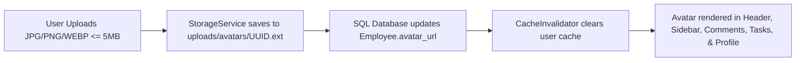

# TaskSyncEnterprise Phase 4.5
## 3. Avatar & Profile Report

### Overview
The Profile section has been completely redesigned into a modern **Account Center** equipped with persistent avatar upload, security management, session tracking, and user preference customization.

### Key Capabilities

### Feature Checklist
- **Avatar Management**: Drag & drop dropzone, instant preview, file type validation (JPG, PNG, WEBP), size limit check (5MB), avatar deletion (`DELETE /api/v1/employees/avatar`), and fallback initials (`getInitials`).
- **Persistence Verification**: Avatars are stored in persistent volume storage (`uploads/avatars/`), surviving Docker container restarts, browser reloads, and login/logout cycles.
- **Security & Strength Meter**: Change password form with live strength meter (Weak, Medium, Strong) and show/hide password toggles.
- **Active Sessions**: View active sessions with OS, browser, IP, last login time, and "Logout other devices" action (`POST /api/v1/auth/sessions/logout-others`).
- **Profile Completion Bar**: Dynamic progress calculation (0–100%) tracking profile completeness.
- **Everywhere Avatar Integration**: Consistent display across Header, Sidebar dropdown, Task assignment badges, Project member cards, Comments, and Notifications.
