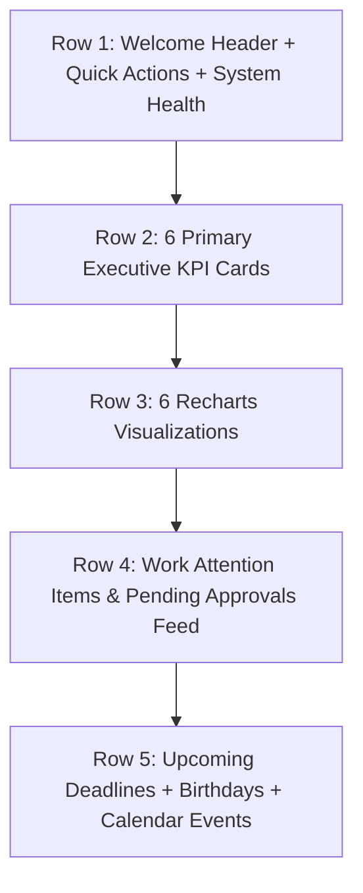

# TaskSyncEnterprise Phase 4.5
## 2. Dashboard Analytics Report

### Overview
The Overview page was completely rebuilt into a real-time Executive Dashboard powered exclusively by backend database aggregations and SQL subqueries. Zero mock or static placeholder data is used.

### Executive Layout Architecture

### Visualizations Powered by Recharts
1. **Task Status Distribution**: Interactive Donut Chart (`PieChart`) displaying real-time task states (To Do, In Progress, Review, Done).
2. **Department Workload**: Multi-Bar Chart (`BarChart`) comparing pending vs overdue tasks per department.
3. **Monthly Activity Trend**: Area Chart (`AreaChart`) tracking task creation vs completion rate across recent months.
4. **Leave Approval Distribution**: Category breakdown of approved, pending, and rejected leave requests.
5. **Notification Volume**: Bar chart illustrating system notification traffic grouped by event type.

### Backend API Integration
Data is supplied via `GET /api/v1/dashboard/analytics`, which runs high-performance SQL subqueries across `employees`, `projects`, `tasks`, `departments`, and `vacations` tables, cached in Redis (`CACHE_TTL_DASHBOARD`).
