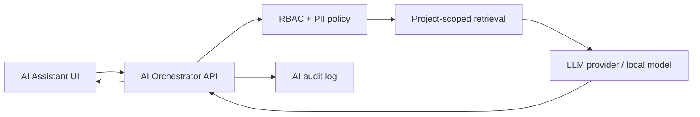

# Roadmap mở rộng sản phẩm và AI

## Nguyên tắc

- Hoàn thiện chất lượng dữ liệu trước AI.
- AI đưa đề xuất, người có quyền quyết định.
- Không gửi PII hoặc secret đến model bên ngoài.
- Mọi đề xuất AI cần log model/version/input policy và có khả năng audit.

## Giai đoạn 1 — Data foundation

Thời lượng dự kiến: 2–4 tuần.

- Sprint snapshot và lịch sử trạng thái Task.
- Actual effort, blocker và skill profile.
- Seed profile `small`, `medium`, `large`, `ai`.
- Data quality validator và anonymization.
- Dashboard velocity/burndown dựa trên dữ liệu thật.

Tiêu chí hoàn thành: có dataset tái lập, không orphan, đủ lịch sử tối thiểu 10 Sprint/project demo.

## Giai đoạn 2 — AI trợ lý an toàn

Thời lượng dự kiến: 3–5 tuần.

- Tóm tắt Project/Sprint từ dữ liệu người dùng được phép xem.
- Gợi ý tách User Story thành Task.
- Gợi ý acceptance criteria và checklist.
- Semantic search tài liệu nội bộ theo RBAC.
- Prompt/version registry và feedback thumbs-up/down.

Kiến trúc:

## Giai đoạn 3 — Dự báo và tối ưu

Thời lượng dự kiến: 4–8 tuần sau khi đủ dữ liệu.

- Dự báo nguy cơ trễ deadline.
- Gợi ý phân công dựa trên skill, workload và availability.
- Phát hiện Sprint capacity bất thường.
- Ước lượng story point có khoảng tin cậy.

Không tự động giao việc hoặc đánh giá nhân viên. Chỉ hiển thị lý do và độ tin cậy cho Manager/Leader.

## Giai đoạn 4 — Production AI governance

- Evaluation dataset cố định.
- Quality, latency và cost budget.
- Prompt injection tests.
- Model fallback/circuit breaker.
- Retention policy, consent và delete workflow.
- Red-team và audit định kỳ.

## Backlog kỹ thuật ngoài AI

- Code splitting để giảm bundle frontend.
- Outbox pattern cho event delivery.
- Object storage cho attachment.
- Background worker cho report/notification.
- Pagination bắt buộc cho list lớn.
- Diễn tập backup/restore và disaster recovery.
