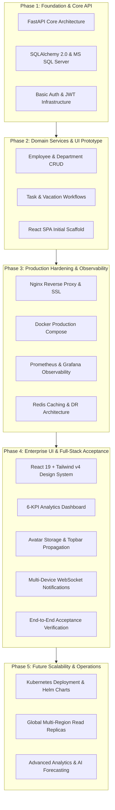
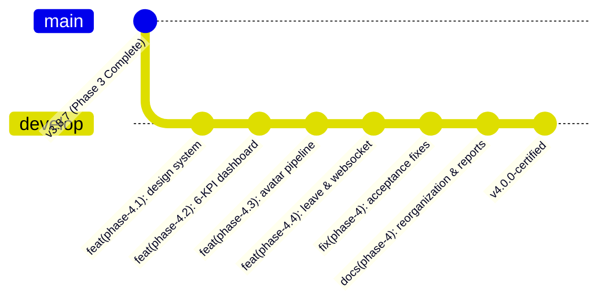

# TaskSyncEnterprise — Master Roadmap (Phase 1–5)

## 📌 Executive Summary
TaskSyncEnterprise is an enterprise-grade task management system built on FastAPI, React 19, TailwindCSS v4, MS SQL Server, Redis, and Nginx. This master roadmap details the architectural evolution across all project phases.

---

## 🏗️ System Evolution Architecture (Phase 1 → Phase 5)

---

## 🔄 Phase 4 Lifecycle & Evidence Flow

```mermaid
flowchart LR
    subgraph Development["1. Development & Fixes"]
        D1["Backend Service Remediation"]
        D2["Frontend Drawer & Form Updates"]
        D3["MSSQL Regression Fixes"]
    end

    subgraph Verification["2. Acceptance Verification"]
        V1["Chrome E2E Acceptance Runner"]
        V2["Avatar Propagation Tests"]
        V3["Leave Workflow State Machine"]
    end

    subgraph Evidence["3. Evidence Collection"]
        E1["JSON Metrics & Timestamps"]
        E2["Full-Page Screenshots"]
        E3["Log & Traceability Audit"]
    end

    subgraph Certification["4. Certification Gate"]
        C1["Repository Hardening"]
        C2["Documentation Reorganization"]
        C3["Phase 4 Certification Report"]
    end

    Development --> Verification
    Verification --> Evidence
    Evidence --> Certification
```

---

## 🌿 Git Branch & Release Workflow

---

## 📋 Phase Roadmap Overview

| Phase | Scope & Objective | Status | Key Deliverables |
|---|---|---|---|
| **Phase 1** | Core API Foundation & Database Schema | `Completed` | FastAPI app, Alembic migrations, MS SQL models, JWT security |
| **Phase 2** | Domain Logic & Initial Frontend | `Completed` | Tasks, Vacations, Employees, Departments, React frontend scaffold |
| **Phase 3** | Production Deployment & Observability | `Completed` | Docker Compose, Nginx SSL, Redis, Prometheus, Grafana, DR procedures |
| **Phase 4** | Enterprise UI, Real-time & Runtime Acceptance | `Completed` | 6-KPI Dashboard, Avatar Upload, Real-Time WS, Playwright E2E |
| **Phase 5** | Cloud Native Expansion & AI Operations | `Planned` | K8s manifests, Multi-region SQL failover, Predictive analytics |
