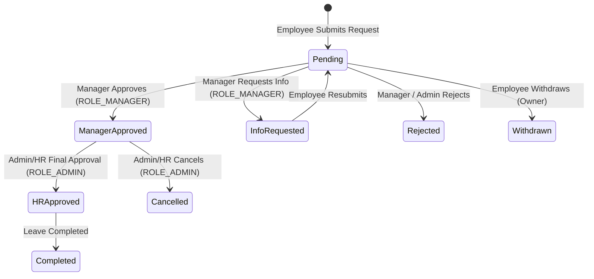

# Phase 4 Leave Workflow Runtime Scenario — TaskSyncEnterprise

**Document Path:** `docs/testing/PHASE_4_LEAVE_RUNTIME_SCENARIO.md`  
**Date:** 2026-07-22  
**Target Phase:** Phase 4.8.1 Gap Remediation  

---

## 📌 Workflow Overview & State Machine

TaskSyncEnterprise implements a multi-step leave approval workflow in `backend/app/services/vacation_service.py` and `frontend/src/pages/vacations/VacationPage.jsx`.



---

## 👥 Selected Demo Accounts

| Role | Demo Email | Password | Allowed Workflow Actions |
|---|---|---|---|
| **Employee** | `employee001@tasksync.example.com` | `TaskSync@2026` | Submit request, view status, withdraw pending request (`Withdrawn`) |
| **Manager** | `manager.it@tasksync.example.com` | `TaskSync@2026` | Department queue review, `Manager Approved`, `Info Requested`, `Rejected` |
| **Admin / HR** | `admin@tasksync.example.com` | `TaskSync@2026` | Final review, `HR Approved`, `Cancelled`, company-wide review |

---

## 🔄 Executable Step-by-Step Scenario

### Step 1: Employee Submits Leave Request
1. Log in as `employee001@tasksync.example.com`.
2. Navigate to `/vacations` and click **"Tạo Yêu cầu Nghỉ"**.
3. Submit: Type = `"Nghỉ phép năm"`, Start Date = `2026-08-01`, End Date = `2026-08-03`, Reason = `"Kỳ nghỉ gia đình"`.
4. **Backend API**: `POST /api/v1/vacations` $\rightarrow$ Status `201 Created`.
5. **Expected UI**: New card appears with `Pending` status and step 1 checked on the 3-step timeline (`1. Đã Gửi đơn` $\checkmark$).

### Step 2: Manager Approval
1. Log in as `manager.it@tasksync.example.com`.
2. Navigate to `/vacations` (or check Pending Approvals on `/dashboard`).
3. Click **"Manager Duyệt"** on `employee001`'s pending request.
4. **Backend API**: `PATCH /api/v1/vacations/:id` with `{ "status": "Manager Approved" }` $\rightarrow$ Status `200 OK`.
5. **Expected UI**: Card badge updates to `Manager Approved` and step 2 checks (`2. Manager Phê duyệt` $\checkmark$).

### Step 3: Admin / HR Final Approval
1. Log in as `admin@tasksync.example.com`.
2. Navigate to `/vacations`.
3. Click **"HR Duyệt Cuối"** on the `Manager Approved` request.
4. **Backend API**: `PATCH /api/v1/vacations/:id` with `{ "status": "HR Approved" }` $\rightarrow$ Status `200 OK`.
5. **Expected UI**: Card badge updates to `HR Approved` and all 3 timeline steps check (`3. HR Hoàn tất` $\checkmark$).

### Step 4: Employee Status Verification
1. Log in back as `employee001@tasksync.example.com`.
2. Open `/vacations`.
3. **Expected UI**: Request shows final green badge `HR Approved`. Nút "Rút Đơn" is hidden because request is finalized.

### Step 5: Invalid Transition Enforcement Check
1. As `employee001@tasksync.example.com`, attempt direct API call to set status:
   `PATCH /api/v1/vacations/:id` with `{ "status": "HR Approved" }`.
2. **Expected Result**: Backend returns `403 Forbidden` / `400 Bad Request` (`"Invalid status transition for current role"`).

### Step 6: In-App WebSocket Notification Verification
1. When Manager approves in Step 2, a real-time WebSocket notification (`/ws/notifications`) is emitted to `employee001`.
2. **Expected Result**: Topbar notification bell increments badge count, and notification entry reads `"Đơn xin nghỉ phép của bạn đã được Manager phê duyệt."`.

### Step 7: Safe Cleanup
1. Log in as `admin@tasksync.example.com`.
2. Execute cleanup API to soft-delete or remove the test vacation row created in Step 1.

---

## 🎯 Verification Command

Run the targeted backend vacation transition contract tests:
```powershell
uv run python -m pytest tests/test_phase_4_6_contracts.py -v
```
