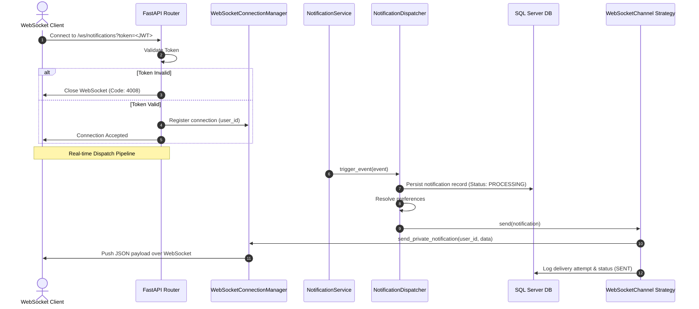

# Phase 3.4 Notification Infrastructure - Implementation Report

This report summarizes the design, implementation, verification results, known limitations, and roadmap for Phase 3.4: Enterprise Notification Infrastructure.

---

## 🏛️ 1. Architecture & Design

We refactored the notification center to support multiple channels using a decoupled **Strategy Pattern**. The business logic triggers events without knowing how messages are delivered.

### Real-Time WebSocket delivery Flow



---

## 📂 2. Summary of Modified & Created Files

### Modified Files
1. **`app/core/enums.py`**: Added `SYSTEM` to the `NotificationChannel` enum.
2. **`app/services/notification/registry.py`**: Auto-registers the new `SystemChannel` strategy.
3. **`app/services/notification/dispatcher.py`**: Maps `SYSTEM` channel values to `"IN_APP"` for database inserts to protect table check constraints.
4. **`app/services/notification/channels/websocket.py`**: Swapped out the simulated placeholder for a real `websocket_manager` delivery push.
5. **`app/main.py`**: Registered the root `/ws/notifications` gateway router and controls the background retry poller thread within lifecycle event scopes.
6. **`CHANGELOG.md`**: Updated with Phase 3.4 release logs.

### Created Files
1. **`PHASE_3_4_REVIEW.md`**: Audit review report analyzing initial system structure.
2. **`app/services/notification/websocket_manager.py`**: Live registry and connection status manager for websocket links.
3. **`app/services/notification/channels/system.py`**: Strategy adapter logging events directly to server logs.
4. **`app/services/notification/poller.py`**: Daemon thread scheduler executing failed email retries.
5. **`tests/test_websocket_notifications.py`**: Unit/integration tests verifying socket connects, heartbeats, private channels, and retry pollers.
6. **`PHASE_3_4_MANUAL_TEST.md`**: Manual copy-pasteable wscat/curl testing script guide.
7. **Docs**: `NOTIFICATION_ARCHITECTURE.md`, `WEBSOCKET_GUIDE.md`, `NOTIFICATION_CHANNELS.md`, and `DELIVERY_PIPELINE.md`.

---

## 🔬 3. Verification & Testing

### Automated Test Coverage
* Automated tests in `tests/test_websocket_notifications.py` mock network components and execute:
  * Connection rejects for missing/invalid tokens.
  * Successful authentications, channel registrations, and heartbeat checks.
  * Private user socket sends, proving message isolation.
  * Thread-safe background email retry execution.

---

## ⚠️ 4. Known Limitations
1. **Memory-Based Connection Registry**: Sockets are tracked in python memory (`Dict[int, List[WebSocket]]`). In a multi-instance production environment, if a client connects to Instance A and the event is triggered on Instance B, the notification will only cache in the database but will not push real-time. (See roadmap below for clustering/Redis PubSub).
2. **Synchronous Poller Thread**: The daemon thread runs in a single process loop. While lightweight, it does not support distributed processing.

---

## 🚀 5. Future Push Notification Roadmap

To support clustering and external Mobile Push channels (FCM/APNS):
```
                       ┌─────────────────────────┐
                       │  Instance A (Websocket) │
                       └───────────▲─────────────┘
                                   │ (Redis Pub/Sub Subscription)
[Business Event] ──► Redis Pub/Sub Channel
                                   │ (Redis Pub/Sub Subscription)
                       ┌───────────▼─────────────┐
                       │  Instance B (Websocket) ├──► [FCM / APNS] ──► Mobile Client
                       └─────────────────────────┘
```
1. **Clustered WebSocket (Redis Pub/Sub)**:
   * Instead of direct local manager lookups, the dispatcher publishes notification payloads to a Redis Pub/Sub channel.
   * All server nodes subscribe to this Redis channel. The node holding the client's active socket will pick it up and write to the socket.
2. **FCM (Firebase Cloud Messaging) Strategy**:
   * Implement a `FCMChannel` strategy inside `app/services/notification/channels/fcm.py`.
   * Store client mobile tokens in a new `device_tokens` table.
   * On dispatch, the FCM Strategy fetches the recipient's device token and calls the Firebase Admin SDK to deliver standard FCM notifications.
